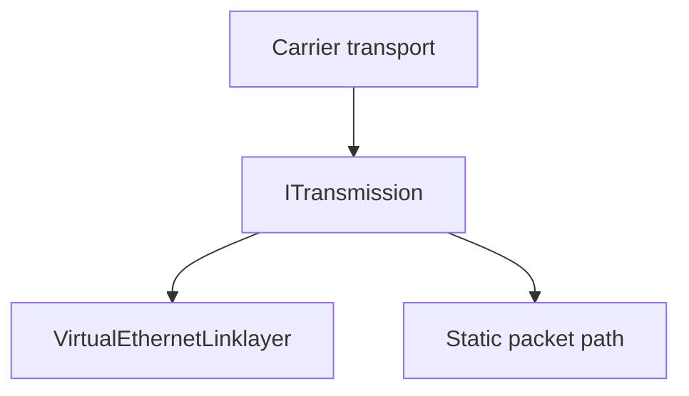

# Tunnel Design Deep Dive

[中文版本](TUNNEL_DESIGN_CN.md)

## Why This Exists

OPENPPP2 does not treat a tunnel as a single encrypted socket. The code splits the tunnel into transport, protected framing, link-layer actions, and static packet handling.

## Layer Map

## Layer 1: Carrier Transport

The outer carrier decides how bytes move between peers. The code supports TCP and WebSocket-style carriers, including TLS-backed WebSocket.

## Layer 2: Protected Transmission

`ITransmission` owns:

- transport handshake timeout
- transport handshake sequencing
- session identifier exchange for the protected transport
- `ivv`-based per-connection key variation
- read/write framing
- protocol-layer cipher state
- transport-layer cipher state

The configured keys are base secrets; the working keys are derived per connection.

## Transport Handshake Behavior

Handshake establishes session identity, mux orientation, and the transition into established framing. The code also treats the early phase conservatively and allows dummy prelude traffic.

This section refers to the protected transport handshake in `ITransmission`, not to client-side virtual TCP accept recovery or any process-level timer.

## Layer 3: Link-Layer Actions

`VirtualEthernetLinklayer` defines the tunnel action vocabulary. It covers:

- information exchange
- keepalive
- TCP-style stream actions
- UDP sendto
- echo / echo reply
- static path setup
- mux setup
- reverse mapping actions

## Layer 4: Static Packet Path

Static UDP is handled separately from the link-layer action path because it has different delivery semantics and state needs.

## Why The Split Matters

The split keeps carrier choice, cryptographic protection, tunnel semantics, and static packet handling independent. That makes the system easier to extend and easier to reason about.

## Related Documents

- `TRANSMISSION.md`
- `PACKET_FORMATS.md`
- `HANDSHAKE_SEQUENCE.md`
