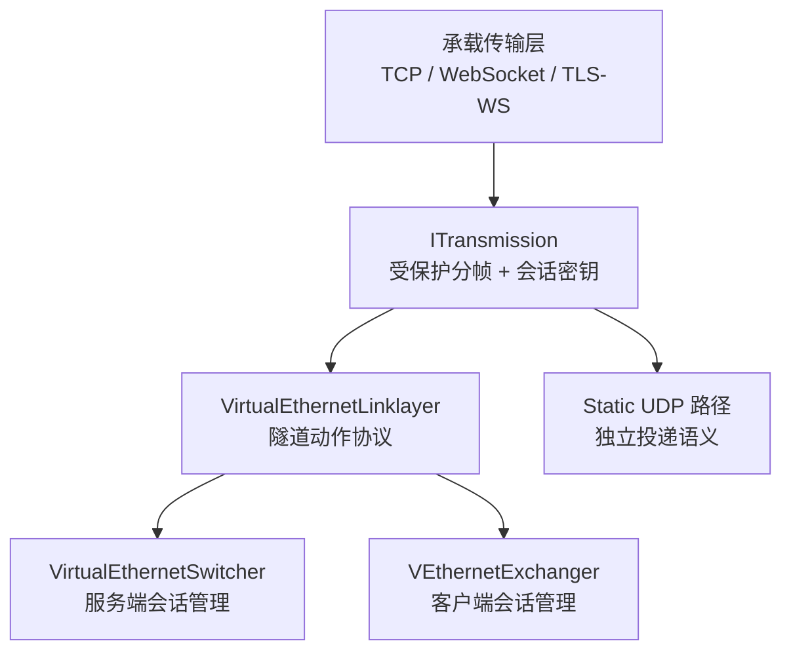
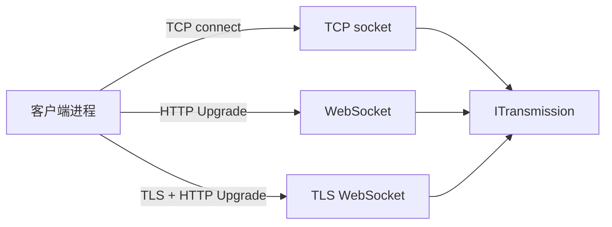
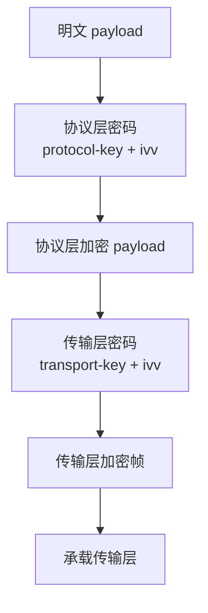
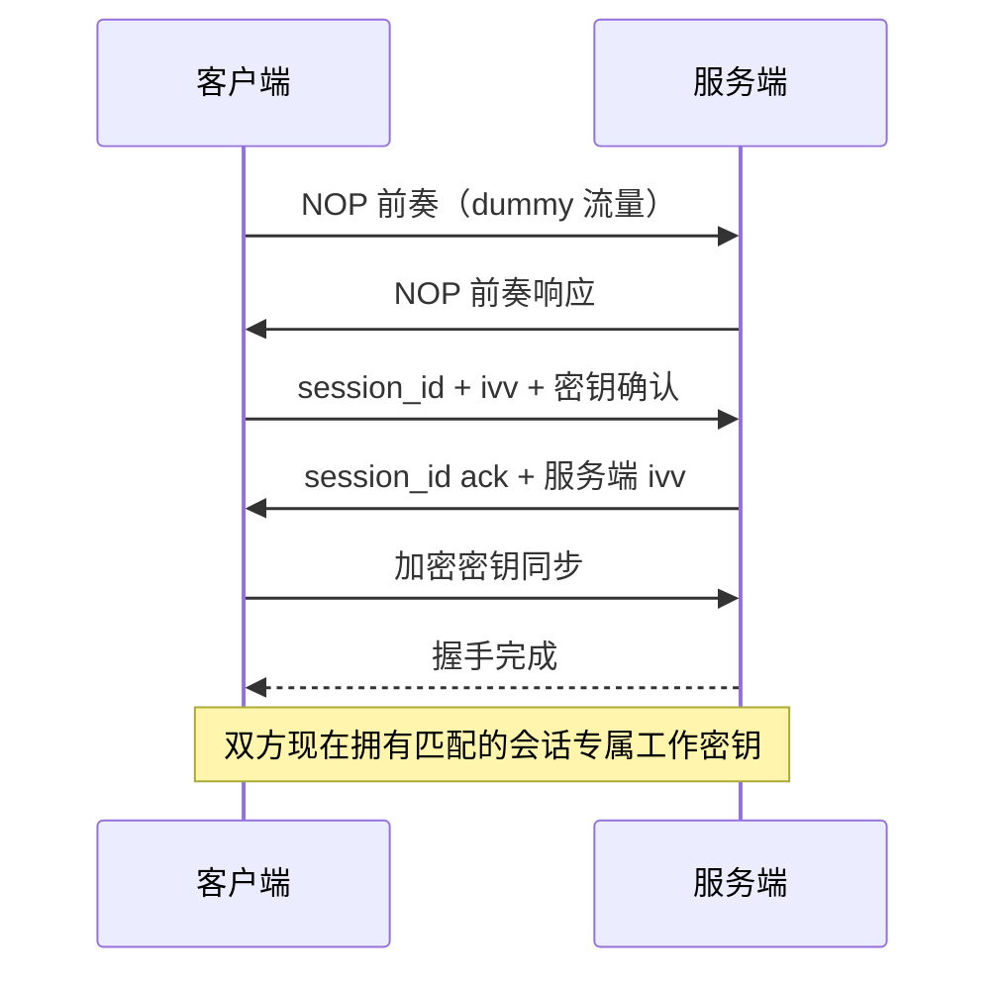
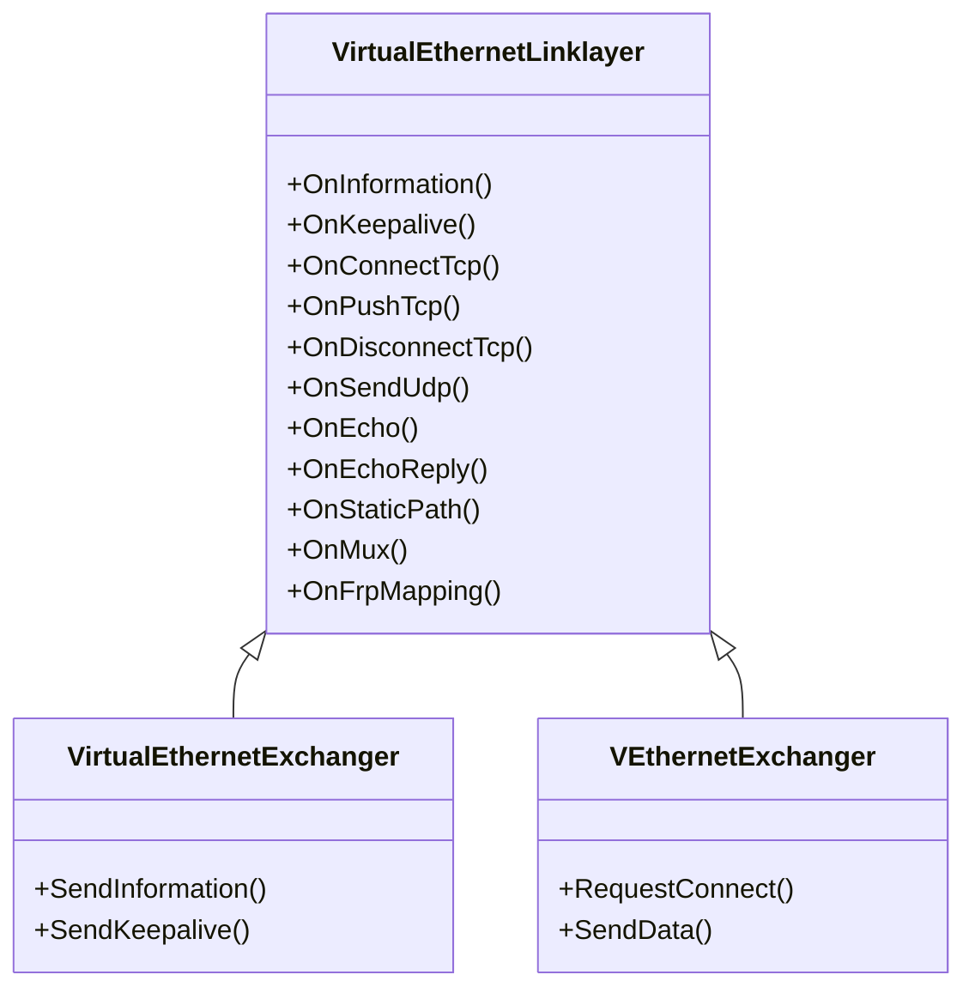
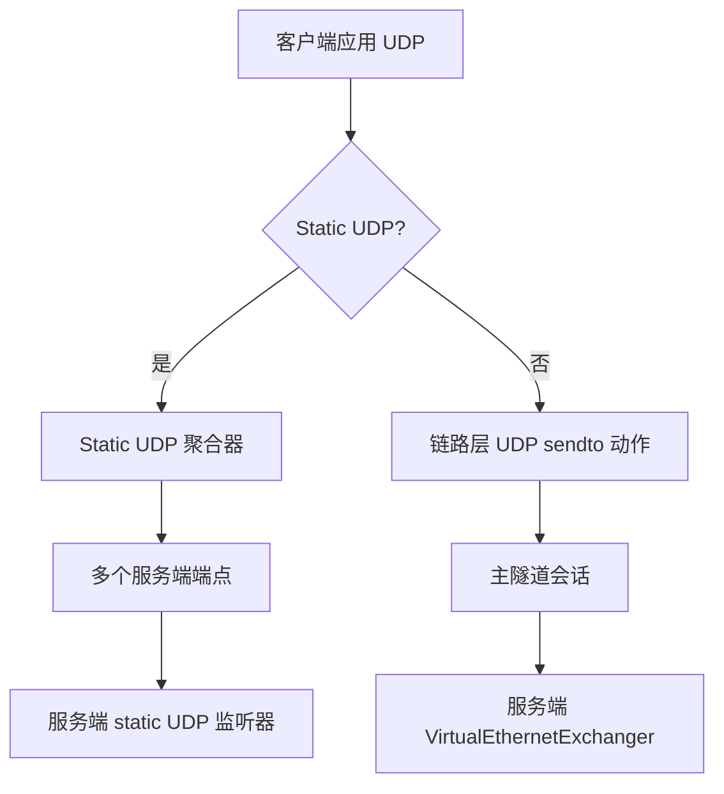
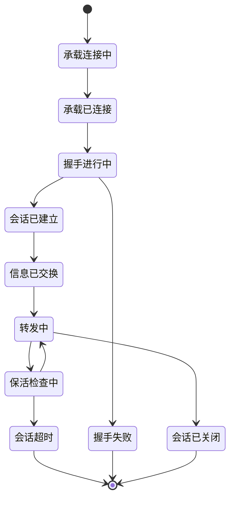

# 隧道设计详解

[English Version](TUNNEL_DESIGN.md)

## 为什么需要这篇文档

OPENPPP2 没有把隧道当成一个单独的加密 socket。
代码把隧道拆成了承载、受保护传输、链路动作和 static 分组处理几个层次。

理解这种拆分对以下工作至关重要：
- 扩展或修改传输承载层
- 理解握手安全属性
- 推理包的完整生命周期
- 诊断每会话问题

---

## 分层图



每一层有独立的职责，可以单独推理。

---

## 第一层：承载传输层

最外层承载决定字节如何在两端之间移动。

支持的承载类型：

| 承载 | 描述 | 配置键 |
|------|------|--------|
| 原始 TCP | 普通 TCP socket 连接 | `server.listen.tcp` |
| WebSocket | HTTP Upgrade 到 WebSocket | `server.listen.ws` |
| TLS WebSocket | TLS 支撑的 WebSocket | `server.listen.wss` |
| 代理 WebSocket | 经 CONNECT 代理的 WebSocket | `client.server-proxy` |

承载层负责：
- 建立 TCP 或 WebSocket 连接
- TLS 协商（WSS 时）
- 向上层提供可靠字节流

承载层**不了解**会话标识、加密密钥或链路动作。



关键源文件：
- `ppp/transmissions/ITcpipTransmission.h`
- `ppp/transmissions/IWebsocketTransmission.h`
- `ppp/transmissions/ISslWebsocketTransmission.h`

---

## 第二层：受保护传输层（`ITransmission`）

`ITransmission` 是位于原始承载之上的保护与分帧层。

### 职责

| 职责 | 描述 |
|------|------|
| 传输握手超时 | 限制握手的最大时长 |
| 握手序列 | 控制建立阶段的消息顺序 |
| 会话标识交换 | 建立 `Int128` 会话 ID |
| 连接级 `ivv` 密钥变化 | 派生会话专属工作密钥 |
| 读写分帧 | 编解码分帧消息 |
| 协议层密钥状态 | 维护 `protocol-key` 密钥上下文 |
| 传输层密钥状态 | 维护 `transport-key` 密钥上下文 |

### 密钥派生

`appsettings.json` 中配置的密钥是**基础密钥**。
每条连接的工作密钥是由基础密钥与连接专属 `ivv` 值派生而来：

```
工作密钥 = KDF(基础密钥, ivv)
```

这提供了会话级密钥隔离：即使一个会话的工作密钥泄露，其他会话依然安全。

### 加密层次

每条连接有两个独立的密钥状态：



影响分帧和暴露的可选标志：

| 标志 | 效果 |
|------|------|
| `masked` | 额外掩码层 |
| `plaintext` | 禁用加密（仅用于测试） |
| `delta-encode` | 流量整形用差分编码 |
| `shuffle-data` | 数据字节混洗 |

### API 参考

```cpp
/**
 * @brief 打开受保护传输并完成握手。
 * @param y        协程 yield 上下文。
 * @return         握手成功并建立会话时返回 true。
 * @note           失败时设置诊断信息。
 */
virtual bool Open(YieldContext& y) noexcept = 0;

/**
 * @brief 从受保护传输读取一个分帧消息。
 * @param y        Yield 上下文。
 * @param buffer   输出缓冲区。
 * @param length   读取的数据长度。
 * @return         成功返回 true，发生错误或 EOF 时返回 false。
 */
virtual bool Read(YieldContext& y, ppp::vector<Byte>& buffer, int& length) noexcept = 0;

/**
 * @brief 向受保护传输写入一个分帧消息。
 * @param y        Yield 上下文。
 * @param buffer   要写入的数据。
 * @param offset   缓冲区起始偏移。
 * @param length   要写入的字节数。
 * @return         成功返回 true。
 */
virtual bool Write(YieldContext& y, const Byte* buffer, int offset, int length) noexcept = 0;
```

源文件：`ppp/transmissions/ITransmission.h`

---

## 传输握手行为

握手执行以下过程：



早期阶段使用 dummy/NOP 流量来防止流量分析识别握手模式。

这里指的是 `ITransmission` 受保护传输握手。
它与以下内容**不同**：
- 客户端虚拟 TCP accept 恢复
- 进程级定时器
- 管理后端认证

---

## 第三层：链路动作层（`VirtualEthernetLinklayer`）

`VirtualEthernetLinklayer` 定义隧道动作词汇——握手完成后客户端和服务端之间使用的协议。

### 动作类型

| 动作 | 方向 | 用途 |
|------|------|------|
| 信息交换 | S → C | 下发策略、额度、IPv6 分配 |
| 保活 | C ↔ S | 检测会话活跃性 |
| TCP connect | C → S | 请求到目标的 TCP 流 |
| TCP push | C ↔ S | 传输 TCP payload |
| TCP disconnect | C ↔ S | 拆除 TCP 流 |
| UDP sendto | C ↔ S | 传输 UDP 数据报 |
| Echo / echo reply | C ↔ S | 往返延迟探测 |
| Static 路径建立 | C ↔ S | 配置 static UDP 路径 |
| Mux 建立 | C → S | 配置多路复用传输 |
| FRP 映射注册 | C → S | 注册反向映射 |
| FRP 连接建立 | S → C | 通知反向连接已到达 |
| FRP 数据推送 | C ↔ S | 在反向连接上传输数据 |
| FRP 断开 | C ↔ S | 拆除反向连接 |
| FRP UDP 中继 | C ↔ S | 反向路径上的 UDP 中继 |

### 类层次结构



源文件：`ppp/app/protocol/VirtualEthernetLinklayer.h`

---

## 第四层：Static 分组路径

Static UDP 与链路动作路径分开处理，原因是：

1. 它有不同的投递语义（原始 UDP，不是分帧动作）
2. 它有不同的状态需求（聚合器多路复用、服务器列表）
3. 它可以独立于主隧道会话运行

### Static UDP 架构



配置：

```json
"udp": {
    "static": {
        "aggligator": 4,
        "servers": ["1.0.0.1:20000", "1.0.0.2:20000"]
    }
}
```

源文件：`ppp/app/client/VEthernetNetworkSwitcher.h`

---

## 为什么要拆层

四层拆分服务于以下工程目标：

| 目标 | 拆层的帮助 |
|------|-----------|
| 承载可扩展性 | 新传输只需满足 ITransmission 接口 |
| 安全隔离 | 加密逻辑封装在第二层，不蔓延到代码库各处 |
| 协议可扩展性 | 新链路动作可在不触碰加密或传输的情况下添加 |
| Static 路径独立性 | UDP 聚合可在不修改会话逻辑的情况下部署 |
| 可测试性 | 每一层都可以用 mock 实现单独测试 |

---

## 连接生命周期



---

## 错误码参考

隧道相关的 `ppp::diagnostics::ErrorCode` 值：

| ErrorCode | 描述 |
|-----------|------|
| `HandshakeFailed` | 受保护传输握手未完成 |
| `HandshakeTimeout` | 握手超过配置的超时时间 |
| `SessionKeyDerivationFailed` | 无法从基础密钥 + ivv 派生工作密钥 |
| `TransmissionReadFailed` | ITransmission 分帧读取失败 |
| `TransmissionWriteFailed` | ITransmission 分帧写入失败 |
| `CarrierConnectionFailed` | 承载 TCP/WebSocket 连接失败 |
| `CarrierTlsNegotiationFailed` | TLS 协商失败（WSS 承载） |
| `LinkLayerProtocolError` | 无效动作类型或格式错误的动作帧 |

---

## 使用示例

### 在运行时检查当前活跃的传输

```cpp
// ppp/app/server/VirtualEthernetExchanger.cpp
auto transmission = exchanger->GetTransmission();
if (transmission) {
    auto kind = transmission->GetKind();  // TcpTransmission, WebSocketTransmission 等
    // ...
}
```

### 从服务端发送保活

```cpp
// ppp/app/server/VirtualEthernetExchanger.cpp
bool VirtualEthernetExchanger::SendKeepalive(const boost::asio::yield_context& y) noexcept {
    auto linklayer = GetLinklayer();
    if (NULLPTR == linklayer) {
        return false;
    }
    return linklayer->SendEcho(y, session_id_);
}
```

### 处理入站 TCP connect 动作

```cpp
// ppp/app/protocol/VirtualEthernetLinklayer.cpp
bool VirtualEthernetLinklayer::OnConnectTcp(
    const boost::asio::yield_context& y,
    ppp::Int32                        connection_id,
    const IPEndPoint&                 destination) noexcept
{
    // 针对防火墙验证目标地址
    // 创建出站 TCP socket
    // 在会话表中注册连接
    // 发送 TCP connect ack
    return true;
}
```

---

## 相关文档

- [`TRANSMISSION_CN.md`](TRANSMISSION_CN.md)
- [`PACKET_FORMATS_CN.md`](PACKET_FORMATS_CN.md)
- [`HANDSHAKE_SEQUENCE_CN.md`](HANDSHAKE_SEQUENCE_CN.md)
- [`LINKLAYER_PROTOCOL_CN.md`](LINKLAYER_PROTOCOL_CN.md)
- [`TRANSMISSION_PACK_SESSIONID_CN.md`](TRANSMISSION_PACK_SESSIONID_CN.md)
