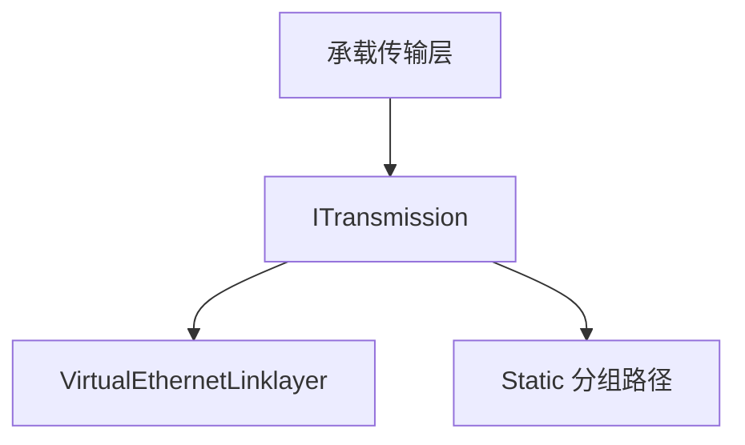

# 隧道设计详解

[English Version](TUNNEL_DESIGN.md)

## 为什么需要这篇文档

OPENPPP2 没有把隧道当成一个单独的加密 socket。代码把隧道拆成了承载、受保护传输、链路动作和 static 分组处理几个层次。

## 分层图

## 第一层：承载传输层

最外层承载决定字节如何在两端之间移动。代码支持 TCP 和 WebSocket 风格承载，包括 TLS-backed WebSocket。

## 第二层：受保护传输层

`ITransmission` 负责：

- 握手超时
- 握手序列
- 会话标识交换
- 基于 `ivv` 的连接级密钥变化
- 读写帧化
- 协议层密钥状态
- 传输层密钥状态

配置中的密钥是基础密钥，工作密钥是按连接派生出来的。

## 握手行为

握手会建立会话标识、mux 方向以及进入已建立帧状态的切换。代码也会把早期阶段当成更保守的阶段处理，并允许 dummy 前奏流量。

## 第三层：链路动作

`VirtualEthernetLinklayer` 定义隧道动作词汇，包含：

- 信息交换
- 保活
- TCP 风格流动作
- UDP sendto
- echo / echo reply
- static 路径建立
- mux 建立
- 反向映射动作

## 第四层：Static 分组路径

Static UDP 与链路动作路径分开处理，因为它们的投递语义和状态需求不同。

## 为什么要拆层

这样可以把承载选择、加密保护、隧道语义和 static 分组处理保持独立，更容易扩展，也更容易推理。

## 相关文档

- `TRANSMISSION_CN.md`
- `PACKET_FORMATS_CN.md`
- `HANDSHAKE_SEQUENCE_CN.md`
