# 隧道设计详解

[English Version](TUNNEL_DESIGN.md)

## 为什么需要这篇文档

OPENPPP2 并没有把隧道理解成“一个加密 socket”。

从代码看，隧道被有意识地拆成多个层次。这一设计决定，是工程能够同时支持以下能力的根本原因：

- TCP 和 WebSocket 承载
- 虚拟以太网转发
- 会话策略与信息交换
- FRP 风格反向映射
- 静态 UDP 分组模式
- 基于 MUX 的子通道
- 平台特化的路由与网卡行为

## 隧道架构总览

### 分层架构图

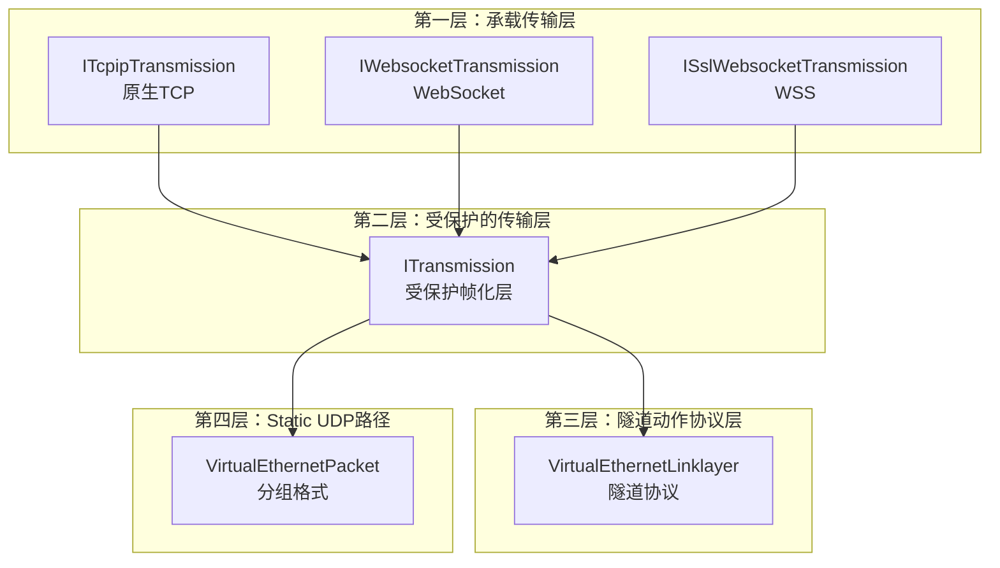

### 系统组件交互图

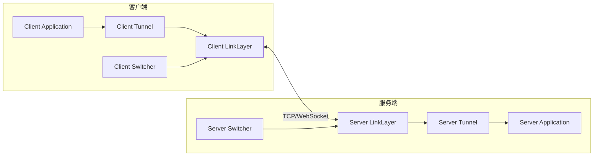

## 第一层：承载传输层

最外层承载是两端之间采用的 socket 风格。

对应实现：

- `ITcpipTransmission`
- `IWebsocketTransmission`
- `ISslWebsocketTransmission`

这一层只决定字节如何移动：

- 原生 TCP
- WebSocket
- WebSocket over TLS

其上层才是隧道真正的语义。

### 承载层特性对比表

| 特性 | TCP | WebSocket | SSL WebSocket |
|------|-----|-----------|---------------|
| 协议类型 | 传输层 | 应用层 | 应用层 |
| 握手开销 | 无 | HTTP握手 | TLS+HTTP |
| 穿透能力 | 基础 | 良好(HTTP) | 良好(HTTPS) |
| 性能开销 | 最低 | 中等 | 较高 |
| Proxy兼容 | 差 | 好 | 好 |
| 适用场景 | 内网直连 | 浏览器环境 | 高受限网络 |

## 第二层：受保护的传输层

`ITransmission` 在承载层之上构建了受保护的帧化传输层。

它负责：

- 握手超时
- 握手序列
- 会话标识交换
- 基于 `ivv` 的连接级重建密钥
- 读写帧化
- 协议层密钥
- 传输层密钥

### 为什么需要这一层

如果没有这一层，每个承载实现都得自己理解会话引导细节。现在代码把这些关注点统一收敛在 `ITransmission` 中，只实现一次。

## 握手设计

传输握手做的不只是“连上就算成功”。从代码事实看，它同时建立：

- 会话 ID
- 连接是否走 mux 语义
- 通过 `ivv` 导出的连接级工作密钥
- 从引导阶段切换到已握手阶段的帧行为

实现中在真正值被接受前，还会先发送若干握手占位流量。不管其更细的运行意图是什么，代码都清楚地表明：连接早期阶段被当成一个特殊且更保守的状态来处理。

### 握手流程序列图

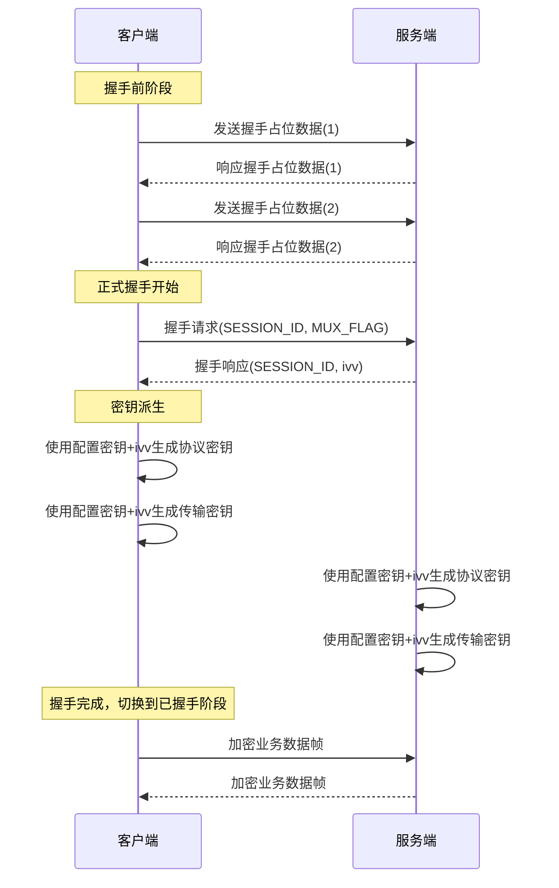

### 密钥派生流程图

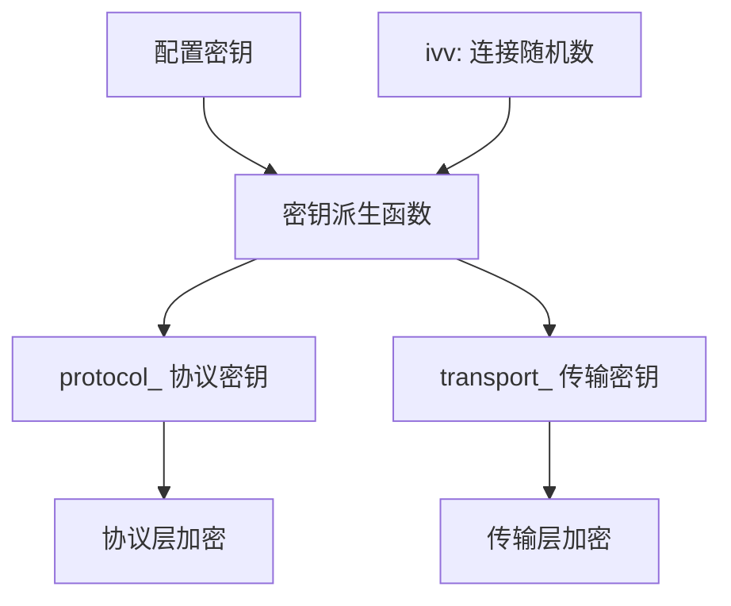

## 为什么握手后要重建密钥

代码会用配置密钥加上运行时 `ivv` 重新生成 `protocol_` 和 `transport_`。

这意味着：

- 配置中的密钥是基础密钥
- 每条建立成功的连接都有自己的工作密钥状态

从工程角度看，这带来：

- 会话级差异化
- 降低所有连接长期共享同一静态密钥状态的程度
- 清晰地区分“引导状态”和“已建立状态”

## 帧化设计

承载 socket 建好之后，字节不会被原样发送，而是经过帧化读写处理。

实现中包含：

- 长度处理
- 对长度 / 头部数据的可选协议层保护
- 负载变换
- 握手前后会切换的格式化行为

### 为什么要做帧化

因为隧道必须承载结构化动作和业务负载，而仅仅是任意字节流。帧化层为上层协议提供了一个稳定基础，使上层逻辑不必关心底层承载到底是 TCP 还是 WebSocket。

### 帧结构图

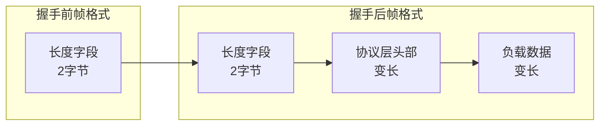

## 第三层：隧道动作协议层

在 `ITransmission` 之上，`VirtualEthernetLinklayer` 定义了运行时真正使用的隧道协议。

这一层建模了：

- `INFO`
- `KEEPALIVED`
- `LAN`
- `NAT`
- `SYN`、`SYNOK`、`PSH`、`FIN`
- `SENDTO`
- `ECHO`、`ECHOACK`
- `STATIC`、`STATICACK`
- `MUX`、`MUXON`
- `FRP_*`

### 动作码分类表

| 动作码 | 类别 | 方向 | 描述 |
|--------|------|------|------|
| INFO | 会话 | 双向 | 信息交换 |
| KEEPALIVED | 保活 | 双向 | 心跳保活 |
| LAN | 网络 | 服务端→客户端 | 局域网信息 |
| NAT | 网络 | 双向 | NAT映射信息 |
| SYN | TCP | 客户端→服务端 | TCP连接请求 |
| SYNOK | TCP | 服务端→客户端 | TCP连接响应 |
| PSH | TCP | 双向 | TCP数据推送 |
| FIN | TCP | 双向 | TCP连接关闭 |
| SENDTO | UDP | 双向 | UDP数据报 |
| ECHO | 测试 | 客户端→服务端 | 回显请求 |
| ECHOACK | 测试 | 服务端→客户端 | 回显响应 |
| STATIC | Static | 双向 | Static路径协商 |
| STATICACK | Static | 双向 | Static确认 |
| MUX | 复用 | 双向 | MUX子通道协商 |
| MUXON | 复用 | 双向 | MUX启用 |
| FRP_* | 反向映射 | 客户端→服务端 | FRP风格端口映射 |

### 为什么要有这套动作模型

因为 OPENPPP2 不只是转发一类流量。它需要一套统一内部语义来表达：

- 路由业务流量
- TCP 流控制
- UDP 数据报中继
- 反向服务暴露
- 保活与健康信号
- mux 协商
- static 通路协商

## 第四层：Static UDP 路径的虚拟分组格式

`VirtualEthernetPacket` 是单独存在的一条封装路径，用于 static 风格的报文传输。

它不同于 `VirtualEthernetLinklayer`，承载了：

- 伪源/目的元数据
- 每包 mask 和校验和
- 基于会话的密钥选择
- 分组级别的 shuffle / XOR / delta 处理

### 为什么它要单独存在

因为 static UDP 传输的需求与 opcode 驱动的链路层不同。代码把它视作“面向报文的传输路径”，而不是控制动作流。

### Static UDP 分组格式图

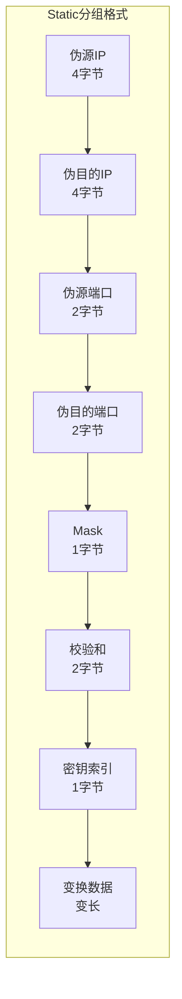

## 数据流详细设计

### TCP 数据流

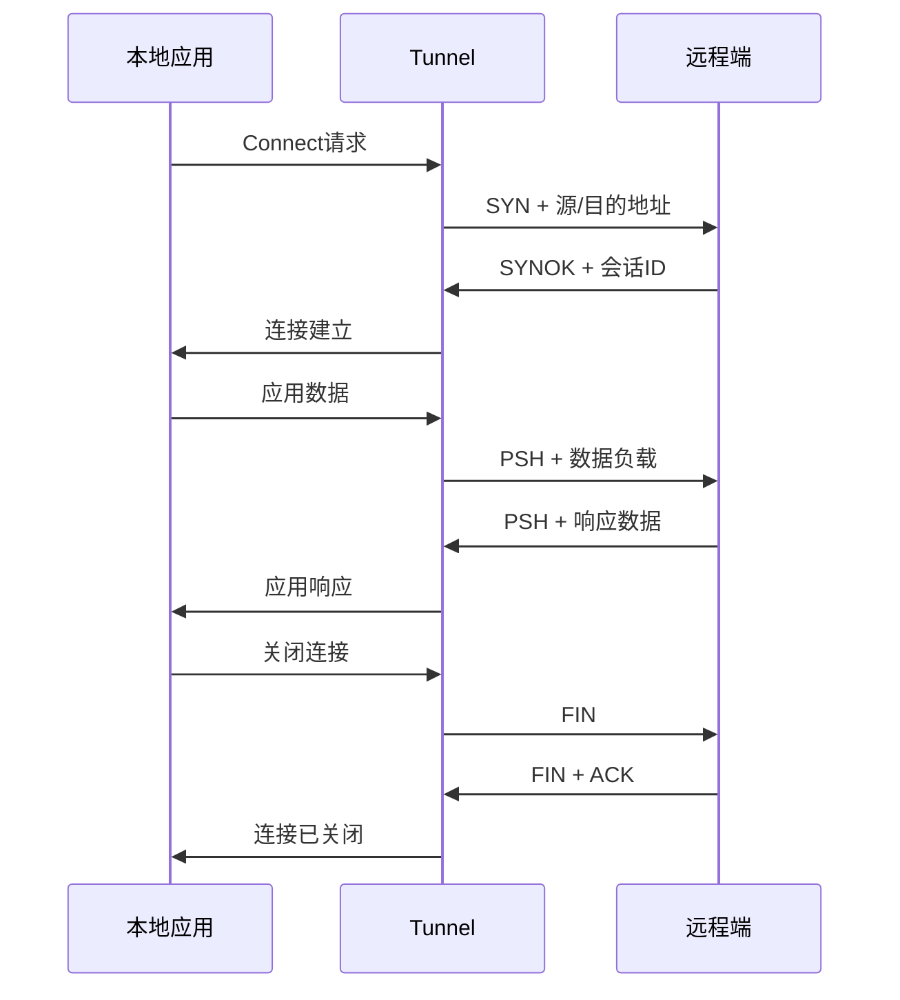

### UDP 数据流

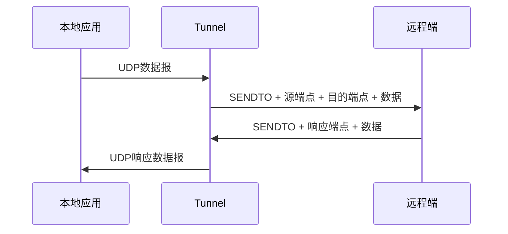

### MUX 子通道数据流

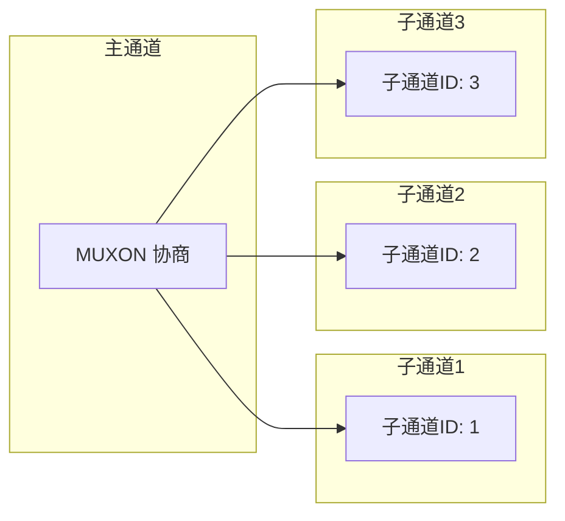

## 隧道建立完整流程

### 完整连接序列图

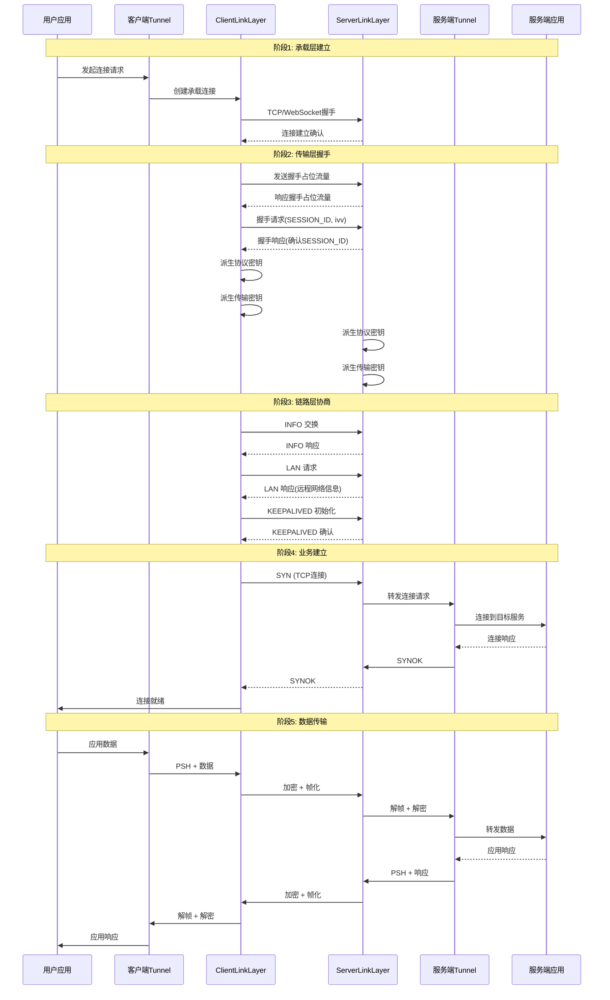

## 安全设计考量

### 密钥体系

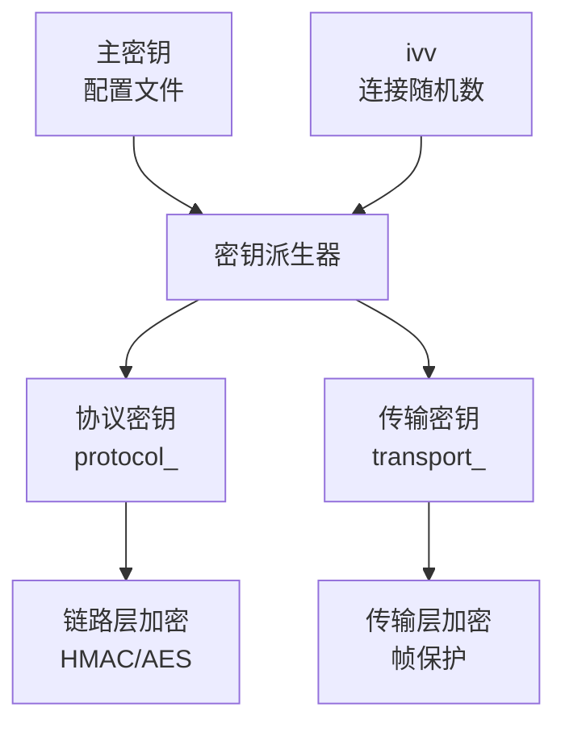

### 安全特性对照表

| 安全特性 | 实现方式 | 作用 |
|----------|----------|------|
| 密钥派生 | HKDF/Bcrypt | 防止主密钥泄露 |
| 连接级密钥 | 每次连接使用不同ivv | 会话隔离 |
| 帧完整性 | HMAC校验 | 防篡改 |
| 前向保密 | 临时会话密钥 | 防历史泄露 |
| 抗重放 | 会话ID+序列号 | 防重放攻击 |

### 传输层安全措施

1. **握手占位流量**: 在真正握手前发送随机数据，防止流量分析
2. **密钥重建**: 每次连接独立派生工作密钥
3. **帧格式切换**: 握手前后使用不同帧格式，增加混淆
4. **可选协议层保护**: 对帧头进行额外加密

### 安全配置建议

```yaml
# 推荐安全配置示例
tunnel:
  encryption: aes-256-gcm
  key_derivation: hkdf
  frame_protection: enabled
  handshake_obfuscation: enabled
  session_timeout: 3600
  keepalive_interval: 30
```

## 平台差异处理

### 各平台架构对比

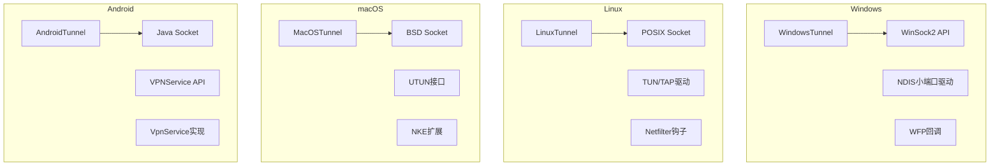

### 平台网络接口差异表

| 平台 | 网络接口类型 | API层 | 权限要求 |
|------|-------------|-------|----------|
| Windows | NDIS小端口/WFP | 系统内核 | 管理员 |
| Linux | TUN/TAP | Linux内核 | root/CAP_NET_ADMIN |
| macOS | UTUN/NKE | XNU内核 | root/SystemExtension |
| Android | VpnService | Android Framework | VPN权限 |

### 路由行为差异

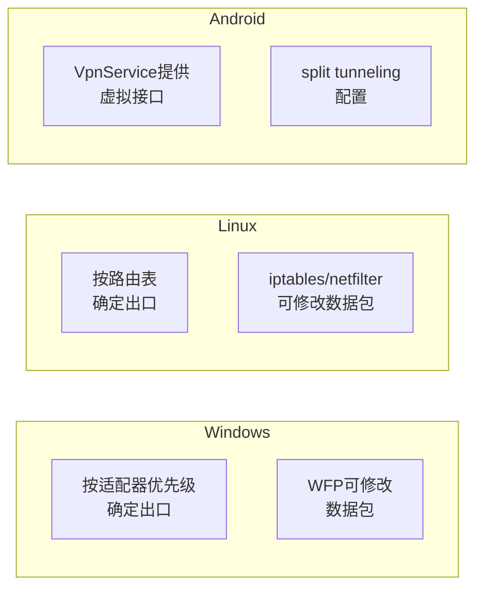

### 平台特定功能对照

| 功能 | Windows | Linux | macOS | Android |
|------|---------|-------|-------|---------|
| TCP转发 | ✓ | ✓ | ✓ | ✓ |
| UDP转发 | ✓ | ✓ | ✓ | ✓ |
| ICMP处理 | ✓ | ✓ | ✓ | 部分 |
| NAT穿透 | ✓ | ✓ | ✓ | ✓ |
| MUX复用 | ✓ | ✓ | ✓ | ✓ |
| FRP映射 | ✓ | ✓ | ✓ | ✓ |
| Split Tunneling | 高级 | 高级 | 高级 | ✓ |
| Kill Switch | ✓ | 高级 | 高级 | ✓ |

### 平台代码组织

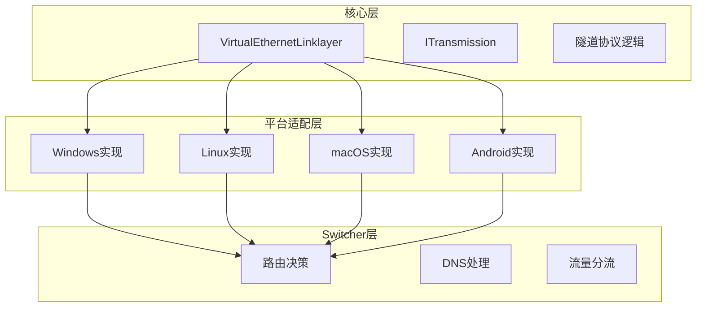

## 为什么隧道不是一个扁平协议

如果把所有行为塞进一个扁平协议，后续演化会非常困难。

现在通过分离：

- 承载传输层
- 受保护的传输层
- 隧道动作协议层
- static 分组格式

工程可以只修改其中一层，而不必重写整个系统。

## 为什么客户端和服务端共用同一条链路层类

客户端和服务端都继承自 `VirtualEthernetLinklayer`，只是分别覆写它们应当合法接受的动作。

这是一个很强的设计选择：

- 一套共享 opcode 模型
- 通过覆写实现角色差异
- 对于方向不合法或可疑的消息，可以显式拒绝

这比维护两套彼此分离的客户端协议和服务端协议更稳健。

## 为什么 TCP、UDP、ICMP、映射、Static、MUX 要走不同内部路径

代码把它们分开，是因为它们在运行上完全不同：

- TCP 需要 connect/data/close 序列
- UDP 需要按端点维持中继关系
- ICMP 需要合成回显和 TTL 相关处理
- mappings 需要反向注册和按端口生命周期管理
- static 模式需要报文化 UDP 传输
- mux 需要逻辑子通道协商与复用

如果强行用一个“通用转发函数”糊在一起，运行时就会变得不透明且难排障。

## 为什么路由和 DNS 逻辑不放在隧道核心里

隧道协议本身不直接管理宿主机路由表和系统 DNS 设置。这些都留在 switcher 和平台代码中。

这种分离是正确的，因为路由和 DNS 操作属于宿主环境问题，而不是线协议问题。

## 设计结果

最终得到的是一个不容易用一句话讲完、但非常适合作为基础设施继续演化的隧道系统。

这个工程不是围绕某一个技巧组织的，而是围绕稳定职责边界组织的。

## 性能优化考量

### 零拷贝优化路径

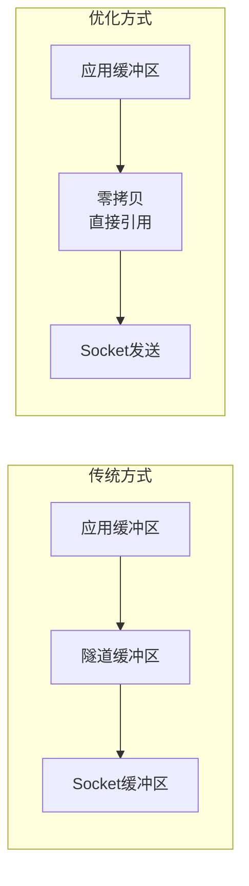

### 连接池管理

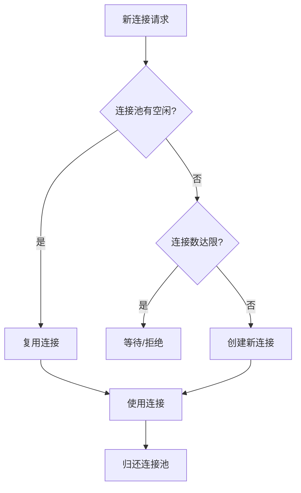

## 故障排查指南

### 常见问题与排查步骤

| 问题类型 | 排查要点 | 工具 |
|----------|----------|------|
| 连接失败 | 检查网络可达性、防火墙 | ping, telnet |
| 握手超时 | 检查密钥配置、时钟同步 | 日志 |
| 数据丢包 | 检查MTU、链路质量 | tcpdump |
| 性能下降 | 检查CPU、带宽、连接数 | top, netstat |
| 密钥错误 | 检查配置文件编码 | 日志 |

### 日志级别说明

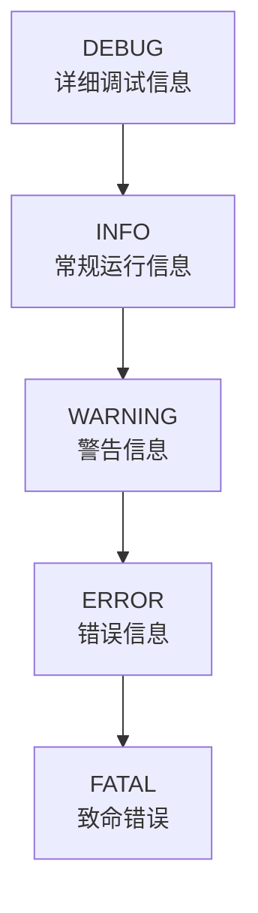

## 下一步建议阅读

- [`LINKLAYER_PROTOCOL_CN.md`](LINKLAYER_PROTOCOL_CN.md)
- [`CLIENT_ARCHITECTURE_CN.md`](CLIENT_ARCHITECTURE_CN.md)
- [`SERVER_ARCHITECTURE_CN.md`](SERVER_ARCHITECTURE_CN.md)
