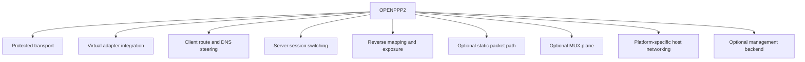
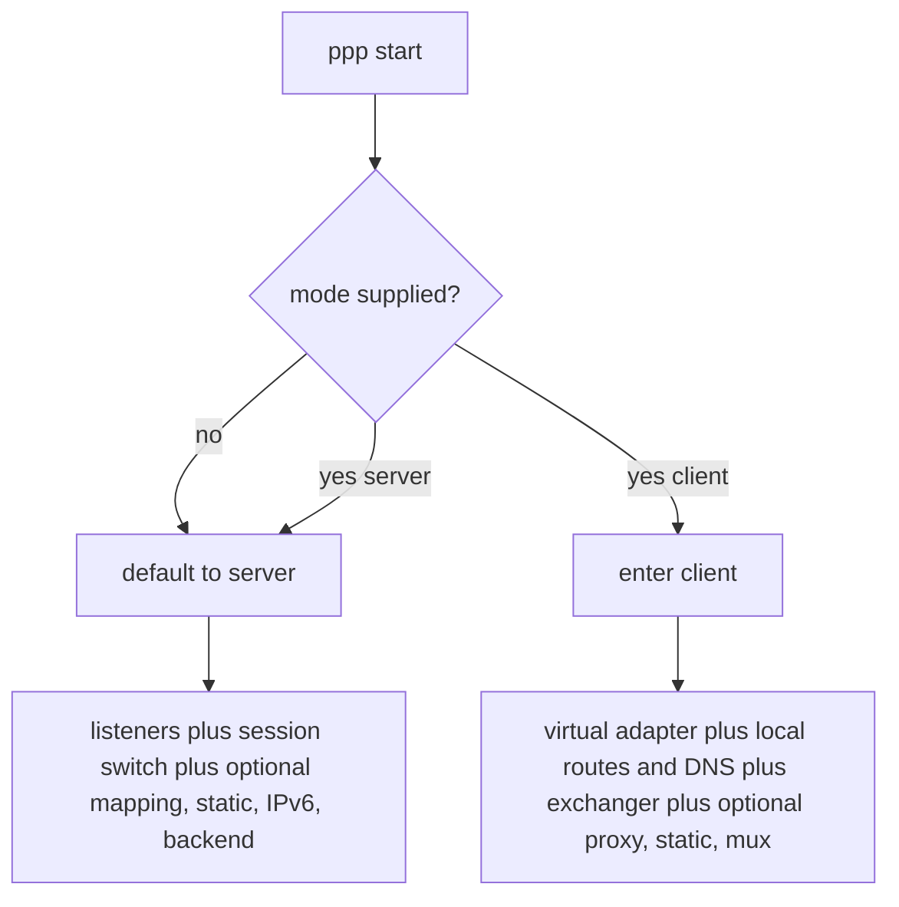
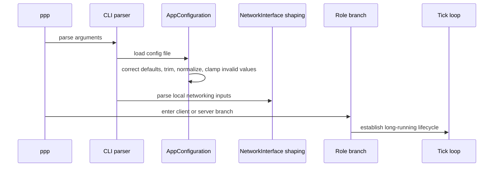
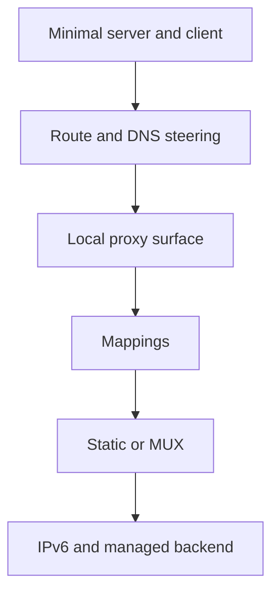

# User Manual

[中文版本](USER_MANUAL_CN.md)

## Document Position

This is not a quick-start note and not a short how-to that only teaches a few launch commands. The purpose of this document is to explain OPENPPP2 as a real network infrastructure runtime, so that a user understands what it is, what it changes on the host, what role a node is supposed to play, which deployment shapes fit it, which deployment shapes do not, and how the system should be operated correctly on different platforms before trying to tune small parameters.

This manual is written for three kinds of readers:

- users who directly deploy and operate OPENPPP2
- network operators who design access patterns for teams, sites, or edge nodes
- developers and maintainers who need a usage document that still remains connected to the real implementation

The document is grounded in the current codebase, mainly:

- `main.cpp`
- `ppp/configurations/AppConfiguration.*`
- `ppp/transmissions/*`
- `ppp/app/protocol/*`
- `ppp/app/client/*`
- `ppp/app/server/*`
- `windows/*`
- `linux/*`
- `darwin/*`
- `android/*`

Its purpose within the full documentation set is to bridge the more internal engineering documents into a user-facing explanation of how the system is actually operated.

If you mainly want to know how to use the system, start here. If, while reading, you keep asking why the behavior is designed this way, continue into the related architecture, transport, routing, platform, deployment, and operations documents listed near the end.

## First Conclusion: What OPENPPP2 Actually Is

If one extremely short sentence is required, OPENPPP2 is a single-binary, multi-role, cross-platform virtual networking runtime. It can run as a client or as a server, and on top of that it can combine route steering, DNS steering, reverse mapping, static packet paths, MUX, platform-specific host networking integration, and an optional management backend.

But that sentence is still too small to be practically useful.

The more accurate operational description is this: OPENPPP2 is not only a tunnel. It is a runtime that combines tunnel transport, virtual adapters, system routes, DNS behavior, session policy, mapping behavior, and platform-specific host networking effects into one coordinated process.

That means you should not think about OPENPPP2 as only:

- an encrypted socket between two endpoints
- a VPN program that is considered successful as soon as it connects
- a small client proxy with a remote upstream

You should think of it as:

- a system process that creates or attaches a virtual networking surface
- a runtime that has real effects on routes, DNS behavior, and host networking preferences
- an overlay node with explicit client/server role separation
- a network node whose server side can own session switching, mapping, IPv6 assignment, and policy enforcement behavior



## The First Mistake Most Users Make

The first common mistake is to assume that OPENPPP2 is a product where you only enter a server address and then click connect. That assumption pushes every later decision in the wrong direction.

The real usage model is:

- first decide what role the current node plays in the overall network
- then decide which runtime planes that node should carry
- then decide how it should attach to the current host and local network
- only then decide how to write the JSON configuration and CLI overrides

In other words, the correct order is:

1. define the network goal
2. define whether the node is a client or a server
3. define whether the node is a full-tunnel edge, split-tunnel edge, proxy edge, site edge, service-publishing edge, IPv6-serving edge, or some combination of those
4. only after that, write JSON and command-line parameters

Many questions such as why traffic does not move, why routes are wrong, or why DNS behavior looks incorrect are not caused by one missing switch. They are caused by the role model being wrong before the first command was even executed.

## One Binary, Two Roles

The main executable is `ppp`. It is one binary with two runtime roles:

- `server`
- `client`

If you do not explicitly supply `--mode=client`, the process defaults to `server`. That is not only a documentation convention. It is what the mode parsing logic in `main.cpp` actually does.

Role selection matters because it changes the entire startup branch:

- the server branch opens listeners, constructs the session switch, accepts remote connections, and establishes policy and mapping boundaries
- the client branch creates or opens the virtual adapter, builds local route and DNS state, creates the remote exchanger, and moves part of the host's traffic into the overlay



### When A Node Should Run As Server

A node should run as `server` when it is intended to be:

- the admission anchor for remote clients
- the session admission and session-switching center of the overlay
- the public or edge node for reverse mappings and service exposure
- the side that assigns, responds to, or manages client-side IPv6 behavior
- the consumer of an optional managed backend policy layer

### When A Node Should Run As Client

A node should run as `client` when it is intended to:

- create or attach a local virtual network surface
- move part of the local host or local subnet traffic into the overlay
- act as a remote-access edge
- execute local route steering and DNS steering
- host local HTTP or SOCKS proxy behavior
- initiate reverse service publication

### Do Not Treat Client And Server As Symmetric Peers

Even though client and server share a large amount of protocol vocabulary, such as link-layer actions, information exchange, and transmission ownership, they are not fully symmetric peers in behavior.

The code contains explicit rejection logic on both sides for actions that are illegal in the current direction. That means:

- some actions are valid only from client to server
- some actions are valid only from server to client
- some actions are only valid after one side has become the main session owner

The practical consequence is that you should not casually swap client and server intent, or copy server-side intent into a client configuration and expect a mirror-image result.

## Four Things To Confirm Before Running

Before starting `ppp` on any platform, it is worth confirming four basic facts. They look simple, but every later problem gets larger if these are wrong.

### First: Administrative Privilege

`main.cpp` checks for administrator or root privilege. Without that privilege, the program refuses to continue.

That is expected. OPENPPP2 is not only a user-space socket process. It needs to:

- open virtual adapters
- change routes
- change DNS behavior
- execute system-network helper behavior on some platforms
- open listeners in server mode
- on Linux IPv6 server deployments, enable forwarding and install `ip6tables` behavior

So if privilege is wrong, do not begin transport or protocol troubleshooting. Fix the host execution model first.

### Second: Configuration File Path

OPENPPP2 prefers an explicitly supplied configuration path, and otherwise tries `./config.json` and `./appsettings.json`. In production or formal testing, you should explicitly specify the configuration file instead of depending on the current working directory.

Recommended practice:

- one clear file per role
- one clear file per environment
- always start with explicit `--config`

Not recommended:

- permanently mixing client and server identity in one hard-to-reason-about JSON file
- depending on whichever `appsettings.json` happens to exist in the current directory

### Third: Platform Preconditions

Preconditions differ by platform.

On Windows, confirm:

- whether the environment is using Wintun or TAP-Windows fallback
- whether the current account may alter system networking state
- whether there are existing proxy or browser preference remnants that may interfere with interpretation

On Linux, confirm:

- `/dev/tun` or `/dev/net/tun`
- route manipulation capability
- whether route protection should remain enabled
- if the server is expected to provide IPv6 transit, whether kernel and userspace tool prerequisites are satisfied

On macOS, confirm:

- `utun` availability
- that interface, route, and resolver changes are allowed and expected in the host environment

On Android, confirm:

- the VPN host layer exists
- the Java/Kotlin to native TUN fd injection path works
- the `protect(int)` call chain is connected

### Fourth: Do Not Duplicate The Same Role And Config Pair

The runtime builds a repeat-run protection key from the current role and the current configuration path. In practice, do not start the same role with the same config on the same machine twice and then interpret the resulting confusion as a network failure.

## What Actually Happens During Startup

From the user point of view, startup is not just read-args then connect. For both client and server, the process broadly passes through these stages:

1. parse CLI arguments
2. load and normalize configuration
3. determine the role
4. parse local interface and shaping inputs
5. initialize role-specific environment
6. open the main client or server runtime object
7. enter the periodic tick loop and long-running state



This order means OPENPPP2 does not simply read parameters and immediately start tunneling. Defaults, compatibility fixes, platform-specific values, and local-network shaping all get normalized before the main runtime is opened.

Users should therefore adopt a habit of asking, for every value they see:

- what will this become after normalization
- whether the current platform supports it
- whether it is applied at startup, at session establishment, or only after an information envelope is received later

## Five Deployment Shapes Every User Should Understand First

OPENPPP2 can support many advanced behaviors, but from the user point of view the most useful first step is to understand five basic deployment shapes. Once those are clear, static mode, MUX, mappings, and managed IPv6 become much easier to reason about.

### Shape One: Minimal Client To Minimal Server

This is the simplest and cleanest starting point.

Its characteristics are:

- the server provides the minimal listener surface
- the client connects to that listener
- no complicated route files yet
- no complicated DNS rule files yet
- no managed backend dependency

The purpose of this shape is not to define the final production topology. Its purpose is to confirm:

- carrier reachability
- basic session establishment
- virtual adapter creation
- basic traffic movement into the overlay

Use this shape first when:

- validating OPENPPP2 on a new machine for the first time
- validating a newly built artifact on a platform
- deciding whether a problem belongs to the host environment or to a higher feature layer

### Shape Two: Split-Tunnel Client Access

This is one of the most common real deployment shapes. The client does not send all traffic into the overlay. Instead it combines:

- bypass lists
- route files
- DNS rules
- selective overlay entry for only certain traffic
- local-network preservation for the rest

Typical use cases include:

- enterprise internal access where only certain prefixes should go remote
- deployments where ordinary Internet traffic should stay local, but corporate prefixes and corporate domain resolution should go through the overlay
- region-, ISP-, or target-domain-specific traffic steering

In this shape, what matters most is not only whether the tunnel connects, but whether the traffic boundary is correct. Users should therefore treat these items as real policy assets:

- bypass files
- route files
- `virr` country-IP inputs
- DNS rule files

### Shape Three: Client As A Local Proxy Edge

In this shape, the main operational concern is how applications consume local HTTP or SOCKS proxy entry points rather than whether the entire host routing table changes.

This shape fits when:

- you do not want to mutate the entire host route table aggressively
- only certain applications should use the overlay
- browsers or tools are expected to speak to a local proxy instead of relying entirely on system routes

The key thing to remember is:

- the client is still a full tunnel client
- the local proxy is only one surface of the client runtime
- a listening local proxy port does not prove the entire tunnel behavior is correct

### Shape Four: Client As A Site Edge

When the client represents more than one host, such as a small lab, office subnet, or branch edge, it starts to behave more like a router edge than a single host VPN endpoint.

You then need to think about:

- `--tun-vnet`
- `--tun-host`
- route installation
- local next-hop behavior
- the relationship between the host and downstream subnets

In this shape, the client is closer to a soft-router edge node than a user desktop tunnel.

### Shape Five: Server As A Session And Publishing Hub

In a fuller deployment, the server may simultaneously act as:

- a reverse mapping publication hub
- the receive side of a static data path
- the control side of IPv6 lease and transit behavior
- the consumer side of a managed backend

That means the server must be operated as a real network node, not as “a process that listens on one port and waits.”

## How Users Should Read The Configuration File

The JSON model in OPENPPP2 is not just a flat list of fields. The most useful way to read it is by asking which runtime plane each block controls.

### `key`

This block defines the base behavior of the protected transport layer. It includes:

- `kf`
- `kh`
- `kl`
- `kx`
- `sb`
- `protocol`
- `protocol-key`
- `transport`
- `transport-key`
- `masked`
- `plaintext`
- `delta-encode`
- `shuffle-data`

Users should read this block as:

- transmission-layer protection and shaping parameters
- configuration for the common transport behavior that sits above a carrier and below the tunnel action layer

Users should not read this block as a shortcut to making claims equivalent to some other mature VPN product's entire security story. Security conclusions must remain grounded in the actual implementation and in `SECURITY.md`, not in algorithm names alone.

### `tcp`, `udp`, `mux`, `websocket`

These blocks define carrier-layer and auxiliary-plane behavior.

For example:

- `tcp` controls listener ports, connect timeout, windows, backlog, and stream behavior
- `udp` controls datagram behavior, DNS redirect, static path behavior, and aggregator inputs
- `mux` controls timeout, congestion, and keepalive characteristics of the mux plane
- `websocket` controls WS/WSS host, path, certificates, and HTTP decoration fields

These blocks should not be confused with client or server identity themselves. They first describe carrier behavior.

### `server`

This block defines server node behavior. It includes at least:

- `log`
- `node`
- `subnet`
- `mapping`
- `backend`
- `backend-key`
- `ipv6`

Users should read this block as a description of what kind of node the server is intended to be:

- a minimal admission node
- a mapping publisher
- a managed-backend consumer
- an IPv6-capable overlay node

### `client`

This block defines client node behavior. It includes at least:

- `guid`
- `server`
- `server-proxy`
- `bandwidth`
- `reconnections.timeout`
- `http-proxy`
- `socks-proxy`
- `mappings`
- `routes`

This block does not describe “the tunnel itself” in the abstract. It describes:

- how the client reaches the server
- how it reconnects
- whether it hosts local proxy surfaces
- whether it publishes local services through mappings
- whether it loads routing policy inputs

### `ip` And `vmem`

These are supporting blocks, but they should not be ignored.

`ip` influences:

- how local listening or interface identity is interpreted in certain situations

`vmem` influences:

- whether a buffer-swap allocator is enabled
- how larger runtime buffer regions are managed

For many users these are not the first settings to change, but in more serious deployments they can become very real inputs to stability and performance.

## The CLI In Real Usage

Although JSON is the long-lived model, the CLI remains an important part of usage. It acts as:

- a role selector
- a local network shaper
- a one-shot utility surface
- a platform helper command surface

Users should be comfortable with at least the following categories.

### Category One: Minimal Startup Commands

Minimal server start:

```bash
ppp --mode=server --config=./appsettings.json
```

Minimal client start:

```bash
ppp --mode=client --config=./appsettings.json
```

Display help:

```bash
ppp --help
```

### Category Two: Local Network Shaping Commands

These are used to shape the client's local host behavior during startup, such as:

- `--nic`
- `--ngw`
- `--tun`
- `--tun-ip`
- `--tun-ipv6`
- `--tun-gw`
- `--tun-mask`
- `--tun-vnet`
- `--tun-host`
- `--tun-static`
- `--tun-mux`
- `--tun-mux-acceleration`

The right way to think about them is:

- JSON defines long-lived node identity
- CLI shapes how this specific run is realized on this specific host

### Category Three: Route And DNS Policy Inputs

These inputs decide what traffic enters the overlay and what remains local. Examples include:

- `--dns`
- `--bypass`
- `--bypass-nic`
- `--bypass-ngw`
- `--virr`
- `--dns-rules`

This category has enormous influence on real-world correctness. Many times the tunnel itself is healthy, but traffic still looks wrong because route and DNS policy were never actually what the operator thought they were.

### Category Four: Lifecycle And Auxiliary Inputs

Examples include:

- `--auto-restart`
- `--link-restart`
- `--block-quic`
- `--tun-flash`

These do not redefine tunnel semantics, but they can strongly change operational behavior and user-visible lifecycle.

## Understanding Carrier Choice Correctly

From the user point of view, carrier choice should first be treated as a deployment constraint and ingress shape decision, not as a marketing-grade feature label.

### `ppp://`

This usually corresponds to the native TCP-oriented path. It fits when:

- there is direct reachability to the server
- you do not require WebSocket-style edge compatibility
- you want the simplest carrier path first

This is usually the best carrier to validate first because it minimizes moving parts.

### `ws://`

This fits when:

- the tunnel must pass through HTTP-style infrastructure
- the deployment already expects a WebSocket-shaped ingress path

But users must remember that WebSocket is only the carrier. The upper tunnel action behavior remains an OPENPPP2 behavior, not a generic WebSocket application behavior.

### `wss://`

This fits when:

- a TLS-wrapped WebSocket ingress is required
- the deployment includes reverse proxies, CDN edges, or other HTTPS-facing infrastructure
- certificates, hostnames, and request decoration are already part of the operational design

Using `wss://` means the deployment must correctly handle:

- certificate files
- certificate key password
- host
- path
- `verify-peer`
- any upstream ingress or CDN expectations

## Routing Strategy Is A Core Part Of Usage, Not An Appendix

Whether OPENPPP2 is truly usable in practice depends at least as much on routing policy as on session establishment.

### Users Should At Least Distinguish Three Route Postures

#### Posture One: As Much Traffic As Possible Goes Into The Overlay

This fits when:

- the remote server is intended to be the main egress or control point
- only the minimum local reachability needed for the real remote endpoint is preserved

#### Posture Two: Explicit Split Tunneling

This fits when:

- only selected prefixes should enter the overlay
- ordinary Internet access should remain local
- enterprise prefixes, research networks, or region-specific inputs should be sent into the overlay

#### Posture Three: The Client Is A Subnet Edge

This fits when:

- the client sits in front of a small downstream network
- the client behaves more like a soft-router or subnet edge than like a single-host endpoint

### Route Files, Bypass Files, And vBGP Inputs Are Policy Assets

They should not be treated as throwaway text files. They should be managed the way important configuration is managed.

Recommended:

- keep them under version control
- define their source
- define their refresh process
- define who owns changes

Not recommended:

- every operator keeps their own unsynchronized copy
- test-environment route input is reused in production without review

### The Benefit And Cost Of Automatic Refresh

`virr` and vBGP-style inputs can help automate route acquisition and refresh, but they also mean:

- the route input source becomes part of runtime behavior
- updates may meaningfully change traffic boundaries
- in some cases process restart may be used to re-enter a clean state after updates

So automatic refresh is not always “better.” It is appropriate only when the operator can control source quality and update timing.

## DNS Strategy Is Also Not A Side Note

In OPENPPP2, DNS is not a tiny detail that happens after the tunnel is already “working.” It is an important part of the control model.

Users should remember:

- the client can load DNS rules
- DNS can be redirected
- the server can maintain a namespace cache
- UDP processing includes DNS-specific decision branches

So when users see symptoms like:

- slow resolution
- wrong resolution direction
- domains that should stay local but go into the overlay
- domains that should go into the overlay but are resolved locally

the first thing to inspect is not the encryption layer. It is the DNS rule file, DNS input source, and redirect behavior.

## Understanding Static Mode Correctly

Many users see static mode and assume it is simply a more advanced or faster path. That is not the right model.

The more accurate model is that static mode is a different data-path style. It uses the static packet model defined around `VirtualEthernetPacket`, and both client and server participate in running that path.

### When Static Mode Should Be Considered

Only consider it when the deployment explicitly needs that path. For example:

- the deployment is intentionally designed around static packet behavior
- you already understand how UDP static servers, keepalive, ICMP, DNS, and QUIC behave in that path

### When Static Mode Should Not Be Enabled

These are not good reasons:

- it sounds more advanced
- it might be faster
- someone else said it exists so it should be turned on

Static mode changes the data-path model. It should not be enabled without a real design reason.

## Understanding MUX Correctly

MUX is also often misread as “always better.” In OPENPPP2 it is an additional plane, not a generic improvement switch for the primary session.

The correct model is:

- the main session must be healthy first
- MUX adds a subconnection plane on top of the main session
- both client and server runtime participate in maintaining it

So the recommended usage order is:

1. stabilize the base session first
2. enable MUX only if the deployment really needs it
3. then tune connection count and acceleration mode gradually

If MUX is enabled before basic stability is understood, troubleshooting becomes much harder.

## Understanding Reverse Mapping Correctly

Mappings allow services behind the client to become reachable through the server. This is not a tiny accessory feature. It is a service publication model.

Before enabling mappings, users should confirm:

- `server.mapping` is enabled on the server side
- the client configuration really contains mapping entries
- the local service is actually listening on `local-ip:local-port`
- protocol choice and remote port planning are clear

Mappings should be operated as service publication, not merely as “internal tunnel traffic.” Once mappings exist, the server becomes part of the service exposure edge.

## IPv6 Usage Notes

IPv6 in OPENPPP2 is not just “allow IPv6 packets through.” It is a model that includes assignment, status, routes, gateways, DNS, leases, and platform-specific application behavior.

### Three Things Users Should Know First

First, the server must explicitly provide IPv6 service. A client should not assume it will automatically receive meaningful IPv6 behavior otherwise.

Second, client-side IPv6 application is not only about receiving an address. It can include:

- address
- default route
- prefix route
- DNS
- rollback behavior when application fails or assignment is withdrawn

Third, the richest server-side IPv6 data-plane path in the current code is Linux-centric. That means:

- if you need serious server-side IPv6 transit, Linux should be treated as the reference platform
- Linux server IPv6 behavior should not be assumed to exist identically on every host platform

### Client IPv6 Request Versus Server IPv6 Assignment

The client may express IPv6 intent through config or CLI, but the final effective result still depends on:

- whether the server offers IPv6 service
- whether the server accepts the request
- whether the local platform can actually apply the assigned state

Once any part of the apply chain fails, rollback behavior can execute. Users therefore need to remember:

- receiving an assignment is not the same as fully applying it
- applying it once is not the same as keeping it forever
- if the assignment is withdrawn, the client may restore previous host state

## Windows Usage Guidance

Windows is one of the easiest platforms to misunderstand because people often assume it behaves “like Linux but with different command names.” It does not.

### What To Confirm Before Use

- whether the system is using Wintun or TAP-Windows fallback
- whether the current environment allows virtual adapter installation and system network mutation
- whether old proxy or browser-network state may interfere with interpretation

### What To Watch During Use

- whether routes are really written into the system
- whether DNS is really applied to the intended adapter
- whether system HTTP proxy behavior appears and whether that is intentional
- whether `block-quic` interacts with local browser or proxy behavior as expected

### What Windows Is Best Suited For

Windows is especially natural as a desktop client platform for:

- remote user access
- local-proxy-assisted access
- host-centric overlay participation

## Linux Usage Guidance

Linux carries some of the most infrastructure-oriented behavior in the project.

### What To Confirm Before Use

- `tun` device availability
- route tool availability
- whether route protection should remain enabled
- whether multi-NIC route control is part of the deployment
- if server IPv6 is expected, whether forwarding, `ip6tables`, and uplink design are already correct

### What A Linux Client Often Becomes

A Linux client can naturally become:

- a single-host edge
- a local proxy edge
- a small site edge
- a soft-router-like node with route steering responsibilities

### What A Linux Server Often Becomes

A Linux server can become:

- an overlay session switch
- a mapping publication hub
- the receive side of static paths
- the control node for IPv6 transit and neighbor-proxy behavior

## macOS Usage Guidance

macOS should mainly be viewed as a client platform. It has real `utun` integration, but users should not assume it carries the same server-side infrastructure depth as Linux.

What to watch:

- whether the `utun` interface is actually allocated
- whether route and resolver changes behave as expected
- if IPv6 is enabled, whether Darwin apply and restore behavior completes correctly

## Android Usage Guidance

Android should be understood as an application-hosted runtime model, not as a direct desktop-style CLI deployment.

Users should understand:

- Android does not use the normal desktop model where `ppp` opens `/dev/tun` itself
- it relies on an external VPN host to provide a TUN fd
- it relies on the Java/Kotlin to JNI `protect(int)` path

That means the real deployable unit on Android is not a single binary. It is:

- the app itself
- the VPN service layer
- the native library
- the host lifecycle

## A Practical Minimal-Risk Adoption Sequence

If this is your first time using OPENPPP2, the safest approach is to open capabilities in layers rather than all at once.

### Stage One: Validate Minimal Client And Server Reachability

First confirm:

- the server starts
- the client connects
- the virtual interface opens
- basic traffic moves

### Stage Two: Introduce Route And DNS Steering

Keep route and DNS inputs small at first. Do not start with large, uncontrolled external datasets.

### Stage Three: Introduce Local Proxy Surfaces

At this stage the focus is not only that a port is open, but whether real applications actually enter the overlay as intended.

### Stage Four: Introduce Mappings

At this point the server's role changes. Firewall exposure and publication policy need to be reviewed accordingly.

### Stage Five: Only Then Consider Static Mode, MUX, Managed IPv6, And Managed Backend

These are powerful features, but they should not all be enabled before the base session model is already understood and stable.



## Typical Launch Examples

### Minimal Server

```bash
ppp --mode=server --config=./server.json
```

Fits:

- initial validation
- minimal inbound testing

### Minimal Client

```bash
ppp --mode=client --config=./client.json
```

Fits:

- initial client validation
- checking adapter and base session behavior

### Client With Explicit DNS And Routing Inputs

```bash
ppp --mode=client --config=./client.json --dns=1.1.1.1,8.8.8.8 --bypass=./ip.txt --dns-rules=./dns-rules.txt
```

Fits:

- split-tunnel style deployments
- DNS steering validation

### Client With Explicit Adapter Shaping

```bash
ppp --mode=client --config=./client.json --nic=eth0 --ngw=192.168.1.1 --tun=ppp0 --tun-ip=10.0.0.2 --tun-gw=10.0.0.1 --tun-mask=30
```

Fits:

- multi-NIC environments
- deployments that require fixed naming and explicit overlay IPv4 planning

### Client With Local Proxy Surfaces

```bash
ppp --mode=client --config=./client.json
```

Prerequisite:

- `client.http-proxy` or `client.socks-proxy` must already be defined in configuration

Operational focus:

- whether the bind address is correct
- whether applications actually use the proxy surface

## What To Observe During Use

At minimum, users should learn to observe three layers.

### First Layer: Process Layer

Look for:

- successful start
- privilege errors
- configuration errors
- duplicate-instance conflict

### Second Layer: Role Layer

For clients, observe:

- whether the virtual adapter opened
- whether the exchanger established
- whether route and DNS behavior were applied

For servers, observe:

- whether listeners opened
- whether sessions establish
- whether mapping or static datagram activity appears when expected

### Third Layer: Policy Layer

Observe:

- whether routes steer traffic the right way
- whether DNS rules are hit as intended
- whether mappings expose the right services
- whether IPv6 is assigned and applied correctly

## Common Misunderstandings

### Misunderstanding One: If It Connects, The Configuration Is Correct

No. Connection success only proves that some base session was established. It does not prove:

- routes are correct
- DNS is correct
- split-tunnel behavior is correct
- mappings are correct
- IPv6 is correct

### Misunderstanding Two: Turn On Every Advanced Feature First, Then Disable Things Later

No. The better approach is to start from the smallest useful capability set and layer features in gradually.

### Misunderstanding Three: Client And Server Configurations Can Mostly Mirror Each Other

No. Client and server share configuration vocabulary and protocol vocabulary, but their role responsibilities are very different.

### Misunderstanding Four: Windows, Linux, And macOS Only Differ In Command Names

No. Their host integration models are substantially different.

### Misunderstanding Five: The Go Backend Is Mandatory

No. The Go backend is an optional management layer, not a prerequisite for the core data plane.

## Recommended Usage Discipline

If OPENPPP2 is expected to remain stable in a team or production setting, the following discipline is strongly recommended.

### First: Separate Configurations By Role

- one client file
- one server file
- one backend file

### Second: Put Route And DNS Inputs Under Change Control

Do not treat them as disposable text files.

### Third: Stabilize The Base Session Before Enabling Advanced Planes

Do not immediately enable static mode, MUX, mappings, IPv6, and backend integration all at once.

### Fourth: Validate Platform Behavior On The Platform Itself

For example:

- validate Windows behavior with Windows builds
- validate Linux behavior with Linux builds
- validate Android behavior inside the Android host model

### Fifth: Treat Host-Side Effects As Part Of The System, Not As Noise

Do not treat routes, DNS, adapter state, or proxy state as irrelevant side effects. In OPENPPP2 those are part of the real runtime behavior.

## Where To Read Next

If you want the top-level system map after finishing this manual, continue with:

- [`ARCHITECTURE.md`](ARCHITECTURE.md)

If you want to understand how client and server work internally, continue with:

- [`CLIENT_ARCHITECTURE.md`](CLIENT_ARCHITECTURE.md)
- [`SERVER_ARCHITECTURE.md`](SERVER_ARCHITECTURE.md)

If you want to focus on route, DNS, and split-tunnel behavior, continue with:

- [`ROUTING_AND_DNS.md`](ROUTING_AND_DNS.md)

If you want the detailed command-line and interface input surface, continue with:

- [`CLI_REFERENCE.md`](CLI_REFERENCE.md)

If you want deployment and operations guidance, continue with:

- [`DEPLOYMENT.md`](DEPLOYMENT.md)
- [`OPERATIONS.md`](OPERATIONS.md)

If you want transport and security details, continue with:

- [`TRANSMISSION.md`](TRANSMISSION.md)
- [`HANDSHAKE_SEQUENCE.md`](HANDSHAKE_SEQUENCE.md)
- [`PACKET_FORMATS.md`](PACKET_FORMATS.md)
- [`SECURITY.md`](SECURITY.md)
