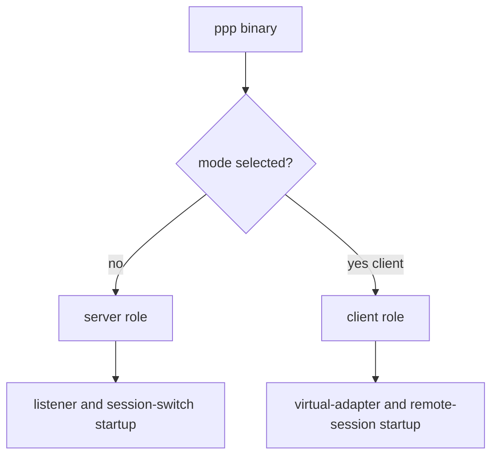
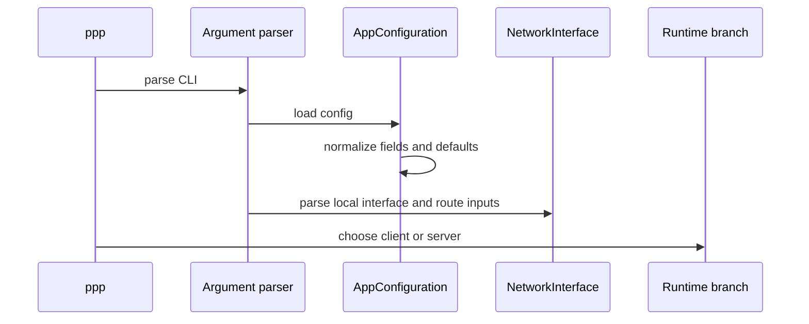
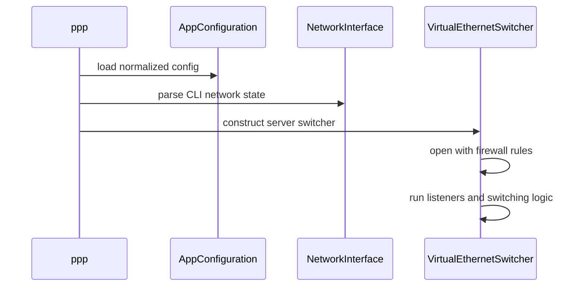
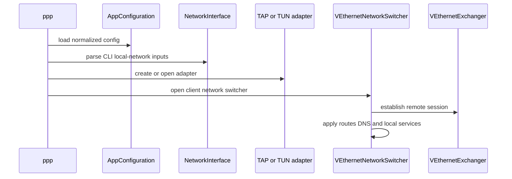

# User Manual

[中文版本](USER_MANUAL_CN.md)

## Scope

This manual explains how to operate OPENPPP2 as a real network infrastructure runtime rather than as a toy tunnel executable. It is intentionally written for operators, maintainers, and developers who need to understand what the system is, how it starts, how it should be deployed, how to run it safely, and how to reason about its behavior across platforms.

The manual is grounded in the actual code layout of the project, especially:

- `main.cpp`
- `ppp/configurations/AppConfiguration.*`
- `ppp/transmissions/*`
- `ppp/app/client/*`
- `ppp/app/server/*`
- `ppp/app/protocol/*`
- platform-specific directories under `windows/`, `linux/`, `darwin/`, and `android/`

This document should be read as the operator-facing bridge between:

- the architectural documents
- the protocol and transmission documents
- the platform and operations documents

## What OPENPPP2 Is Operationally

OPENPPP2 is a single-binary client/server virtual Ethernet VPN or SD-WAN runtime. But that sentence by itself is still too small.

Operationally, the project combines several capabilities that are often split across multiple products in other ecosystems:

- a protected tunnel transport core
- a virtual Ethernet or virtual routed data plane
- client-side route and DNS steering
- server-side session switching and policy enforcement
- reverse mapping and service exposure behavior
- optional mux and static packet paths
- platform-specific virtual adapter and route integration
- optional management-backend integration

That is why the system should be operated more like infrastructure software than like a casual one-click consumer VPN application.

## One Binary, Two Runtime Roles

`ppp` has two runtime roles:

- `server`
- `client`

If no mode is supplied, the process defaults to `server` mode.



This matters because the project is not built as two separate executables. Both roles share the same codebase, the same configuration model, and much of the same protected transport and protocol logic.

## Before Running Anything

An operator should verify a few fundamental facts before starting `ppp`.

### Administrative privilege is required

`main.cpp` checks for administrator or root privilege and rejects unprivileged execution.

This is expected because the runtime needs to:

- open and configure virtual adapters
- manipulate routes and DNS behavior
- interact with system networking state
- run platform helper commands in some cases

### Duplicate role and configuration execution is blocked

The runtime creates a repeat-run lock based on:

- role
- configuration path

That means operators should not assume they can casually start multiple identical processes against the same role and same config file.

### The configuration file is the main model

Even though the CLI is important, the real long-lived definition of the node is the JSON configuration.

The CLI should be treated as:

- startup role selector
- local network shaper
- operational override surface
- utility-command surface

### Platform prerequisites must be checked first

Different platforms need different prerequisites.

On Windows you should check:

- Wintun availability
- TAP-Windows fallback environment
- permission to alter system networking state

On Linux you should check:

- `/dev/tun`
- route manipulation capability
- interface naming and local topology assumptions
- whether route protection should remain enabled

On macOS you should check:

- `utun` availability
- interface and route behavior expectations

On Android you should check:

- VPN integration layer
- VPN FD injection path
- protect-socket integration path

## Startup Model

At startup, the runtime roughly does the following:

1. parse arguments
2. load and normalize configuration
3. determine whether the process is client or server
4. parse network-interface shaping options
5. initialize runtime-level environment pieces such as DNS helper state and thread limits
6. take the client branch or server branch
7. either open the client switcher plus virtual adapter, or open the server session switch plus listeners



This split is one of the best ways to mentally organize the product. OPENPPP2 is not “just transport” and not “just a virtual adapter.” It is a process that first shapes state, then chooses a runtime branch, then opens the relevant environment.

## How Server Mode Should Be Understood

Server mode is not simply “listen and forward.” In operational terms the server is responsible for:

- opening listeners for the configured carriers
- building the session switch
- accepting or admitting sessions
- applying firewall and policy gates
- allocating virtual network state
- handling NAT, mappings, optional IPv6, and backend cooperation

This means the server is the policy and exchange center of the overlay.

### Minimal server start

```bash
ppp --mode=server --config=./appsettings.json
```

### Server start with explicit firewall rules

```bash
ppp --mode=server --config=./appsettings.json --firewall-rules=./firewall-rules.txt
```

### Server startup sequence in code terms

In the server branch, `main.cpp` does the following at a high level:

- prepare Linux IPv6 environment first when applicable
- construct `VirtualEthernetSwitcher`
- apply preferred NIC selection
- open the switcher with firewall rules
- run listeners and session processing



### When server mode is the right choice

Use server mode when the node is intended to be:

- the central admission point for clients
- the session-policy switch of the deployment
- the tunnel-side gateway for remote access
- the server-side exposure point for mappings or reverse-published services
- the IPv6 allocator or policy owner in deployments that use the IPv6 extension model

## How Client Mode Should Be Understood

Client mode is not merely “connect to server.” It is responsible for creating a local virtual networking environment and deciding what local traffic enters the overlay.

Operationally, client mode is responsible for:

- opening or creating the virtual adapter
- selecting or discovering local interface and gateway context
- shaping local routes and DNS behavior
- creating the remote exchanger and maintaining the session
- exposing optional local proxy or mapping behavior
- optionally participating in static mode and mux paths

### Minimal client start

```bash
ppp --mode=client --config=./appsettings.json
```

### Client start with explicit adapter shaping

```bash
ppp --mode=client --config=./appsettings.json --tun=openppp2 --tun-ip=10.0.0.2 --tun-gw=10.0.0.1 --tun-mask=30
```

### Client startup sequence in code terms



### When client mode is the right choice

Use client mode when the node is intended to be:

- a remote user edge
- a branch edge entering an overlay
- a local route and DNS steering node
- a client-side proxy or service-publication initiator

## Configuration And CLI Together

The best operational model is to let the configuration file define the node’s durable identity and let the CLI shape the local launch environment.

For example:

- carrier type, keys, backend details, mapping declarations, and transport blocks belong in JSON
- local adapter name, local test address, route-file choice, helper command use, and some platform overrides often belong in CLI

This separation helps prevent accidental drift between infrastructure intent and local launch experiments.

## Choosing The Carrier

Carrier selection should follow deployment constraints rather than fashion.

### TCP

Use when:

- the path is straightforward
- simple deployment matters more than HTTP-facing edge compatibility
- the environment does not require WebSocket semantics

### WS

Use when:

- the tunnel must pass through HTTP-oriented infrastructure
- the edge environment naturally expects WebSocket semantics

### WSS

Use when:

- the deployment requires TLS at the WebSocket edge
- reverse proxies or CDN-style entry points are involved
- certificate management is already part of the environment

Operationally, the important thing to remember is that the upper tunnel and handshake logic remain OPENPPP2’s own logic above the carrier.

## Choosing Full Tunnel Versus Split Tunnel

Before adjusting small route parameters, decide the deployment model.

### Full tunnel

Use when:

- most or all traffic should enter the overlay
- the remote server is the intended main egress or policy point

### Split tunnel

Use when:

- only selected routes, domains, or DNS flows should enter the overlay
- the host should continue to use local egress for general traffic

### Subnet-forwarding edge

Use when:

- the client behaves more like a site edge than a single host tunnel endpoint

### Local proxy edge

Use when:

- local HTTP or SOCKS functions are part of the deployment design

The mistake to avoid is tuning bypass and DNS rules before deciding which of these designs the node is supposed to implement.

## Route And DNS Inputs Are Policy, Not Decoration

Operators should treat:

- bypass files
- route files
- DNS rules files
- `virr` country IP lists

as policy artifacts.

They are not secondary metadata. They directly determine which traffic enters the overlay and which traffic remains local.

This is one of the places where OPENPPP2 feels much more like router or SD-WAN software than like a simple per-app proxy tool.

## Choosing Static Mode

Static mode should be enabled only when the deployment intentionally wants the static packet path.

The wrong reason to enable it is:

- “it sounds advanced”
- “it sounds faster”

The right reason to enable it is:

- the deployment model has been designed around the `VirtualEthernetPacket` path and its semantics

This is important because static mode is not a tiny feature flag. It changes the packet model used by the system.

## Choosing MUX

MUX should be used when the deployment benefits from additional logical sub-links on top of an established session.

The right way to think about MUX is:

- it is a connection-structure feature
- it is not a universal replacement for the primary tunnel
- it should be enabled because the deployment needs it, not because it exists

Operators should also remember that MUX has both client-side and server-side runtime implications.

## Choosing IPv6

IPv6 should only be enabled after deciding three things clearly:

1. the server is intentionally configured for IPv6 service
2. the deployment really needs overlay IPv6
3. the target platform supports the required IPv6 data-path behavior

This matters because OPENPPP2’s IPv6 support is not just “allow IPv6 packets.” It includes:

- lease handling
- prefix and gateway logic
- address-to-session expectations
- platform-sensitive behavior, with Linux carrying the richest server-side implementation

## Windows Operational Notes

Windows is not a generic “same as Linux but with different APIs.” It has a distinct operational model.

Important facts:

- Wintun is preferred when available
- TAP-Windows exists as fallback behavior
- helper commands can modify system network preference and reset behavior
- system HTTP proxy integration exists through the parser even though not fully printed in help

What operators should verify on Windows:

- adapter installation state
- whether Wintun or TAP path is active
- whether system-proxy-related behavior is intentional
- whether `--block-quic` and proxy-related choices are compatible with the deployment

## Linux Operational Notes

Linux carries some of the most infrastructure-heavy behavior in the project.

Important facts:

- `/dev/tun` behavior is central
- route protection is important
- `--tun-ssmt` and multiqueue can materially change I/O behavior
- bypass interface selection can change route outcomes
- server-side IPv6 support is most complete here

What operators should verify on Linux:

- actual interface names and route ownership
- whether route protection stays enabled
- whether multiqueue is really needed
- whether bypass NIC choice is correct for the topology

## macOS Operational Notes

macOS uses `utun` and has a smaller feature surface than Linux, but it should still be treated as its own operational environment.

What operators should verify on macOS:

- the actual `utun` behavior in the host environment
- route application correctness
- whether promiscuous and SSMT-related shaping is appropriate

## Android Operational Notes

Android is not a normal desktop-style CLI-first environment.

It relies on:

- VPN-style integration
- externally supplied VPN file descriptors
- protect-socket support in the surrounding environment

Operators and developers should therefore treat Android as a platform-integration target, not just “another place to run the same binary in the same way.”

## What To Verify After Startup

After starting `ppp`, verify at least the following:

- the process entered the intended role
- the expected configuration file was loaded
- the expected local adapter was created or opened
- the expected server listeners or remote client session are active
- route and DNS policy reflect the intended deployment
- optional features such as static, mux, mappings, or local proxy listeners are enabled only when expected

## Common Operator Mistakes

Several mistakes are especially easy to make in a project like this.

### Mistaking CLI shape for full system understanding

Knowing a few switches is not enough. Many important behaviors live in the JSON model and in platform runtime logic.

### Enabling optional features because they sound advanced

Static mode, MUX, mappings, local proxies, and IPv6 should be turned on because the deployment needs them, not because they are available.

### Treating route and DNS files as minor details

These are policy artifacts. They decide traffic placement.

### Assuming identical behavior across platforms

Same intention does not imply same operational reality across Windows, Linux, macOS, and Android.

## How To Use This Manual With Other Docs

The best reading order for an operator is:

1. this user manual
2. `CLI_REFERENCE.md`
3. `CONFIGURATION.md`
4. `DEPLOYMENT.md`
5. `OPERATIONS.md`
6. `PLATFORMS.md`
7. protocol and security documents when deeper debugging is needed

The best reading order for a developer moving from operations into implementation is:

1. this user manual
2. `STARTUP_AND_LIFECYCLE.md`
3. `TRANSMISSION.md`
4. `HANDSHAKE_SEQUENCE.md`
5. `PACKET_FORMATS.md`
6. `CLIENT_ARCHITECTURE.md`
7. `SERVER_ARCHITECTURE.md`

## Final Operating Mindset

OPENPPP2 should be operated with the mindset used for infrastructure software:

- know the role of the node
- know the topology around it
- know what traffic should enter the overlay
- know what services are intentionally being exposed
- know what platform-local behavior is being invoked

If that mindset is followed, the system becomes far easier to deploy and reason about.

## Related Documents

- [`CLI_REFERENCE.md`](CLI_REFERENCE.md)
- [`CONFIGURATION.md`](CONFIGURATION.md)
- [`DEPLOYMENT.md`](DEPLOYMENT.md)
- [`OPERATIONS.md`](OPERATIONS.md)
- [`PLATFORMS.md`](PLATFORMS.md)
- [`TRANSMISSION.md`](TRANSMISSION.md)
