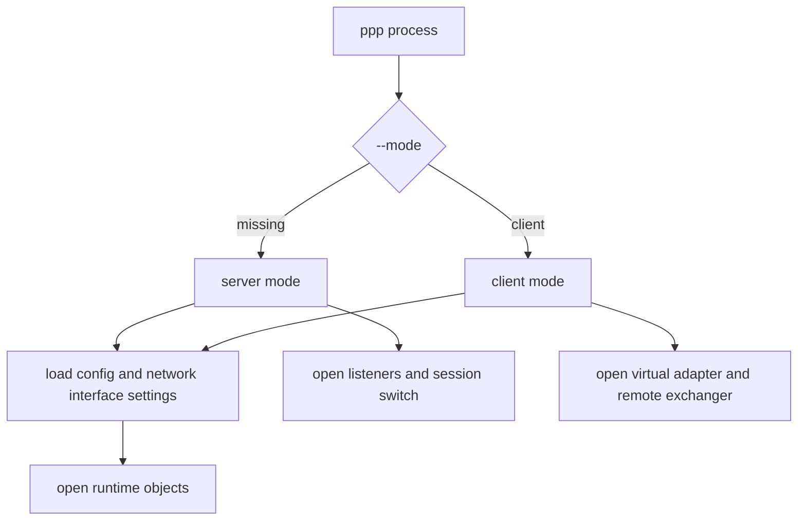
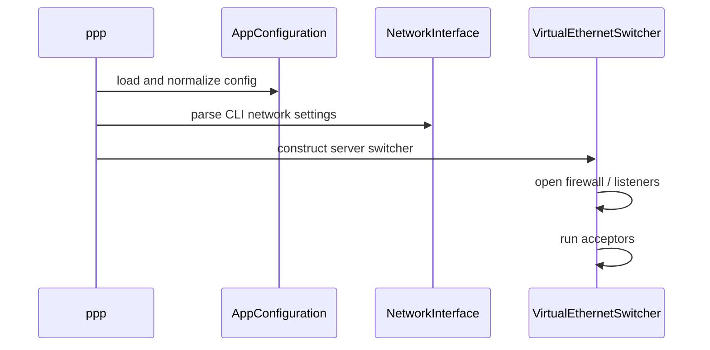
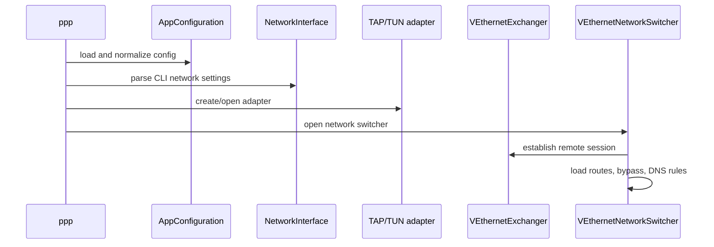

# User Manual

[中文版本](USER_MANUAL_CN.md)

## Scope

This manual explains how to operate OPENPPP2 as a network infrastructure runtime.

It is written from the codebase as it exists now:

- one executable: `ppp`
- two runtime roles: `server` and `client`
- one shared configuration model plus command-line overrides
- platform-specific adapter and route handling under a shared protocol core

## Operating Model

`ppp` starts in `server` mode unless `--mode=client` is supplied.



## Before You Run It

- Run as administrator or root. `main.cpp` rejects non-privileged execution.
- Expect one active instance per role and configuration path. The process creates a repeat-run lock.
- Treat `appsettings.json` as the main configuration entry point and CLI switches as runtime shaping inputs.
- Validate platform-specific prerequisites first: TAP/Wintun on Windows, `/dev/tun` on Linux, `utun` support on macOS, VPN service integration on Android.

## Typical Server Workflow

### What the server does

The server runtime is responsible for:

- opening tunnel listeners
- creating the session switch
- applying firewall rules when configured
- allocating virtual network state
- optionally reporting to the management backend

### Basic startup

```bash
ppp --mode=server --config=./appsettings.json
```

### With explicit firewall rules

```bash
ppp --mode=server --config=./appsettings.json --firewall-rules=./firewall-rules.txt
```

### Server startup sequence



## Typical Client Workflow

### What the client does

The client runtime is responsible for:

- creating or opening a virtual adapter
- preparing local route and DNS policy
- creating the remote exchanger
- opening optional local proxy, mapping, static, and mux features

### Basic startup

```bash
ppp --mode=client --config=./appsettings.json
```

### With explicit adapter and tunnel addresses

```bash
ppp --mode=client --config=./appsettings.json --tun=openppp2 --tun-ip=10.0.0.2 --tun-gw=10.0.0.1 --tun-mask=30
```

### Client startup sequence



## Configuration And CLI Relationship

OPENPPP2 uses both JSON configuration and CLI arguments.

- JSON defines the persistent runtime model.
- CLI changes startup role, local interface behavior, route helpers, and platform operations.
- Some CLI switches are operational helpers rather than long-term configuration.

Use these documents together:

- [`CONFIGURATION.md`](CONFIGURATION.md)
- [`CLI_REFERENCE.md`](CLI_REFERENCE.md)

## Choosing A Transport

Use transport choice based on network environment rather than aesthetics.

- Use TCP when you need straightforward deployment and minimal intermediaries.
- Use WS or WSS when the tunnel must pass through HTTP-oriented infrastructure, reverse proxies, or CDN-style edges.
- Use WSS when TLS termination and certificate-based deployment are part of the environment.

The codebase supports multiple carriers, but the tunnel model above them stays shared.

## Choosing Optional Features

### Static mode

Use `--tun-static=yes` when you intentionally want the static packet path described in `VirtualEthernetPacket`-based handling.

Do not enable it only because it sounds faster. It changes the data path shape and should match the deployment design.

### MUX

Use `--tun-mux=<connections>` when the deployment benefits from additional logical sub-links created by the client and accepted by the server.

This is not a universal replacement for the primary tunnel. It is an additional path model.

### IPv6

Use client IPv6 requests only when the server-side IPv6 service is intentionally configured and the target platform supports the required path.

Linux currently contains the richest IPv6 server-side machinery.

### Routing and bypass

Use bypass files, route files, and DNS rules only after deciding whether the deployment is:

- full tunnel
- split tunnel
- subnet forwarding
- local proxy edge

Those decisions should come before parameter tuning.

## Platform Notes

### Windows

- Preferred adapter path is Wintun, with TAP-Windows fallback.
- Supports Windows-only helper commands such as network reset and preferred IP family selection.
- Supports a system HTTP proxy handoff path through `--set-http-proxy`, even though it is not printed in the help table.

### Linux

- Uses `/dev/tun` and supports Linux-specific route protection and SSMT multiqueue behavior.
- Carries the most complete IPv6 server-side implementation.
- Route and interface behavior depends heavily on actual host network layout.

### macOS

- Uses `utun`.
- Supports promiscuous and SSMT-related client shaping, but with a smaller platform feature surface than Linux.

### Android

- Integrates as an Android VPN-style target rather than a normal desktop binary workflow.
- Expect the data path to rely on externally provided VPN file descriptors and protect-socket hooks.

## Verification Checklist

After startup, confirm at least these facts:

- the process selected the intended role
- the expected adapter name and addresses were applied
- the expected listeners or remote endpoint are active
- routes and DNS rules match the deployment intent
- optional features such as static, mux, or mapping are enabled only when intended

## Operational Warnings

- Help output and parser behavior are close but not perfectly identical. Some implemented switches, such as `--set-http-proxy`, are parsed in code without a full help-table entry.
- Defaults may be platform-sensitive, such as `--lwip` on Windows depending on Wintun availability.
- Linux and Windows differ materially in route protection and system integration behavior. Do not assume parameter equivalence means implementation equivalence.

## Related Documents

- [`CLI_REFERENCE.md`](CLI_REFERENCE.md)
- [`CONFIGURATION.md`](CONFIGURATION.md)
- [`DEPLOYMENT.md`](DEPLOYMENT.md)
- [`OPERATIONS.md`](OPERATIONS.md)
- [`PLATFORMS.md`](PLATFORMS.md)
