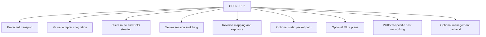
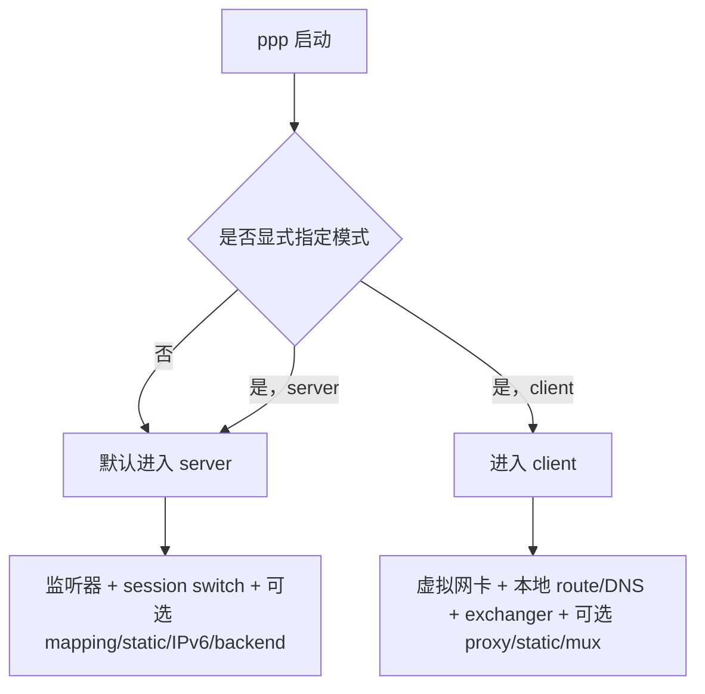
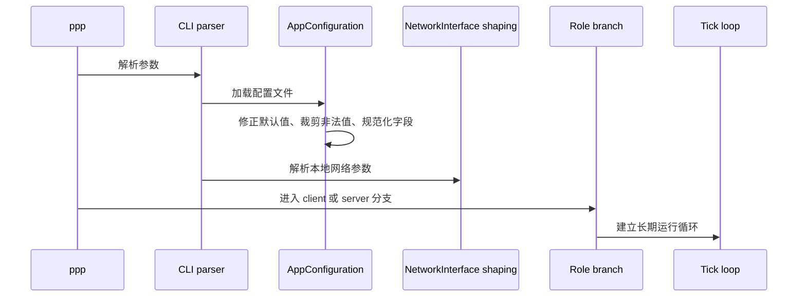
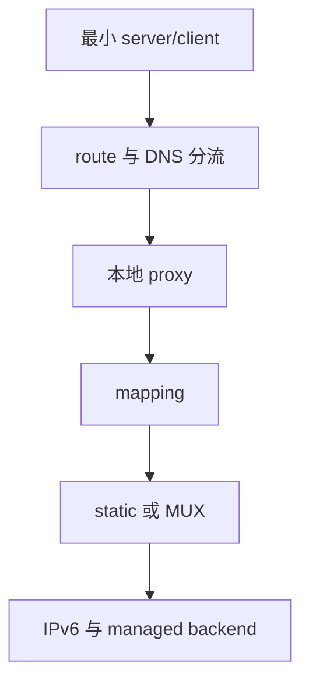

# 用户手册

[English Version](USER_MANUAL.md)

## 文档定位

本文不是“快速体验说明”，也不是“把几个命令拼起来就能跑”的短说明。本文的目标，是把 OPENPPP2 作为一套真正的网络基础设施运行时来说明，让使用者在运行它之前，先理解它是什么、它会改变宿主机什么、它应该以什么角色被部署、它适合哪些场景、不适合哪些场景，以及在不同平台上应该如何做出正确的操作决策。

这份文档面向三类读者：

- 直接部署和运行 OPENPPP2 的使用者
- 为团队或站点设计接入方案的网络运维人员
- 需要从“如何使用”一路追到“为什么会这样工作”的开发者与维护者

本文以代码事实为准，重点锚定：

- `main.cpp`
- `ppp/configurations/AppConfiguration.*`
- `ppp/transmissions/*`
- `ppp/app/protocol/*`
- `ppp/app/client/*`
- `ppp/app/server/*`
- `windows/*`
- `linux/*`
- `darwin/*`
- `android/*`

本文在整套文档中的位置，是把以下几类更“工程内部”的文档，桥接成一份真正可落地的使用文档：

- 架构文档
- 传输与协议文档
- 平台文档
- 部署文档
- 运维文档

如果你只想先知道“这个东西到底该怎么用”，请先读本文；如果你在读本文的过程中不断想追问“为什么”，请按文末的相关文档继续向下钻。

## 先说结论：OPENPPP2 到底是什么

如果只用一句非常短的话来概括，OPENPPP2 是一个单二进制、多角色、跨平台的虚拟网络运行时。它既能运行成 client，也能运行成 server，还能在这个基础上叠加路由分流、DNS 分流、反向映射、静态数据路径、MUX、多平台宿主网络集成、可选管理后端等能力。

但这句话仍然过于短。真正有助于使用者理解它的说法应该是：OPENPPP2 不是一个“只有隧道本身”的工具，而是一套把隧道、虚拟接口、系统路由、DNS、会话策略、映射转发、平台辅助行为整合在一起的网络运行时。

这意味着使用 OPENPPP2 时，你不能只把它当作：

- 一个 socket 到另一个 socket 的加密连接
- 一个能连上就算成功的 VPN 程序
- 一个简单的代理客户端

你应该把它当成：

- 一个会创建或接入虚拟网络接口的系统进程
- 一个会对本机 route、DNS、网络偏好产生真实影响的运行时
- 一个有明确 client/server 角色分工的 overlay 节点
- 一个在 server 侧承担 session switch、mapping、IPv6 管理、策略执行职责的网络节点



## 使用者最容易犯的第一个错误

使用者最容易犯的第一个错误，是把 OPENPPP2 当成“配置一个 server 地址，然后点击连接”的软件。这种理解方式会导致后续很多判断全都偏掉。

因为 OPENPPP2 的真实使用模型是：

- 先决定当前节点在整个网络中的角色
- 再决定当前节点应该承担哪些平面能力
- 再决定它在当前宿主机上应该如何接入网络
- 最后才是“具体怎么启动和怎么调参数”

也就是说，顺序应该是：

1. 先明确你的网络目标
2. 再明确这个节点是 client 还是 server
3. 再明确是全隧道、分流、代理边缘、站点边缘、服务暴露、IPv6 分配等哪种用法
4. 最后才去写 JSON 和命令行

很多“为什么没有流量”“为什么 route 不对”“为什么 DNS 不符合预期”的问题，根源都不是参数少敲了一个，而是第一步的角色理解就错了。

## 一个二进制，两种角色

OPENPPP2 的主程序是 `ppp`。它只有一个主二进制，但有两种运行角色：

- `server`
- `client`

如果你不显式指定 `--mode=client`，默认会进入 `server` 角色。这一点不是文档假设，而是 `main.cpp` 中角色解析逻辑的直接结果。

角色选择之所以重要，是因为它会决定整个启动分支：

- `server` 分支会打开监听器、创建会话交换器、承接远端连接、建立策略与映射边界
- `client` 分支会创建或打开虚拟网卡、建立本地路由与 DNS 环境、创建远端 exchanger，并把本地主机的一部分流量送入 overlay



### 什么时候你应该运行成 server

当一个节点需要承担以下职责时，它应该运行成 `server`：

- 作为远端 client 的接入锚点
- 作为 overlay 网络中的会话接入与会话切换中心
- 作为反向映射和服务暴露的公网或边缘节点
- 作为客户端 IPv6 分配、响应、管理逻辑的一侧
- 作为可选 managed backend 的策略消费端

### 什么时候你应该运行成 client

当一个节点需要承担以下职责时，它应该运行成 `client`：

- 在本地创建或接入虚拟网络接口
- 把本地主机或本地子网的一部分流量送入 overlay
- 作为远端接入边缘
- 作为本地 route steering 和 DNS steering 的执行者
- 作为本地 HTTP/SOCKS proxy 的承载者
- 作为反向服务发布的一侧发起端

### 不要把 client 和 server 理解成对等 peer

虽然 client 和 server 在协议层共享很多词汇，例如同样认识 link-layer action、同样参与信息交换、同样持有 transmission，但它们在行为上并不是完全对称的 peer。

代码里 client 和 server 都有“方向非法则直接拒绝”的处理。也就是说：

- 某些动作只允许 client 发给 server
- 某些动作只允许 server 发给 client
- 某些动作只允许在某一侧作为主会话建立后才有效

这件事对使用者的意义是：你不能把两个节点随便互换定位，或者把某些 server 配置直接搬给 client 指望它按“镜像角色”工作。

## 运行前必须确认的四件事

在任何平台上真正启动 `ppp` 之前，建议先确认四件事。这四件事看似基础，但不先确认好，后面所有问题都会放大。

### 第一件事：管理员权限

`main.cpp` 会检查管理员或 root 权限。没有权限，程序会直接拒绝运行。

这是合理的，因为 OPENPPP2 不是一个只在用户态做一点 socket 事情的程序。它会：

- 打开虚拟网卡
- 修改路由
- 修改 DNS
- 在某些平台上执行系统网络相关辅助逻辑
- 在 server 模式下打开监听器
- 在 Linux IPv6 server 场景中启用 forwarding 和 `ip6tables` 规则

所以，权限不足时不要继续做“协议层排障”。先解决宿主执行权限问题。

### 第二件事：配置文件路径

OPENPPP2 会优先查找命令行传入的配置文件；若没有，则尝试 `./config.json` 和 `./appsettings.json`。实际生产中，建议你始终明确指定配置路径，而不是把行为建立在当前工作目录上。

推荐做法是：

- 每个角色一份明确的配置文件
- 每个环境一份明确的配置文件
- 启动命令始终显式传 `--config`

不推荐做法是：

- 把 client 和 server 配置长期混在一份难以判断的 JSON 里
- 依赖当前目录刚好有一个叫 `appsettings.json` 的文件

### 第三件事：平台前置条件

平台不同，前置条件不同。

Windows 上要先确认：

- 当前环境到底走 Wintun 还是 TAP-Windows
- 是否允许修改系统网络设置
- 当前系统是否存在代理、浏览器网络偏好或其他可能干扰结果的历史状态

Linux 上要先确认：

- `/dev/tun` 或 `/dev/net/tun` 可用
- 本机具备 route 操作能力
- route protection 是否该开启
- 若 server 要做 IPv6 transit，则内核与系统工具链满足前提

macOS 上要先确认：

- `utun` 正常
- 当前环境允许接口、route、resolver 变更

Android 上要先确认：

- VPN host 层存在
- Java/Kotlin 到 native 的 TUN fd 注入链正常
- `protect(int)` 调用链已接通

### 第四件事：不要重复启动同一角色和同一路径配置

运行时会对“当前角色 + 当前配置路径”建立重复运行保护。实际操作中，不要把同一套配置在同一台机子上重复启动两次，再把之后产生的混乱当作网络异常。

## 从使用者视角看，启动过程到底发生了什么

不管当前是 client 还是 server，`ppp` 的启动过程大致都分为几个阶段：

1. 命令行解析
2. 配置读取与规范化
3. 模式识别
4. 网络接口与本地整形参数解析
5. 角色分支初始化
6. 打开 client 或 server 的主运行时对象
7. 进入定时 tick 和长期运行



这个顺序意味着：OPENPPP2 的行为不是“参数读进来马上开始连”。很多默认值、兼容值、平台值和本地网络值，都会在真正打开运行时前被整形。

因此，使用者应该习惯一种思路：

- 看到配置值时，不要只看它文本上写了什么
- 要问它最后在规范化后会变成什么
- 要问当前平台是否支持它
- 要问它是在 startup 生效、session establish 生效，还是在后续收到 server information 后才真正生效

## 作为使用者，你最应该先掌握的五种部署形态

OPENPPP2 可以支持很多复杂能力，但从使用者角度，优先应先掌握五种基本部署形态。把这五种形态理解透了，再往上叠加 static、MUX、mapping、managed IPv6 等能力，成本会低很多。

### 第一种：最小 client 对最小 server

这是最简单、最干净的入门形态。

其特点是：

- server 提供最小 listener
- client 连接该 listener
- 不做复杂 route list，不做复杂 DNS list，不做复杂 mapping
- 不要求 managed backend

使用这个形态的目的，不是为了长期生产，而是为了确认：

- 基础 carrier 可达
- 基础 session 可建立
- 虚拟网卡可打开
- 基础流量可进入 overlay

推荐在以下情况下先用这种形态：

- 第一次验证一台新机器能否运行 OPENPPP2
- 第一次在某个平台上验证编译产物
- 需要快速判断“问题在宿主环境还是在高级功能配置”

### 第二种：client 分流接入

这是真正常见的使用形态之一。客户端不会把所有流量都导入 overlay，而是：

- 使用 bypass list
- 使用 route list
- 使用 DNS rule
- 对部分流量导入 overlay
- 对剩余流量保留在本地网络

适用场景包括：

- 企业内网接入，只需要部分业务前缀进入远端
- 本地访问互联网仍然走原出口，但企业域名解析、企业前缀路由走 overlay
- 某些 ISP 路由、某些地区前缀、某些目标域名需要指定走隧道

使用这种形态时，最重要的不是“连接成功”，而是“流量边界是否符合预期”。因此使用者应重点管理：

- bypass 文件
- route 文件
- `virr` 自动更新输入
- DNS 规则文件

### 第三种：client 作为本地代理边缘

在这种形态下，使用者更关心的是本地应用如何通过 HTTP 或 SOCKS 代理进入 overlay，而不是整个系统路由是否改变。

这种模式适合：

- 不希望整机大改路由
- 只让部分应用使用 overlay
- 希望通过浏览器、工具链或指定进程使用本地代理

这种形态下要重点理解：

- client 仍然是完整的 tunnel client
- 本地代理只是 client runtime 的一部分表面
- 不要把“本地代理端口开了”误当成“整个 tunnel 行为就正确了”

### 第四种：client 作为站点边缘

当 client 不只是代表一台主机，而是代表一个小型站点、一个子网、一个实验室或一个办公区边缘时，它更像一台软路由边缘节点。

这时你要考虑的就不是单主机 VPN，而是：

- `--tun-vnet`
- `--tun-host`
- route 注入
- 本地 next-hop
- 宿主机与下游子网的关系

在这种模式下，client 的职责更接近“子网入口节点”，而不是普通终端软件。

### 第五种：server 作为会话与发布中心

在更完整的部署中，server 不只是接入点，还可能同时承担：

- 反向 mapping 的发布中心
- 静态数据路径的接收端
- IPv6 lease 与 transit 的控制侧
- managed backend 策略消费侧

这意味着 server 需要被运维成一个真正的网络节点，而不是“开个端口等人连”。

## 使用者如何读配置文件

OPENPPP2 的 JSON 配置不是一堆平铺字段，而是一套结构化模型。最有帮助的读法，是按“这部分定义了哪种平面”来读。

### `key`

决定的是 protected transport 的基础行为。包括：

- `kf`
- `kh`
- `kl`
- `kx`
- `sb`
- `protocol`
- `protocol-key`
- `transport`
- `transport-key`
- `masked`
- `plaintext`
- `delta-encode`
- `shuffle-data`

使用者在读这部分时，应把它理解成：

- 握手前后传输层的保护与扰动参数
- 不同 carrier 之上的统一 transmission behavior 定义

不要把它理解成“勾选了某个算法就等价于某个成熟现成 VPN 的全部安全语义”。这类结论应以 `SECURITY_CN.md` 为准，而不是按算法名直接类比。

### `tcp`、`udp`、`mux`、`websocket`

这些分组定义的是 carrier 层与相关子平面的行为。

例如：

- `tcp` 决定 stream listener、connect timeout、窗口与 backlog
- `udp` 决定 datagram、DNS redirect、static path、aggligator
- `mux` 决定附加子链路的超时、拥塞、保活
- `websocket` 决定 WS/WSS 的 host、path、证书、HTTP 装饰字段

这些分组不应与“客户端或服务端业务角色”混为一谈。它们首先是 carrier behavior 定义。

### `server`

定义服务端节点行为。包括但不限于：

- `log`
- `node`
- `subnet`
- `mapping`
- `backend`
- `backend-key`
- `ipv6`

使用者应把这一组理解成：

- 当前 server 节点在 overlay 中承担哪些功能
- 是否只是一个最小接入 server
- 是否同时做 mapping
- 是否需要 managed backend
- 是否要提供 IPv6 服务

### `client`

定义客户端节点行为。包括但不限于：

- `guid`
- `server`
- `server-proxy`
- `bandwidth`
- `reconnections.timeout`
- `http-proxy`
- `socks-proxy`
- `mappings`
- `routes`

这一组决定的不是“隧道本身”，而是：

- 当前 client 如何接入 server
- 如何重连
- 是否暴露本地代理
- 是否发布本地服务
- 是否加载 route input

### `ip` 与 `vmem`

它们属于辅助但不应忽视的部分。

`ip` 会影响：

- 对本机监听接口的理解
- 某些服务端本地地址解析行为

`vmem` 会影响：

- 是否启用 buffer swap allocator
- 运行时的大块缓冲区管理方式

对普通使用者而言，这两组不一定是第一批需要改的；但一旦部署规模上来，`vmem` 和地址提示就可能成为非常现实的性能与稳定性输入。

## 命令行在真实使用中的角色

尽管 JSON 是长期模型，但 CLI 在 OPENPPP2 中非常重要。它不是装饰项，而是：

- 模式选择器
- 本地网络整形器
- 一次性 utility 命令面板
- 平台 helper command 入口

使用者应该优先掌握下面几组命令行用途。

### 第一组：最基本的启动命令

最基本的 server 启动：

```bash
ppp --mode=server --config=./appsettings.json
```

最基本的 client 启动：

```bash
ppp --mode=client --config=./appsettings.json
```

查看帮助：

```bash
ppp --help
```

### 第二组：本地 network shaping 命令

这些命令用来调整 client 在当前宿主机上的实际行为，例如：

- `--nic`
- `--ngw`
- `--tun`
- `--tun-ip`
- `--tun-ipv6`
- `--tun-gw`
- `--tun-mask`
- `--tun-vnet`
- `--tun-host`
- `--tun-static`
- `--tun-mux`
- `--tun-mux-acceleration`

使用这些参数时的思路应当是：

- JSON 负责长期身份
- CLI 负责本次运行的宿主网络落地形态

### 第三组：route 与 DNS 策略输入命令

这些命令决定“什么流量进入 overlay，什么流量留在本地”。例如：

- `--dns`
- `--bypass`
- `--bypass-nic`
- `--bypass-ngw`
- `--virr`
- `--dns-rules`

这一组对真实可用性影响极大。很多时候 tunnel 自身没有问题，问题却出在 route 和 DNS 策略根本不是你以为的那样。

### 第四组：辅助生命周期命令

例如：

- `--auto-restart`
- `--link-restart`
- `--block-quic`
- `--tun-flash`

这些参数不会直接改变隧道协议语义，但会显著改变使用体验和运维行为。

## 常见 carrier 的正确理解

作为使用者，应把 carrier 先看成“接入方式”和“部署约束”的选择，而不是看成“哪个名字更高级”。

### `ppp://`

它通常表示原生 TCP 直连型 carrier。适用于：

- 你可以直接连到 server
- 你不需要 WebSocket 边缘兼容性
- 你更希望 carrier 路径简单直接

这通常是最应优先验证的 carrier，因为它最直接、变量最少。

### `ws://`

它适用于：

- 你希望通过 WebSocket 栈穿过某些 HTTP 风格基础设施
- 你当前部署天然依赖 WS 路径

但应记住，WebSocket 只是 carrier，不代表 tunnel action 层的行为发生了本质变化。

### `wss://`

它适用于：

- 需要 TLS 化的 WebSocket 入口
- 部署上存在 reverse proxy、CDN、HTTPS 边缘
- 你本来就需要证书、host、path、HTTP 头修饰等行为

使用 `wss://` 时，除了 tunnel 本身，还必须同时正确处理：

- 证书路径
- 证书口令
- host
- path
- verify-peer
- 前置 ingress 或 CDN 行为

## 路由策略是使用手册的核心，不是附录

OPENPPP2 是否真正“好用”，很大程度不取决于隧道能否握手，而取决于你的 route 策略是否写对。

### 你至少要先区分三种 route 使用姿态

#### 姿态一：尽量全量进入 overlay

这种模式适合：

- 你希望远端 server 成为主要出口
- 本地网络只保留必要的 remote endpoint 可达性

#### 姿态二：显式分流

这种模式适合：

- 只让部分前缀进入 overlay
- 本地互联网访问继续走本地出口
- 企业业务、实验网段、指定国家前缀通过 overlay

#### 姿态三：客户端作为边缘子网节点

这种模式适合：

- client 后面挂着一个小网段
- client 更像软路由或站点边缘

### route 文件、bypass 文件、vbgp 输入都属于策略资产

你不应该把它们当成“顺手放一个 txt 文件”。它们应该像配置文件一样被管理。

推荐做法：

- 纳入版本管理
- 明确文件来源
- 明确刷新周期
- 明确谁负责修改

不推荐做法：

- 运维人员每次手工改一版，彼此都不知道哪个是最新
- 把测试环境的 route 文件直接带进生产

### 自动更新的好处与代价

`virr` 和 vBGP 风格输入可以帮助你自动获取和刷新 route list，但代价是：

- route input 本身成为运行的一部分
- 更新后可能触发新的系统行为
- 在某些情况下甚至会导致进程重启以重入干净状态

因此，对使用者来说，自动更新不是“越开越好”，而是“只有你能控制输入质量与更新时机时才应该开”。

## DNS 策略同样不是附属项

在 OPENPPP2 中，DNS 不是“网通了以后顺便解析一下域名”的小问题。它属于系统控制面的重要一层。

你至少应该知道几件事：

- client 可以持有 DNS rule
- DNS 可以被重定向
- server 可以有 namespace cache
- UDP 层对 DNS 有特殊处理路径

因此，当你遇到：

- 域名解析慢
- 域名解析方向不对
- 某些域名明明应走本地却走进了 overlay
- 某些域名明明应走 overlay 却被本地解析了

首先应该检查的不是加密层，而是 DNS 策略文件、DNS 输入、DNS redirect 行为。

## 如何正确看待 static mode

很多人看到 static mode 会下意识把它当成“更高级的数据通道”。这是不准确的。

更准确的理解是：static mode 是一条不同风格的数据路径。它使用 `VirtualEthernetPacket` 所定义的 static packet 格式，server 和 client 两侧会共同参与这条路径的建立和运行。

### 什么时候应该考虑启用 static mode

只有当你的部署明确需要它时，才应该启用。例如：

- 当前方案设计上就依赖 static packet path
- 你已经理解 UDP static servers、keepalive、ICMP、DNS、QUIC 在 static 路径中的行为

### 什么时候不应该启用 static mode

以下理由都不够好：

- “看起来像高级功能”
- “也许更快”
- “别人说可以开，那我也开”

static mode 会改变数据路径模型，不应当在没有明确理由时默认开启。

## 如何正确看待 MUX

MUX 也常被误解成“默认更好”。但在 OPENPPP2 中，MUX 是一个附加平面，不是主会话的简单增强开关。

正确理解应是：

- 主会话先要稳定
- MUX 是在主会话之上增加子连接平面
- client 和 server 两侧都必须共同支持与共同维持

因此，推荐的使用顺序是：

1. 先让基础会话稳定
2. 再在确有需要时开启 MUX
3. 再逐步调整连接数和加速模式

如果一开始就开 MUX，然后再排“为什么基础连接不稳”，会让问题层级完全混乱。

## 如何正确看待反向映射

mapping 让 client 后面的本地服务，通过 server 暴露到更广的可达面上。这不是一个小功能，而是一个明确的服务发布模型。

启用 mapping 前，建议先确认：

- server 上 `server.mapping` 已启用
- client 的 `mappings` 配置真实存在
- 本地服务确实监听在 `local-ip:local-port`
- `protocol` 和远端端口规划清晰

使用 mapping 时，应该从“服务发布”的角度去运维，而不是从“隧道内部通信”的角度去想。因为此时 server 已不只是接入点，而是服务暴露边缘的一部分。

## IPv6 使用说明

IPv6 在 OPENPPP2 中不是“顺手透传 IPv6 报文”这么简单，而是一套带有 assignment、status、route、gateway、DNS、lease、平台应用行为的机制。

### 作为使用者，你应该先知道三件事

第一，server 必须明确配置 IPv6 服务，否则 client 端就不应假设自己会获得稳定 IPv6 行为。

第二，client 端的 IPv6 应用不仅是拿到地址，还包含：

- 地址
- 默认路由
- 前缀路由
- DNS
- 必要时的回滚

第三，当前代码里最完整的 server-side IPv6 data plane 是 Linux-centric 的。这意味着：

- 如果你要认真部署 server IPv6 transit，应优先把 Linux 当参考平台
- 不要想当然地把 Linux 上的 IPv6 server 行为等价套到所有平台

### 客户端请求 IPv6 与服务端下发 IPv6

client 可以通过配置或 CLI 表达自己请求的 IPv6 倾向，但最终以 server 的 assignment 结果和当前平台能否正确 apply 为准。

一旦 apply 链条中某一步失败，runtime 会做 rollback。这意味着从使用者角度要理解：

- 拿到 assignment 不等于 apply 成功
- apply 成功不等于以后永远保持
- assignment 被撤回时，客户端也可能恢复到之前的网络状态

## Windows 使用建议

Windows 是最容易让使用者误以为“和 Linux 差不多”的平台之一，但它实际上有很强的宿主特性。

### 使用前要确认什么

- 当前系统是否已有历史遗留代理设置
- 当前系统是否允许安装或使用虚拟网卡
- 当前环境到底优先走 Wintun 还是 TAP fallback

### 使用时要重点关注什么

- route 是否真正写入系统
- DNS 是否真正落在期望网卡上
- 是否出现了系统 HTTP proxy 联动
- `block-quic`、浏览器、系统网络偏好之间是否有交叉影响

### 适合怎样的使用者

Windows 更像桌面 client 平台，尤其适合：

- 桌面远程接入
- 本地代理接入
- 以宿主机为使用单位的 overlay 接入

## Linux 使用建议

Linux 是当前整个工程里最“基础设施化”的平台之一。

### 使用前要确认什么

- `tun` 设备可用
- 网络管理工具可用
- 是否需要 protect network
- 是否需要多网卡 route 控制
- 若 server 提供 IPv6，则 forwarding、`ip6tables`、uplink 设计都清楚

### Linux client 更像什么

Linux client 很容易被用成：

- 单机接入端
- 本地代理边缘
- 小型站点边缘
- 具备 route steering 的软路由节点

### Linux server 更像什么

Linux server 在较完整部署中更像：

- overlay session switch
- mapping 发布中心
- static path 接收端
- IPv6 transit 和 neighbor proxy 的控制节点

## macOS 使用建议

macOS 主要应被看成一个客户端平台。它有真实的 `utun` 集成，但不应期待它天然等价于 Linux 的全部 server 侧基础设施能力。

使用时重点关注：

- `utun` 接口是否成功分配
- route 和 resolver 变更是否符合预期
- 若启用 IPv6，Darwin 上的 apply/restore 是否执行完整

## Android 使用建议

Android 应被理解成“宿主应用承载 native runtime”的模型，而不是把桌面 CLI 直接照搬到手机上。

使用者应明确：

- Android 上并不是 `ppp` 自己创建 `/dev/tun`
- 它依赖外部 VPN host 提供 TUN fd
- 它依赖 Java/Kotlin 与 JNI protect 调用链

这意味着 Android 上真正的部署单元不是某个二进制文件，而是：

- App 本身
- VPN service 层
- native library
- 宿主生命周期

## 最小可用实践

如果你是第一次接触 OPENPPP2，推荐按下面的顺序逐步打开能力，而不是一步到位。

### 第一步：只验证最小 client/server 可达

先做到：

- server 能起
- client 能连
- 虚拟接口能开
- 基础流量能过

### 第二步：再引入 route 与 DNS steering

先让 route 与 DNS 文件最小化，不要一开始就引入大量外部输入。

### 第三步：再决定是否开放本地代理

这一步的重点不是“开了端口”，而是看应用是否按预期进入 overlay。

### 第四步：再决定是否引入 mapping

此时 server 的角色已经发生变化，建议同时审视防火墙和发布面。

### 第五步：最后才考虑 static、MUX、managed IPv6、managed backend

这些能力都很强，但都不适合在还没稳定理解基础会话时就一起打开。



## 典型启动示例

### 最小 server

```bash
ppp --mode=server --config=./server.json
```

适用：

- 第一轮验证
- 最小入站测试

### 最小 client

```bash
ppp --mode=client --config=./client.json
```

适用：

- 第一轮 client 验证
- 看虚拟接口和基础会话是否正常

### 带本地 DNS 与 route 输入的 client

```bash
ppp --mode=client --config=./client.json --dns=1.1.1.1,8.8.8.8 --bypass=./ip.txt --dns-rules=./dns-rules.txt
```

适用：

- 需要分流策略
- 需要更明确的 DNS steering

### 带显式 adapter shaping 的 client

```bash
ppp --mode=client --config=./client.json --nic=eth0 --ngw=192.168.1.1 --tun=ppp0 --tun-ip=10.0.0.2 --tun-gw=10.0.0.1 --tun-mask=30
```

适用：

- 多网卡环境
- 需要固定命名和固定 overlay IPv4 的场景

### 带本地代理的 client

```bash
ppp --mode=client --config=./client.json
```

前提：

- 配置中的 `client.http-proxy` 或 `client.socks-proxy` 已写好

使用时重点关注：

- 代理监听地址是否正确
- 应用是否真的走了代理

## 使用中的观测点

作为使用者，至少要学会从三个层面观测运行状态。

### 第一层：进程层

看：

- 是否正常启动
- 是否有权限报错
- 是否有配置报错
- 是否重复运行冲突

### 第二层：角色层

client 看：

- 虚拟网卡是否打开
- exchanger 是否建立
- route 和 DNS 是否应用

server 看：

- 监听器是否打开
- session 是否建立
- 是否出现 mapping 或 static datagram 活动

### 第三层：策略层

看：

- route 是否按预期导流
- DNS 是否按预期命中规则
- mapping 是否按预期暴露
- IPv6 是否按预期分配并生效

## 常见误区

### 误区一：能连上就说明配置对了

不对。能连上只说明某条基础会话建立了，不能说明：

- route 对了
- DNS 对了
- 分流对了
- mapping 对了
- IPv6 对了

### 误区二：先把所有高级功能打开再慢慢关

不对。正确方式应该是从最小能力集逐层叠加。

### 误区三：客户端和服务端配置可以大体互抄

不对。client 和 server 虽然共用大量配置模型与协议词汇，但角色职责完全不同。

### 误区四：Windows、Linux、macOS 只是命令不同

不对。它们的 host integration 模型差异很大。

### 误区五：Go backend 是必须的

不对。Go backend 是可选管理后端，不是基础 data plane 的前提。

## 推荐的使用纪律

如果你希望 OPENPPP2 在团队里长期稳定运行，建议遵守以下纪律。

### 第一，配置按角色分离

- client 一份
- server 一份
- backend 一份

### 第二，route 与 DNS 输入纳入版本管理

不要把它们当作临时文件。

### 第三，先稳定基础会话，再叠加高级能力

不要直接把 static、MUX、mapping、IPv6、backend 一起开满。

### 第四，平台问题在平台上验证

例如：

- Windows 行为用 Windows 产物验证
- Linux 行为用 Linux 产物验证
- Android 行为在 Android host 模型中验证

### 第五，把“宿主副作用”当成系统的一部分

不要把 route、DNS、adapter、proxy 的变化看成副作用垃圾信息。对 OPENPPP2 来说，这些本来就是系统行为的一部分。

## 从本文继续往下读什么

如果你已经读完本文，下一步应该按你的目的继续：

如果你想知道整个系统是如何分层的，请继续读：

- [`ARCHITECTURE_CN.md`](ARCHITECTURE_CN.md)

如果你想知道 client 和 server 各自内部是怎么运行的，请继续读：

- [`CLIENT_ARCHITECTURE_CN.md`](CLIENT_ARCHITECTURE_CN.md)
- [`SERVER_ARCHITECTURE_CN.md`](SERVER_ARCHITECTURE_CN.md)

如果你想重点理解 route、DNS 和分流，请继续读：

- [`ROUTING_AND_DNS_CN.md`](ROUTING_AND_DNS_CN.md)

如果你想重点理解命令行和接口输入，请继续读：

- [`CLI_REFERENCE_CN.md`](CLI_REFERENCE_CN.md)

如果你想重点理解部署和运维，请继续读：

- [`DEPLOYMENT_CN.md`](DEPLOYMENT_CN.md)
- [`OPERATIONS_CN.md`](OPERATIONS_CN.md)

如果你想重点理解传输与安全边界，请继续读：

- [`TRANSMISSION_CN.md`](TRANSMISSION_CN.md)
- [`HANDSHAKE_SEQUENCE_CN.md`](HANDSHAKE_SEQUENCE_CN.md)
- [`PACKET_FORMATS_CN.md`](PACKET_FORMATS_CN.md)
- [`SECURITY_CN.md`](SECURITY_CN.md)
