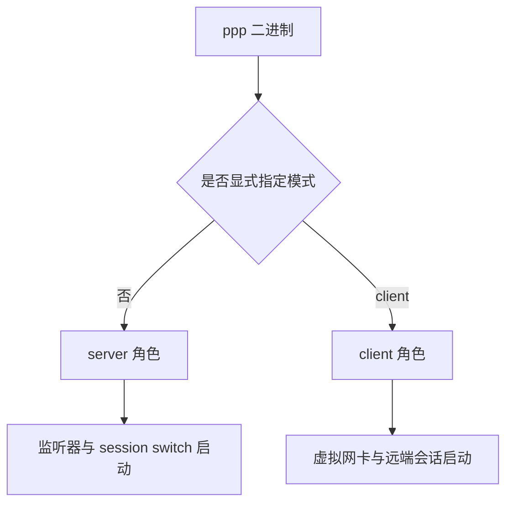
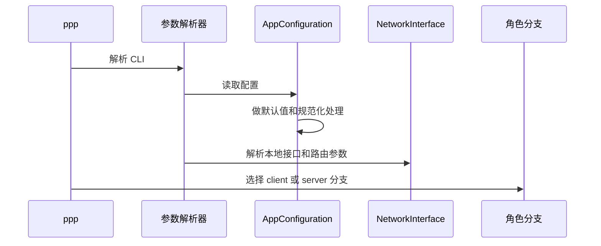
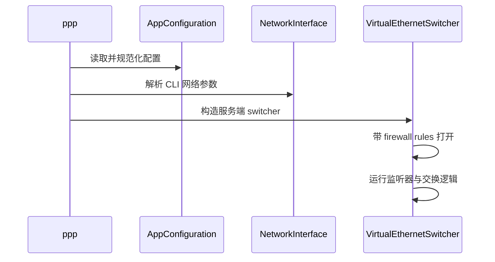
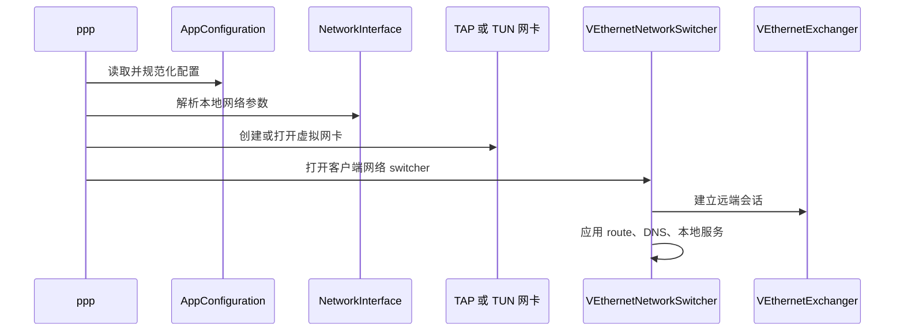

# 用户手册

[English Version](USER_MANUAL.md)

## 文档范围

本文从真正的运维和开发协作视角解释如何使用 OPENPPP2。目标不是把它写成一个“会跑就行”的简易说明，而是把它写成一份基础设施型运行时的用户手册：让读者知道它是什么、怎么启动、怎么部署、不同平台上应该注意什么、什么时候用哪些功能、如何把它和整套文档体系结合起来理解。

本文主要基于以下代码结构：

- `main.cpp`
- `ppp/configurations/AppConfiguration.*`
- `ppp/transmissions/*`
- `ppp/app/client/*`
- `ppp/app/server/*`
- `ppp/app/protocol/*`
- `windows/`、`linux/`、`darwin/`、`android/` 下的平台实现

这份手册在整个文档体系中的位置，是把：

- 架构文档
- 协议文档
- 安全文档
- 平台与运维文档

桥接到真实的“怎么运行、怎么部署、怎么理解角色”这个层面。

## 从运维视角看，OPENPPP2 到底是什么

OPENPPP2 是一个单二进制 client/server 虚拟以太网 VPN 或 SD-WAN 运行时。但只写这句话还远远不够，因为它实际组合的能力比大多数“单隧道工具”宽得多。

从运维视角看，这个工程同时组合了：

- 受保护的隧道传输核心
- 虚拟以太网或虚拟三层 overlay 数据面
- 客户端侧 route 与 DNS 分流控制
- 服务端侧 session switch 与策略执行
- reverse mapping 与服务暴露行为
- 可选 mux 与 static packet path
- 平台特化网卡与系统路由集成
- 可选管理后端接入

这也是为什么它应该被按“基础设施软件”来理解，而不是按“消费级一键 VPN 小工具”来理解。

## 一个二进制，两种角色

`ppp` 只有一个二进制，但运行时有两个角色：

- `server`
- `client`

如果没有显式指定模式，默认进入 `server`。



这一点非常关键，因为工程不是把客户端和服务端拆成两个完全独立的程序。两种角色共享同一套配置模型、同一套传输保护层、同一套大量协议语义。

## 运行前必须先确认的事情

在真正启动 `ppp` 之前，建议运维先确认几件最基础但最重要的事实。

### 必须具备管理员权限

`main.cpp` 会检查管理员或 root 权限，没有权限就直接拒绝执行。

这符合工程实际，因为运行时需要：

- 打开和配置虚拟网卡
- 调整系统路由和 DNS
- 接触操作系统网络状态
- 在某些平台执行系统级 helper command

### 不允许同角色同配置重复运行

运行时会根据：

- 当前角色
- 当前配置路径

建立防重复运行锁。

因此不能假定“同一份配置、同一种角色”可以无限重复叠加运行。

### JSON 配置才是主要模型

虽然 CLI 很重要，但长期定义节点形态的核心仍然是 JSON 配置。

命令行更适合被理解成：

- 角色选择器
- 本地网络整形器
- 运维 override 面板
- utility command 表面

### 平台前置条件必须先检查

不同平台需要先确认不同前置条件。

Windows 上应先确认：

- Wintun 是否可用
- TAP-Windows fallback 环境是否正常
- 当前账户是否允许修改系统网络状态

Linux 上应先确认：

- `/dev/tun` 是否正常
- route 操作能力是否具备
- 本机接口命名和拓扑是否符合预期
- route protection 是否应该保持开启

macOS 上应先确认：

- `utun` 支持是否正常
- 路由与接口行为是否符合宿主环境预期

Android 上应先确认：

- VPN 集成层是否存在
- VPN FD 注入路径是否正常
- protect-socket 机制是否接通

## 启动模型

从大体流程上看，`ppp` 启动时会依次完成：

1. 解析命令行
2. 读取并规范化配置
3. 判断当前角色是 client 还是 server
4. 解析本地 network-interface shaping 参数
5. 初始化 DNS、线程池等运行时辅助状态
6. 进入 client 分支或 server 分支
7. 分别打开客户端网络环境或服务端监听环境



这是理解产品的一个很好切入点。OPENPPP2 既不是“只有 transport”，也不是“只有虚拟网卡”，而是一个先整形状态、再选运行分支、再打开对应环境的基础设施进程。

## 如何理解 server 模式

server 模式绝不是“监听一个端口然后转发”那么简单。从运维角度，它负责：

- 打开 carrier 监听器
- 建立 session switch
- 接纳或认证会话
- 施加 firewall 与策略门控
- 分配虚拟网络状态
- 处理 NAT、mapping、可选 IPv6、backend 协作

也就是说，server 是 overlay 的会话和策略中心。

### 最小 server 启动方式

```bash
ppp --mode=server --config=./appsettings.json
```

### 带 firewall rules 的 server 启动方式

```bash
ppp --mode=server --config=./appsettings.json --firewall-rules=./firewall-rules.txt
```

### 用代码视角看 server 启动顺序

在 server 分支中，`main.cpp` 大致会：

- 如果是 Linux，则优先准备 IPv6 服务端环境
- 构造 `VirtualEthernetSwitcher`
- 应用 preferred NIC
- 用 firewall rules 打开 switcher
- 启动监听器和 session switching



### 什么场景应该使用 server 模式

当节点需要扮演以下角色时，应使用 server 模式：

- 远端 client 的接入中心
- overlay 的 session-policy switch
- 远程接入场景下的 tunnel-side gateway
- 反向映射和服务暴露的服务端锚点
- IPv6 分配或策略执行中心

## 如何理解 client 模式

client 模式也绝不只是“连接远端 server”。它的本质任务是：在本地宿主机上把 overlay 隧道真正落成一个网络环境。

从运维角度，client 模式负责：

- 创建或打开虚拟网卡
- 选择或发现本地接口和网关上下文
- 整形本地 route 与 DNS 行为
- 创建远端 exchanger 并维持会话
- 按需开放本地 proxy 或 mapping 行为
- 按需参与 static 和 mux 数据路径

### 最小 client 启动方式

```bash
ppp --mode=client --config=./appsettings.json
```

### 带显式网卡整形的 client 启动方式

```bash
ppp --mode=client --config=./appsettings.json --tun=openppp2 --tun-ip=10.0.0.2 --tun-gw=10.0.0.1 --tun-mask=30
```

### 用代码视角看 client 启动顺序



### 什么场景应该使用 client 模式

当节点需要扮演以下角色时，应使用 client 模式：

- 远程接入边缘
- 分支站点接入 overlay 的边缘节点
- 本地 route 与 DNS steering 节点
- 客户端侧 proxy 或服务发布发起端

## 配置与 CLI 应如何配合

最稳妥的运维模型是：让配置文件定义节点的长期身份，让 CLI 负责整形本次启动的本地环境。

例如：

- carrier 类型、keys、backend 细节、mapping 声明、transport block 等适合放在 JSON
- 本地网卡名、测试地址、route file 选择、helper command、某些平台 override 则适合用 CLI

这样做有助于避免“基础设施意图”和“本地临时测试动作”混在一起。

## 如何选择 carrier

carrier 应该根据部署约束选择，而不是根据名字选择。

### TCP

适合在以下场景使用：

- 链路路径较直接
- 简单部署优先级高于 HTTP 边缘兼容性
- 当前环境并不要求 WebSocket 语义

### WS

适合在以下场景使用：

- 隧道必须穿越 HTTP 风格基础设施
- 边缘环境天然以 WebSocket 方式工作

### WSS

适合在以下场景使用：

- 部署要求在 WebSocket 边缘带 TLS
- 前置 reverse proxy 或 CDN edge
- 环境中本来就有证书管理和 HTTPS 接入要求

运维上最重要的一点是：carrier 虽然不同，但上层的 OPENPPP2 握手和隧道逻辑仍然是统一的。

## 如何选择全隧道还是分流隧道

在调整小参数之前，应先决定部署模型本身。

### 全隧道

适合：

- 大多数甚至全部流量都应进入 overlay
- 远端 server 被设计成主要 egress 或策略中心

### 分流隧道

适合：

- 只有部分前缀、部分域名、部分 DNS 流量需要进入 overlay
- 宿主机的大多数普通流量仍然应走本地网络

### 子网转发边缘

适合：

- client 更像站点边缘，而不是单用户 host tunnel endpoint

### 本地代理边缘

适合：

- 本地 HTTP 或 SOCKS 能力是部署的一部分

最常见的错误，是还没决定这四类模型中的哪一种，就开始盲调 bypass 和 DNS 规则。

## route 和 DNS 输入不是装饰项

运维必须把以下内容当作策略资产：

- bypass 文件
- route 文件
- DNS 规则文件
- `virr` 国家 IP 列表

它们不是附属信息，而是直接决定“什么流量进 overlay、什么流量留本地”的政策材料。

也正因为如此，OPENPPP2 的气质更接近路由器软件或 SD-WAN 软件，而不是简单 per-app proxy 工具。

## 如何选择 static mode

只有在部署明确需要 static packet path 时，才应启用 static mode。

错误的启用理由包括：

- “听上去更高级”
- “感觉会更快”

正确的启用理由是：

- 当前部署方案本来就是围绕 `VirtualEthernetPacket` 这条路径设计的

这一点很重要，因为 static mode 并不是一个小开关，而是会切换数据路径模型。

## 如何选择 MUX

当部署确实需要在已有 session 之上叠加额外逻辑子链路时，再使用 MUX。

对 MUX 的正确理解应该是：

- 它是连接结构能力
- 它不是主隧道的通用替代品
- 应该因为部署需要它而启用，而不是因为它存在就默认打开

同时也要记住，MUX 既影响 client 侧，也影响 server 侧的运行行为。

## 如何选择 IPv6

启用 IPv6 之前，先明确三件事：

1. 服务端是否真的配置了 IPv6 服务
2. 当前部署是否真的需要 overlay IPv6
3. 目标平台是否支持对应路径

这很重要，因为 OPENPPP2 的 IPv6 不是“允许过 IPv6 包”这么简单，它包含：

- lease handling
- prefix 与 gateway 逻辑
- 地址与会话绑定
- 平台相关行为，其中 Linux 的服务端实现最完整

## Windows 运维说明

Windows 不是“和 Linux 一样，只是 API 名字不同”。它有独立的运行模型。

重要事实包括：

- 优先使用 Wintun
- TAP-Windows 作为 fallback
- helper commands 可以修改系统网络偏好和 reset 行为
- system HTTP proxy 集成在解析路径中真实存在，只是帮助文本没有完整展开

Windows 运维应重点核对：

- 虚拟网卡是否安装成功
- 当前到底走的是 Wintun 还是 TAP 路径
- 系统代理联动是否真的是预期行为
- `--block-quic` 与本地代理、系统行为是否匹配

## Linux 运维说明

Linux 承载了这个工程里最基础设施化的一部分行为。

重要事实包括：

- `/dev/tun` 是核心前提
- route protection 很关键
- `--tun-ssmt` 与 multiqueue 会实质改变 I/O 组织方式
- bypass interface 的选择会改变路由结果
- 最完整的 server-side IPv6 path 在 Linux 上

Linux 运维应重点核对：

- 实际接口名和路由归属
- route protect 是否保持启用
- multiqueue 是否真的必要
- bypass NIC 选择是否与拓扑一致

## macOS 运维说明

macOS 使用 `utun`，功能面比 Linux 小，但也必须按独立平台来对待。

macOS 运维应重点核对：

- `utun` 在当前宿主环境中的真实行为
- route 应用是否正确
- promisc 和 SSMT 相关整形是否真有必要

## Android 运维说明

Android 不是普通桌面命令行环境，它更接近 VPN 集成目标。

它依赖：

- VPN 风格集成
- 外部注入的 VPN FD
- protect-socket 支持

因此，Android 应被理解为平台集成目标，而不是“同一个二进制换个平台直接同样运行”。

## 启动后应该核对什么

启动 `ppp` 之后，至少应核对：

- 进程是否进入了预期角色
- 配置文件是否加载正确
- 虚拟网卡是否按预期创建或打开
- 服务端监听器或客户端远端会话是否正常
- route 与 DNS 策略是否符合部署意图
- static、mux、mapping、本地代理等可选能力是否只在需要时启用

## 运维最常见的错误

在这类工程里，以下错误尤其常见。

### 把 CLI 熟悉度误当成系统理解

记住几个参数并不等于理解了整个系统。大量关键行为仍然在 JSON 配置和平台运行逻辑里。

### 因为功能“看起来高级”就开启它

static、MUX、mapping、本地 proxy、IPv6 都应该因为部署需要才开，而不是因为它们存在。

### 把 route 和 DNS 文件当成小细节

这些其实都是策略输入，会决定实际流量去向。

### 假定所有平台行为完全等价

Windows、Linux、macOS、Android 的相同意图，并不等于相同的运行现实。

## 如何把本手册和其它文档结合起来使用

面向运维者的推荐阅读顺序是：

1. 本手册
2. `CLI_REFERENCE_CN.md`
3. `CONFIGURATION_CN.md`
4. `DEPLOYMENT_CN.md`
5. `OPERATIONS_CN.md`
6. `PLATFORMS_CN.md`
7. 需要深层排障时，再进入协议与安全文档

面向开发者、希望从运维视角进入实现视角的阅读顺序是：

1. 本手册
2. `STARTUP_AND_LIFECYCLE_CN.md`
3. `TRANSMISSION_CN.md`
4. `HANDSHAKE_SEQUENCE_CN.md`
5. `PACKET_FORMATS_CN.md`
6. `CLIENT_ARCHITECTURE_CN.md`
7. `SERVER_ARCHITECTURE_CN.md`

## 最后的使用心态

使用 OPENPPP2 时，最合适的心态是基础设施软件心态：

- 先明确节点角色
- 再明确周边拓扑
- 再明确哪些流量应该进入 overlay
- 再明确哪些服务被有意暴露
- 再明确当前平台会调用哪些本地系统行为

只要遵循这种心态，这套系统就会变得容易理解得多，也更容易稳定运行。

## 相关文档

- [`CLI_REFERENCE_CN.md`](CLI_REFERENCE_CN.md)
- [`CONFIGURATION_CN.md`](CONFIGURATION_CN.md)
- [`DEPLOYMENT_CN.md`](DEPLOYMENT_CN.md)
- [`OPERATIONS_CN.md`](OPERATIONS_CN.md)
- [`PLATFORMS_CN.md`](PLATFORMS_CN.md)
- [`TRANSMISSION_CN.md`](TRANSMISSION_CN.md)
