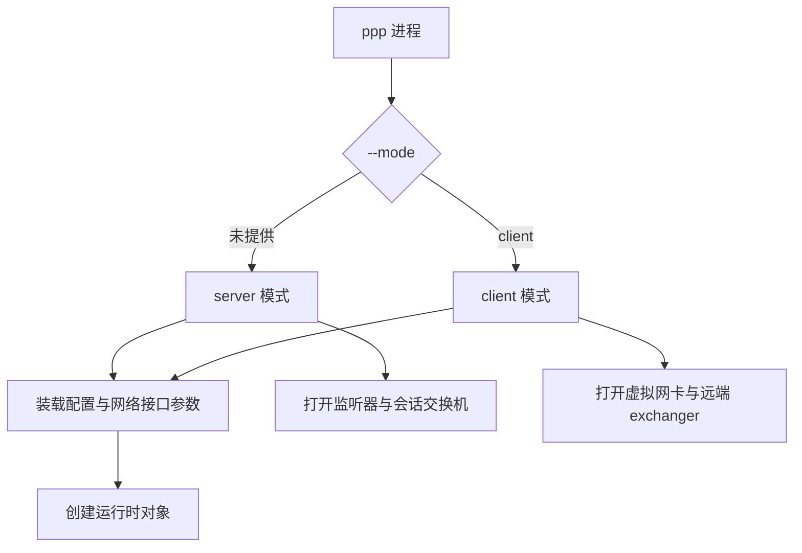
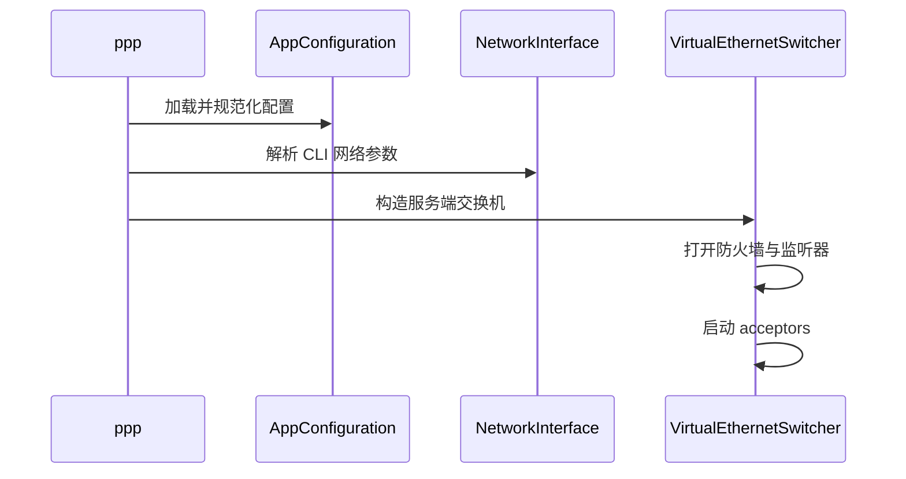
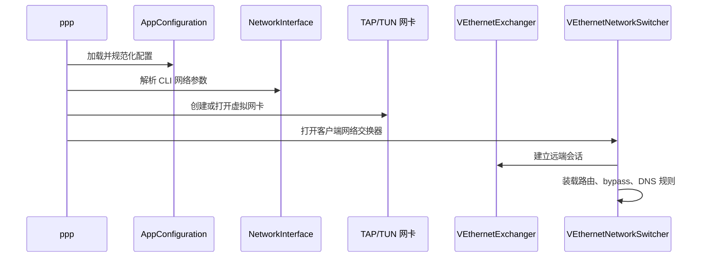

# 用户手册

[English Version](USER_MANUAL.md)

## 范围

本手册说明如何把 OPENPPP2 当作网络基础设施运行时来使用。

内容基于当前代码事实展开：

- 单一可执行程序：`ppp`
- 两种运行角色：`server` 与 `client`
- 一套共享配置模型，加上一组命令行覆盖项
- 共享协议核心之上叠加平台特化网卡与路由处理

## 运行模型

如果没有显式传入 `--mode=client`，`ppp` 默认以 `server` 模式启动。



## 运行前检查

- 必须以管理员或 root 权限运行，`main.cpp` 会拒绝非特权执行。
- 默认不允许同一角色和同一配置路径重复运行，进程会创建防重入锁。
- 应把 `appsettings.json` 视为主要配置入口，把 CLI 视为启动整形与运维入口。
- 先核对平台前置条件：Windows 的 TAP/Wintun、Linux 的 `/dev/tun`、macOS 的 `utun`、Android 的 VPN 集成环境。

## 服务端典型使用方式

### 服务端负责什么

服务端运行时主要负责：

- 打开隧道监听器
- 创建会话交换机
- 按需应用防火墙规则
- 分配虚拟网络状态
- 在启用时与管理后端交互

### 基本启动

```bash
ppp --mode=server --config=./appsettings.json
```

### 显式指定防火墙规则

```bash
ppp --mode=server --config=./appsettings.json --firewall-rules=./firewall-rules.txt
```

### 服务端启动时序



## 客户端典型使用方式

### 客户端负责什么

客户端运行时主要负责：

- 创建或打开虚拟网卡
- 准备本地路由与 DNS 策略
- 创建远端 exchanger
- 按需打开本地代理、映射、static、mux 等能力

### 基本启动

```bash
ppp --mode=client --config=./appsettings.json
```

### 显式指定网卡与隧道地址

```bash
ppp --mode=client --config=./appsettings.json --tun=openppp2 --tun-ip=10.0.0.2 --tun-gw=10.0.0.1 --tun-mask=30
```

### 客户端启动时序



## 配置与 CLI 的关系

OPENPPP2 同时使用 JSON 配置和命令行参数。

- JSON 定义持久化运行模型。
- CLI 用于决定启动角色、本地接口行为、路由辅助行为与平台运维操作。
- 一部分 CLI 是运维辅助命令，而不是长期配置项。

应结合以下文档一起看：

- [`CONFIGURATION_CN.md`](CONFIGURATION_CN.md)
- [`CLI_REFERENCE_CN.md`](CLI_REFERENCE_CN.md)

## 如何选择承载传输

承载传输应根据网络环境选择，而不是根据名字选择。

- 当部署路径简单、网络中间件较少时，可优先考虑 TCP。
- 当隧道需要穿过 HTTP 基础设施、反向代理或 CDN 边缘时，可考虑 WS 或 WSS。
- 当环境要求 TLS 终止、证书部署或 HTTPS 风格接入时，应考虑 WSS。

代码支持多种 carrier，但其上的隧道模型是共享的。

## 如何选择可选能力

### Static 模式

当你明确要使用 `VirtualEthernetPacket` 那条静态分组路径时，再启用 `--tun-static=yes`。

不要因为它“听起来更快”就默认打开。它会改变数据路径形态，应和部署设计一致。

### MUX

当部署需要由客户端发起、服务端接收的额外逻辑子链路时，可使用 `--tun-mux=<connections>`。

它不是主隧道的普适替代，而是附加路径模型。

### IPv6

只有在服务端明确配置了 IPv6 服务，且目标平台具备相应支持时，才应在客户端请求 IPv6。

当前 Linux 具备最完整的 IPv6 服务端数据面实现。

### 路由与 bypass

在启用 bypass 文件、route 文件和 DNS 规则前，应先明确部署属于哪一类：

- 全隧道
- 分流隧道
- 子网转发
- 本地代理边缘

这些决策应先于参数调优。

## 平台说明

### Windows

- 优先走 Wintun，无法使用时回退到 TAP-Windows。
- 支持 Windows 专用运维命令，例如网络重置与协议栈优先级切换。
- 代码中支持 `--set-http-proxy` 这条系统代理联动路径，但帮助表没有完整列出它。

### Linux

- 使用 `/dev/tun`，支持 Linux 专有的 route protect 与 SSMT multiqueue。
- 具备最完整的 IPv6 服务端实现。
- 路由与接口行为会明显受到宿主网络拓扑影响。

### macOS

- 使用 `utun`。
- 支持 promisc 与 SSMT 类参数，但平台特性面小于 Linux。

### Android

- 更接近 Android VPN 集成目标，而不是普通桌面二进制流程。
- 数据面依赖外部传入的 VPN fd 与 protect socket 机制。

## 启动后核对清单

启动后至少应确认：

- 进程实际进入了预期角色
- 虚拟网卡名称与地址配置符合预期
- 监听器或远端连接状态正确
- 路由与 DNS 规则符合部署意图
- static、mux、mapping 等可选能力只在需要时启用

## 运维警告

- 帮助输出与真实解析行为大体一致，但不是完全一一对应。比如 `--set-http-proxy` 在代码里可解析，但没有完整出现在帮助表中。
- 某些默认值带有平台条件，例如 Windows 下 `--lwip` 会受 Wintun 是否可用影响。
- Linux 与 Windows 在 route protect 和系统集成上的行为差异很大，不能因为参数名字相同就假定实现等价。

## 相关文档

- [`CLI_REFERENCE_CN.md`](CLI_REFERENCE_CN.md)
- [`CONFIGURATION_CN.md`](CONFIGURATION_CN.md)
- [`DEPLOYMENT_CN.md`](DEPLOYMENT_CN.md)
- [`OPERATIONS_CN.md`](OPERATIONS_CN.md)
- [`PLATFORMS_CN.md`](PLATFORMS_CN.md)
