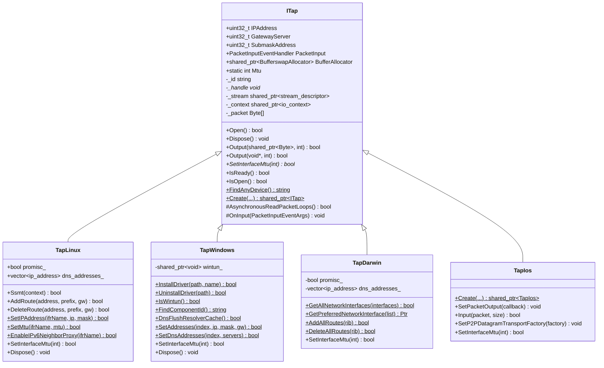
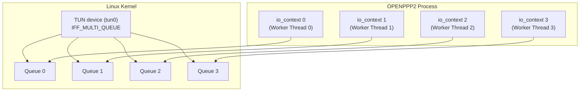
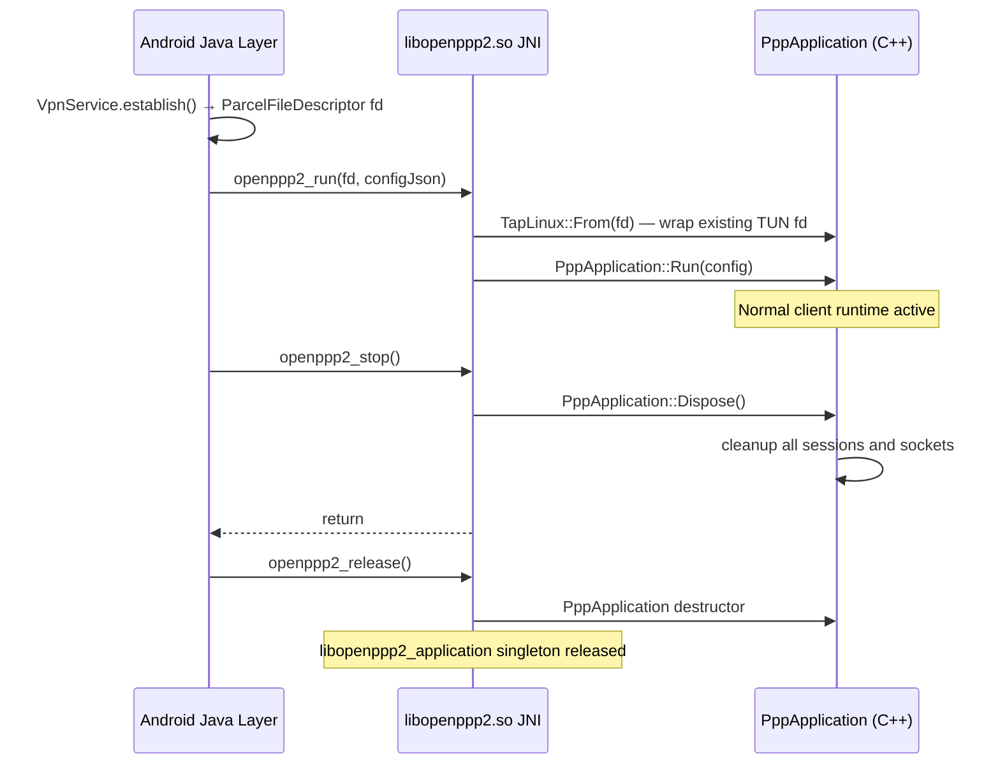

# Platform Integration
> Status: Active
> Type: Guide
> Last verified: 63fc030

> **Purpose:** Describe the current behavior, configuration, or implementation boundary for this topic.
> **Audience:** OPENPPP2 users, operators, and developers.
> **Status:** Current.
> **Last verified against:** Current repository structure, implementation paths, and documentation links, 2026-07-31.
> **Parent index:** [Back to index](README.md) · **Chinese:** [平台集成](PLATFORMS_CN.md)


[中文版本](PLATFORMS_CN.md)

## Scope

This document explains how OPENPPP2 binds one shared runtime core to different host networking models, with detailed API coverage for each platform backend, build-time organization, and cross-platform development guidelines.

## Overview: Canonical Client Routing Policy

When `client.routing` is present as an object, it is the authoritative client IP/DNS policy. The canonical object contains only `ip.bypass`, `ip.routes`, `ip.peer-routes`, and `dns.rules`. The top-level `--mode=client`/`--mode=proxy` and independent `client.proxy-only` flag select runtime behavior; `client.proxy-only` is read regardless of whether the canonical object is present. Legacy `client.routes` and `client.peer-routes` remain fallback inputs only when the canonical object is absent. An old nested mode key is ignored and is not serialized.

The policy has separate native and host-integration layers. Both modes load the canonical bypass list, ordinary routes, peer-prefix routes, and DNS rules into the native route/RIB/FIB and DNS policy/rule table. The desktop bootstrap also runs `GeoRuleGenerator` when enabled and loads canonical sources in both modes. TUN host integration may additionally project that native state into system routes or host DNS settings; proxy-only does not discard the state, it only suppresses those host mutations:

| Platform | `tun` | `proxy-only` |
|---|---|---|
| Linux / Windows / macOS | Native policy is built first; supported TUN host integration may project bypass, ordinary routes, peer-prefix routes, and DNS settings to the host. | Native policy is still built and used by the local proxies; desktop uses `TapStub` and installs no host route platform or system DNS mutation. |
| Android | Native policy is built, while `VpnService.Builder` installs the configured route, captures IPv6 with `::/0`, and adds tunnel DNS servers. | Native policy is still built; `VpnService.Builder` installs only the VPN interface subnet route, with no IPv6 capture or tunnel DNS. |
| iOS | Native policy is built, while `PacketTunnelProvider` sets the included route, bypass entries as excluded routes, and `NEDNSSettings` for tunnel DNS. | Native policy is still built; provider sets only the tunnel-subnet included route, without bypass exclusions or tunnel DNS, while control/telemetry host exceptions remain protected. |

`routing.ip.routes` is the ordinary route-source layer and enters the native RIB/FIB in both modes. `routing.ip.peer-routes` is the separate peer-prefix gateway layer; desktop TUN may additionally install host routes, while proxy-only and Android/iOS keep the entries in native forwarding state without synthesizing arbitrary per-prefix OS routes.

---

## 1. Main Idea

The shared core covers configuration, transport, handshake, link-layer actions, routing policy, and session management. The platform layer covers adapter creation, route mutation, DNS mutation, socket protection, and IPv6 host plumbing.

The shared core lives in `ppp/`. Platform-specific implementations live in:

| Directory | Target |
|-----------|--------|
| `windows/` | Windows (Vista+, primarily Win10/Win11) |
| `linux/` | Linux (kernel 4.x+, includes Android kernel) |
| `darwin/` | macOS (13.0+ Ventura; set via `CMAKE_OSX_DEPLOYMENT_TARGET`) |
| `android/` | Android (API 23+, via JNI shared library and `VpnService`) |
| `ios/` | iOS Packet Tunnel / Network Extension, with a native bridge to the shared core |

The CMake build system selects the desktop platform tree at configure time based on `CMAKE_SYSTEM_NAME`. Android and iOS application projects supply their own host integration and pass an already-authorized tunnel interface to the native core.

---

## 2. Why This Layer Exists

The platform layer exists because the code does not just move packets. It mutates the host:

- virtual interfaces are created or opened (TUN/TAP device, Wintun ring buffer, utun socket)
- default routes may be protected or rewritten (to prevent the VPN tunnel traffic from routing over itself)
- DNS servers may be changed (to redirect DNS queries through the tunnel)
- firewall or socket protection may be applied (Android `VpnService.protect()`)
- IPv6 transit may need platform-specific plumbing (neighbor proxy, forwarding rules)

That is not portable by accident; it must be written explicitly for each OS.

```mermaid
graph TD
    CORE["Shared Core (ppp/)"] --> ITAP["ITap abstraction"]
    ITAP --> LINUX["TapLinux\n(linux/ directory)"]
    ITAP --> WIN["TapWindows\n(windows/ directory)"]
    ITAP --> DARWIN["TapDarwin\n(darwin/ directory)"]
    ITAP --> ANDROID["TapLinux (android variant)\nJNI fd from VpnService"]
    ITAP --> IOS["TapIos\nNEPacketTunnelFlow callbacks"]

    CORE --> ROUTE["Route management"]
    ROUTE --> LR["netlink RTM_NEWROUTE/RTM_DELROUTE\n(Linux)"]
    ROUTE --> WR["IP Helper API SetIpForwardEntry\n(Windows)"]
    ROUTE --> DR["PF_ROUTE RTM_ADD/RTM_DELETE\n(macOS)"]
    ROUTE --> AR["VpnService.Builder.addRoute\n(Android host)"]
    ROUTE --> IR["NEPacketTunnelNetworkSettings\n(iOS host)"]

    CORE --> DNS["DNS management"]
    DNS --> LD["resolv.conf / systemd-resolved\n(Linux)"]
    DNS --> WD["SetDnsAddresses + DnsFlushResolverCache\n(Windows)"]
    DNS --> DD["scutil --dns\n(macOS)"]
    DNS --> AD["VpnService.Builder.addDnsServer\n(Android host)"]
    DNS --> ID["NEDNSSettings\n(iOS host)"]
```



---

## 3. Platform Abstraction Layer (ITap)

### Design Overview

`ITap` (`ppp/tap/ITap.h`) is the central platform-neutral abstraction for virtual network devices. Every platform backend inherits from this single interface, which encapsulates:

- **Device lifecycle**: construction around a native handle, `Open()`, `Dispose()`.
- **Packet I/O**: asynchronous read loop (`AsynchronousReadPacketLoops`), inbound event callback (`PacketInputEventHandler`), and two `Output()` overloads for shared-buffer or raw-pointer writes.
- **Address metadata**: `IPAddress`, `GatewayServer`, `SubmaskAddress` stored as `uint32_t` constants.
- **Factory creation**: static `ITap::Create()` overloads, with compile-time conditional signatures for Windows (adds `lease_time_in_seconds`) versus POSIX (adds `promisc` flag).
- **MTU enforcement**: pure-virtual `SetInterfaceMtu(int mtu)` implemented by each backend.

The base class owns a `boost::asio::posix::stream_descriptor` (`_stream`) and an MTU-sized reusable read buffer (`_packet[ITap::Mtu]`). Asynchronous reads are dispatched through the Boost.Asio `io_context` held in `_context`.

### ITap Class Diagram



> **Note on Android**: Android uses `TapLinux` directly. The `TapLinux::From()` static factory (guarded by `#if defined(_ANDROID)`) wraps an existing TUN file descriptor supplied by the Android `VpnService`, rather than opening `/dev/tun` itself.
>
> **Note on iOS**: iOS uses `TapIos`, which does not own a POSIX tunnel descriptor. `NEPacketTunnelFlow` supplies input packets and receives output through callbacks.

---

## 4. Platform-Specific Architecture

### Combined Platform Architecture

```mermaid
graph TD
    OS["Operating System / Kernel"] --> DRV
    DRV["Kernel Driver / Virtual NIC"]
    DRV --> ITap["ITap (C++ abstraction)"]
    ITap --> VEth["VEthernet Network Stack (lwIP)"]
    VEth --> PPP["PPP Transport / Session Layer"]

    subgraph Linux
        L1["TUN device (/dev/net/tun)"]
        L2["ioctl TUNSETIFF IFF_TUN|IFF_NO_PI"]
        L3["netlink RTM_NEWROUTE/RTM_DELROUTE"]
        L4["SSMT: TUNSETIFF IFF_MULTI_QUEUE\n(one fd per io_context thread)"]
        L1 --> L2 --> L3
        L2 --> L4
    end

    subgraph Windows
        W1["Wintun ring-buffer driver\n(WintunReceivePacket/WintunSendPacket)"]
        W2["TAP-Windows NDIS driver (fallback)\n(overlapped I/O)"]
        W3["IP Helper API SetUnicastIpAddressEntry\nSetDnsAddresses DnsFlushResolverCache"]
        W1 --> W3
        W2 --> W3
    end

    subgraph macOS
        M1["utun socket\n(PF_SYSTEM / SYSPROTO_CONTROL)"]
        M2["PF_ROUTE socket RTM_ADD/RTM_DELETE"]
        M3["SIOCDIFADDR_IN6/SIOCAIFADDR_IN6\n(IPv6 address management)"]
        M1 --> M2
        M1 --> M3
    end

    subgraph Android
        A1["VpnService.establish()\n(ParcelFileDescriptor)"]
        A2["TapLinux::From(fd)\n(wraps existing TUN fd)"]
        A3["JNI bridge in libopenppp2.so"]
        A4["VpnService.Builder routes + DNS"]
        A1 --> A2 --> A3
        A1 --> A4
    end

    subgraph iOS
        I1["NEPacketTunnelFlow"]
        I2["TapIos callback facade"]
        I3["PacketTunnelProvider network settings"]
        I1 --> I2
        I3 --> I1
    end

    Linux --> ITap
    Windows --> ITap
    macOS --> ITap
    Android --> ITap
    iOS --> ITap
```



---

## 5. Linux: TapLinux

`TapLinux` (`linux/ppp/tap/TapLinux.h`) is a `final` class that:

1. **Opens the TUN device** via `OpenDriver()`, which calls `open("/dev/net/tun", ...)` and applies `ioctl(TUNSETIFF)` with the `IFF_TUN | IFF_NO_PI` flags. The interface name (e.g. `tun0`) comes from the `dev` argument or is auto-assigned by the kernel.
2. **Configures the interface** using `ioctl` socket operations: `SetIPAddress()` calls `SIOCSIFADDR`/`SIOCSIFNETMASK`, `SetMtu()` calls `SIOCSIFMTU`, and `SetNetifUp()` calls `SIOCSIFFLAGS`.
3. **Route management** is done via `netlink(7)` RTM_NEWROUTE / RTM_DELROUTE messages, wrapped in `AddRoute()` / `DeleteRoute()` and their bulk counterparts `AddAllRoutes()` / `DeleteAllRoutes()`.
4. **IPv6 support** is extensive: `SetIPv6Address()`, `AddRoute6()`, `DeleteRoute6()`, `EnableIPv6NeighborProxy()`, and `AddIPv6NeighborProxy()` allow fine-grained neighbor discovery proxy management for server-side IPv6 transit.
5. **Multi-queue SSMT**: `Ssmt(context)` opens additional file descriptors on the same TUN device (via `TUNSETIFF` with `IFF_MULTI_QUEUE`) and registers them as separate `stream_descriptor` objects, enabling parallel read paths per IO thread.
6. **Promiscuous mode**: when `promisc_` is `true`, the adapter is put into `IFF_PROMISC` mode, allowing all frames to be captured regardless of destination MAC.

### TapLinux Key API

```cpp
/**
 * @brief Opens the TUN virtual adapter at the OS level.
 * @return true on success, false with SetLastErrorCode on failure.
 * @note  Calls open("/dev/net/tun"), ioctl(TUNSETIFF), SetIPAddress(), SetMtu(), SetNetifUp().
 */
bool Open() noexcept override;

/**
 * @brief Adds a host route via netlink RTM_NEWROUTE.
 * @param address   Destination network address (host byte order).
 * @param prefix    CIDR prefix length.
 * @param gateway   Next-hop gateway address.
 * @return true on success.
 */
bool AddRoute(uint32_t address, int prefix, uint32_t gateway) noexcept;

/**
 * @brief Opens N additional TUN queue file descriptors for SSMT multi-queue mode.
 * @param context   Additional io_context to attach new queues to.
 * @return true if at least one additional queue was opened.
 * @note  Linux kernel 3.8+ required for IFF_MULTI_QUEUE.
 */
bool Ssmt(const std::shared_ptr<boost::asio::io_context>& context) noexcept;

/**
 * @brief Enables IPv6 neighbor proxy on the TUN interface via /proc/sys/net/ipv6.
 * @param ifrName  Interface name (e.g., "tun0").
 * @return true on success.
 */
static bool EnableIPv6NeighborProxy(const ppp::string& ifrName) noexcept;
```

### Linux SSMT Multi-Queue Architecture



---

## 6. Windows: TapWindows

`TapWindows` (`windows/ppp/tap/TapWindows.h`) is a `final` class that supports two kernel driver backends:

| Backend | Detection | Notes |
|---|---|---|
| **Wintun** | `IsWintun()` returns `true` | Ring-buffer based; highest performance; used when Wintun DLL is available |
| **TAP-Windows** | NDIS intermediate driver | Legacy fallback; uses DHCP MASQ or TUN mode |

### Key Operations

- **Driver installation**: `InstallDriver(path, declareTapName)` copies driver files and calls `SetupDi` APIs to install the NDIS adapter. `UninstallDriver()` removes it.
- **Component ID resolution**: `FindComponentId()` scans the Windows registry under `HKLM\SYSTEM\CurrentControlSet\Control\Class\{4D36E972...}` to locate the Wintun or TAP-Windows adapter GUID.
- **Interface configuration**: `SetAddresses()` uses `IP Helper API` (`SetUnicastIpAddressEntry`) to assign IP, mask, and gateway. `SetDnsAddresses()` writes DNS servers through the same IP Helper path.
- **Wintun ring buffer**: when Wintun is active, `wintun_` holds the `WINTUN_ADAPTER_HANDLE`; reads and writes go through `WintunReceivePacket` / `WintunSendPacket` ring-buffer APIs rather than a file descriptor.
- **Async I/O**: `AsynchronousReadPacketLoops()` is overridden to use Wintun's event-driven ring-buffer model on Wintun, or overlapped I/O on TAP-Windows.
- **DNS cache flush**: `DnsFlushResolverCache()` calls the Win32 `DnsFlushResolverCache()` API after DNS server changes take effect.

At application startup, `Windows_PreparedEthernetEnvironment()` in `ApplicationInitialize.cpp` ensures a component ID is available before `ITap::Create()` is called; if no adapter is found, `InstallDriver()` is invoked automatically.

### TapWindows Key API

```cpp
/**
 * @brief Installs the Wintun or TAP-Windows NDIS driver.
 * @param path            Path to the driver .inf file.
 * @param declareTapName  Adapter display name to declare.
 * @return true on success, false with SetLastErrorCode on failure.
 * @note  Requires administrator privilege. Uses SetupDiInstallClassEx + SetupDiInstallDevice.
 */
static bool InstallDriver(const ppp::string& path, const ppp::string& declareTapName) noexcept;

/**
 * @brief Assigns IP address, subnet mask, and gateway to the virtual adapter.
 * @param adapterIndex  Adapter index from GetAdaptersInfo.
 * @param ip            IPv4 address in host byte order.
 * @param mask          Subnet mask in host byte order.
 * @param gateway       Default gateway in host byte order.
 * @return true on success.
 */
static bool SetAddresses(DWORD adapterIndex, uint32_t ip, uint32_t mask, uint32_t gateway) noexcept;

/**
 * @brief Assigns DNS server addresses to the virtual adapter.
 * @param adapterIndex  Adapter index.
 * @param servers       List of DNS server IP addresses.
 * @return true on success.
 */
static bool SetDnsAddresses(DWORD adapterIndex, const ppp::vector<uint32_t>& servers) noexcept;

/**
 * @brief Flushes the Windows DNS resolver cache.
 * @return true on success.
 * @note  Called after SetDnsAddresses to ensure the new servers are used immediately.
 */
static bool DnsFlushResolverCache() noexcept;
```

### Windows Network Helper Functions

Windows-specific startup helpers in `windows/ApplicationInitialize.cpp`:

| Function | Purpose |
|----------|---------|
| `Windows_PreparedEthernetEnvironment()` | Ensures TUN adapter Component ID; installs driver if missing |
| `Windows_NetworkReset()` | Resets Windows network stack via `netsh` commands |
| `Windows_NetworkOptimization()` | Applies TCP/UDP tuning registry keys |
| `Windows_NetworkPreferredIPv4()` | Sets IPv4 binding priority in Windows |
| `Windows_NetworkPreferredIPv6()` | Sets IPv6 binding priority in Windows |
| `Windows_NoLsp(program)` | Launches program without LSP interception |

---

## 7. macOS: TapDarwin

`TapDarwin` (`darwin/ppp/tap/TapDarwin.h`) is a `final` class that uses macOS `utun` virtual interfaces:

- **Device creation**: opens a `PF_SYSTEM` socket with `SYSPROTO_CONTROL` and connects to the `utun` kernel control (`com.apple.net.utun_control`), obtaining the `utunN` interface automatically.
- **Route management**: `AddAllRoutes()` / `DeleteAllRoutes()` operate on a `RouteInformationTable` (mapping destination → gateway) using `PF_ROUTE` raw socket messages (`RTM_ADD` / `RTM_DELETE`), respecting macOS route semantics which differ from Linux.
- **Network interface enumeration**: `GetAllNetworkInterfaces()` walks `getifaddrs()` results and populates `NetworkInterface` structs including gateway addresses from the routing table. `GetPreferredNetworkInterface()` selects the best candidate based on metric and reachability.
- **Packet framing**: `OnInput()` overrides the base class handler to strip the 4-byte address-family prefix that macOS prepends to every utun read, then forwards the raw IP frame to the lwIP stack.
- **IPv6**: macOS IPv6 plumbing uses BSD-style `SIOCDIFADDR_IN6` / `SIOCAIFADDR_IN6` ioctls for address assignment, diverging significantly from the Linux netlink path.

### TapDarwin Key API

```cpp
/**
 * @brief Enumerates all active network interfaces with addresses and routing info.
 * @param interfaces  [out] Vector of NetworkInterface structs populated on success.
 * @return true on success.
 * @note  Combines getifaddrs() with PF_ROUTE sysctl to retrieve gateway for each interface.
 */
static bool GetAllNetworkInterfaces(ppp::vector<NetworkInterface>& interfaces) noexcept;

/**
 * @brief Selects the best physical network interface for VPN bypass routing.
 * @param list  Candidate interface list from GetAllNetworkInterfaces().
 * @return shared_ptr to the preferred interface, or NULLPTR if none found.
 * @note  Selection criteria: non-loopback, non-VPN, lowest metric, has gateway.
 */
static std::shared_ptr<NetworkInterface> GetPreferredNetworkInterface(
    const ppp::vector<std::shared_ptr<NetworkInterface>>& list) noexcept;

/**
 * @brief Adds all routes in the route information table via PF_ROUTE socket.
 * @param rib  Route information table mapping destination → gateway.
 * @return true if all routes were added successfully.
 */
static bool AddAllRoutes(const RouteInformationTable& rib) noexcept;
```

---

## 8. Android: JNI Bridge (libopenppp2.so)

Android does not expose raw TUN devices to unprivileged apps. Instead:

1. The host Android application calls `VpnService.establish()` to obtain a `ParcelFileDescriptor` representing a TUN interface already configured by the OS.
2. This file descriptor is passed over JNI to `libopenppp2.so` via `__LIBOPENPPP2__` annotated export functions (defined with `extern "C" JNIEXPORT`).
3. Inside the library, `TapLinux::From()` wraps the raw fd in a `TapLinux` instance without re-opening `/dev/net/tun` — the kernel interface already exists.
4. The OPENPPP2 runtime uses the same packet-processing core as desktop Linux, while the Java `VpnService` remains the owner of system routes, DNS, and the VPN fd.

### Android routing modes

`PppVpnService.kt` applies the top-level `--mode`/`client.proxy-only` runtime choice through `VpnService.Builder` for the host-side projection. The native client consumes the same canonical IP/DNS sources in both modes:

- **Both modes**: load `routing.ip.bypass` and ordinary `routing.ip.routes` into the native RIB/FIB, keep `routing.ip.peer-routes` in the native peer RIB/FIB, and load `routing.dns.rules` into the native DNS policy/rule table.
- **`tun`**: adds the configured route (normally `0.0.0.0/0`), adds `::/0` for IPv6 leak protection, and adds the configured tunnel DNS servers.
- **`proxy-only`**: adds only the VPN interface subnet route; it does not capture IPv6 with `::/0` and does not add tunnel DNS servers.
- When geo-rules are enabled, `android/libopenppp2.cpp` runs `GeoRuleGenerator` and feeds generated and canonical sources into the native client in both modes; proxy-only does not skip that policy-loading path.

`routing.ip.peer-routes` is not expanded into arbitrary `Builder.addRoute()` calls. The mobile native route coordinator keeps peer-prefix entries in its internal RIB/FIB, so an Android host must provide any additional per-prefix system route policy it needs.

### JNI Macro Conventions

```cpp
// Marks a JNI-exported function visible to the Java layer
#define __LIBOPENPPP2__(JNIType)  extern "C" JNIEXPORT __unused JNIType JNICALL

// Retrieves the singleton application context
#define __LIBOPENPPP2_MAIN__      libopenppp2_application::GetDefault()
```

### JNI Lifecycle Mapping



### Android-Specific Constraints

| Constraint | Reason |
|-----------|--------|
| No jemalloc overlay | Android system already uses jemalloc; do not add another layer |
| API 23 minimum | All syscalls and NDK APIs must be available on Android 6.0+ |
| NDK R20B | CI validation uses NDK R20B; do not use NDK APIs added after R20B |
| No raw socket privilege | `VpnService.protect()` must be called on bypass sockets; raw socket creation requires `BIND_VPN_SERVICE` |
| TUN fd from Java | Never attempt to open `/dev/tun` on Android; always use the fd from `VpnService` |
| System route and DNS owner | Java `VpnService.Builder` owns `addRoute()` and `addDnsServer()`; the C++ bridge does not call netlink |

---

## 9. iOS: Packet Tunnel / Network Extension

iOS has no desktop-style route mutation path in this repository. The application and Packet Tunnel extension divide responsibilities:

1. `ProfileStore.swift` stores profiles and builds the effective JSON, including the canonical `client.routing` object, then shares it through the App Group state.
2. `PacketTunnelProvider.swift` reads that configuration and creates `NEPacketTunnelNetworkSettings`:
   - `tun` uses the configured included route, converts `routing.ip.bypass` to IPv4 excluded routes, and installs `NEDNSSettings` with match-all DNS when tunnel DNS is enabled;
   - `proxy-only` includes only the tunnel subnet route, omits host bypass exclusions and tunnel DNS, and still excludes resolved control/telemetry hosts so the provider does not recurse.
3. `OpenPPP2PacketTunnelAdapter.swift` connects `NEPacketTunnelFlow` packet reads/writes to the native callback bridge.
4. `OpenPPP2PacketTunnelBridge.cpp` creates `TapIos`, starts the shared client runtime, loads the canonical native routing and DNS policy in both modes, and forwards packets through the Swift callback. The iOS bridge does not invoke `GeoRuleGenerator`.

`routing.ip.peer-routes` is currently kept in the mobile native RIB/FIB in both modes; the Packet Tunnel provider does not turn each entry into an arbitrary `NEIPv4Route`. Additional per-prefix OS routing therefore requires explicit host integration.

### iOS Integration Boundary

| Layer | Current responsibility |
|---|---|
| App `ProfileStore.swift` | Persist profiles and write effective configuration/options to shared tunnel state |
| `PacketTunnelProvider.swift` | Set included/excluded IPv4 routes, tunnel DNS, and start/stop the extension |
| `OpenPPP2PacketTunnelAdapter.swift` | Bridge `NEPacketTunnelFlow` packets and provider-owned P2P transport |
| `OpenPPP2PacketTunnelBridge.cpp` | Create `TapIos`, run the C++ client, and expose the C callbacks |

---

## 10. Platform Responsibility Map

| Responsibility | Linux | Windows | macOS | Android | iOS |
|---|---|---|---|---|---|
| TUN/TAP open | `open(/dev/net/tun)` + `ioctl(TUNSETIFF)` | Wintun API or TAP-Windows | `PF_SYSTEM utun socket` | `VpnService` fd via JNI | `NEPacketTunnelFlow` callbacks through `TapIos` |
| IP address assign | `SIOCSIFADDR` ioctl | IP Helper `SetUnicastIpAddressEntry` | `SIOCAIFADDR` ioctl | `VpnService.Builder.addAddress()` | `NEIPv4Settings` in `PacketTunnelProvider` |
| Route add | netlink `RTM_NEWROUTE` | IP Helper `CreateIpForwardEntry2` | `PF_ROUTE RTM_ADD` | `VpnService.Builder.addRoute()` | `NEIPv4Settings.includedRoutes/excludedRoutes` |
| DNS configure | write `/etc/resolv.conf` | `SetDnsAddresses` | `scutil` or `configd` | `VpnService.Builder.addDnsServer()` | `NEDNSSettings` (omitted in proxy-only) |
| Socket protection | Mark socket with routing policy rule | N/A | N/A | `VpnService.protect(fd)` | Provider-owned Network Extension transport |
| IPv6 neighbor proxy | `/proc/sys/net/ipv6/conf/*/proxy_ndp` | N/A | SIOCAIFADDR_IN6 | Not used by the app VPN route setup | Not used by Packet Tunnel setup |
| SSMT multi-queue | `IFF_MULTI_QUEUE` | Wintun multi-session | N/A (utun is single-queue) | Single VpnService fd | Single `NEPacketTunnelFlow` |

---

## 11. Cross-Platform Development Guidelines

### Platform Guard Macros

Always use the repository macros, never raw compiler symbols:

```cpp
// Correct — uses repo-defined macros
#if defined(_WIN32)
    // Windows-specific code
#elif defined(_LINUX)
    // Linux-specific code (includes Android)
#elif defined(_ANDROID)
    // Android-only code
#elif defined(_MACOS)
    // macOS-specific code
#elif defined(_IPHONE)
    // iOS Packet Tunnel-specific code
#endif

// Wrong — never use these in shared ppp/ files
#ifdef __linux__       // WRONG
#ifdef _MSC_VER        // WRONG
#ifdef __APPLE__       // WRONG
```

### Platform-Specific Code Placement

| Code Type | Correct Location |
|-----------|----------------|
| Shared abstraction | `ppp/tap/ITap.h` / `ppp/tap/ITap.cpp` |
| Linux implementation | `linux/ppp/tap/TapLinux.h` / `.cpp` |
| Windows implementation | `windows/ppp/tap/TapWindows.h` / `.cpp` |
| macOS implementation | `darwin/ppp/tap/TapDarwin.h` / `.cpp` |
| Android JNI bridge | `android/libopenppp2.cpp` |
| iOS TAP and bridge | `ios/ppp/tap/TapIos.*` / `ios/OpenPPP2PacketTunnelBridge.cpp` |
| Android CMake | `android/CMakeLists.txt` (not shared with desktop) |
| iOS framework build | `ios/CMakeLists.txt` and `ios/build-xcframework.sh` |

### Compilation Verification Strategy

For maximum efficiency, validate one platform at a time:

1. **Windows**: run `build_windows.bat Release x64` — covers MSVC and vcpkg.
2. **Linux**: sync to `/root/dd/openppp2` via `rsync`, then `cd build && make -j32` — covers GCC 7.5 / Boost / OpenSSL.
3. **Android**: open the Android Studio project and build — covers NDK R20B / API 23.
4. **macOS**: review for `#ifdef` correctness; no compilation environment available here.
5. **iOS**: run `ios/build-xcframework.sh` and build the Xcode app/Packet Tunnel target on macOS.

---

## 12. Runtime effects

Host-layer effects come from TUN/host integration, not from the existence of the native routing policy:

- In TUN mode, virtual-interface setup may change the system route table so selected traffic reaches the tunnel.
- When host DNS integration is enabled, changing host DNS settings can send application name resolution through tunnel DNS.
- In proxy-only mode, desktop startup installs no host route platform or system DNS mutation; Android and iOS builders/providers install only the minimal interface or tunnel-subnet route and no tunnel DNS.
- Socket protection keeps OPENPPP2 control connections outside the tunnel where the platform requires it.

Both modes still use the native RIB/FIB, peer-prefix state, DNS policy/rule table, and local HTTP/SOCKS proxy path. Only host changes actually installed by TUN integration require host-layer rollback. `ITap::Dispose()` also clears native route and policy state, and for installed host changes it triggers:

1. Route entry deletion (`DeleteRoute()` / `DeleteRoute6()`)
2. DNS configuration restore (`SetDnsAddresses()` writes the original DNS)
3. DNS cache flush (Windows: `DnsFlushResolverCache()`)
4. Interface down (`SIOCSIFFLAGS` clears `IFF_UP`)
5. File descriptor close (the associated `stream_descriptor` is destroyed)

---

## Related Documents

- [`ARCHITECTURE.md`](../architecture/ARCHITECTURE.md) — System-level architecture overview
- [`DEPLOYMENT.md`](../operations/DEPLOYMENT.md) — Build and deployment guide for each platform
- [`OPERATIONS.md`](../operations/OPERATIONS.md) — Runtime operations and monitoring
- [`STARTUP_AND_LIFECYCLE.md`](../architecture/STARTUP_AND_LIFECYCLE.md) — Process startup and platform prep sequence
- [`CONCURRENCY_MODEL.md`](../architecture/CONCURRENCY_MODEL.md) — Threading and SSMT model
