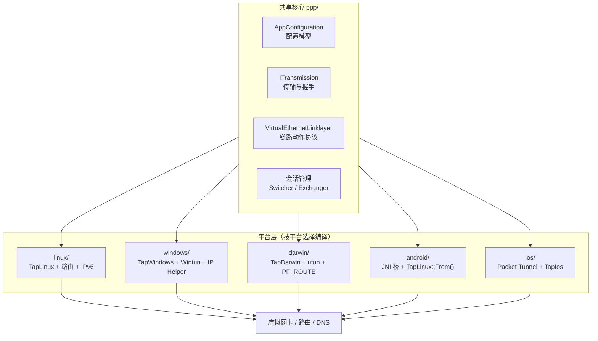
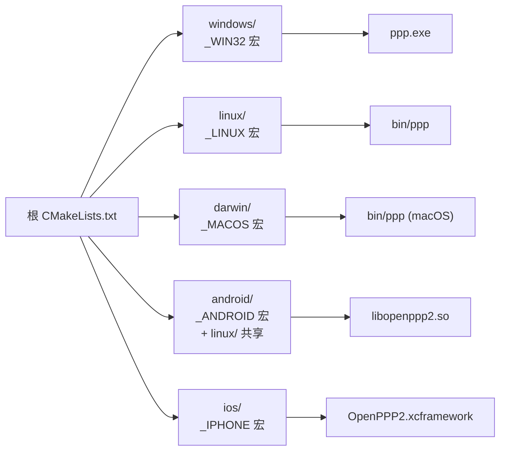
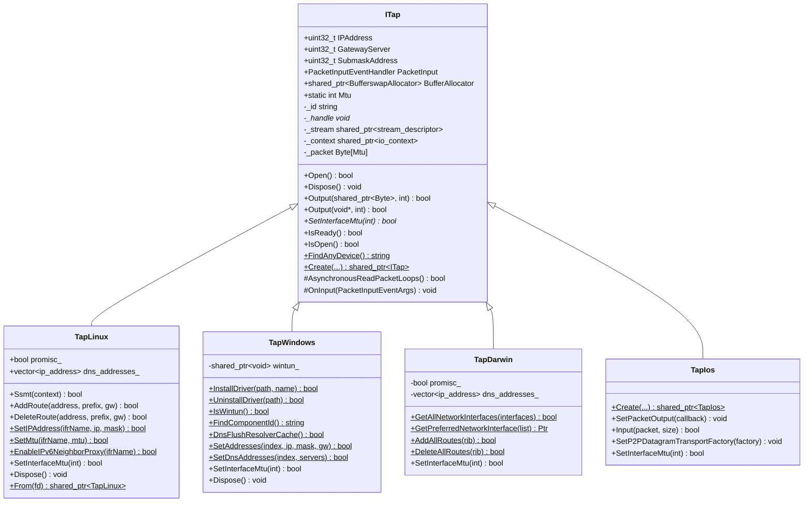
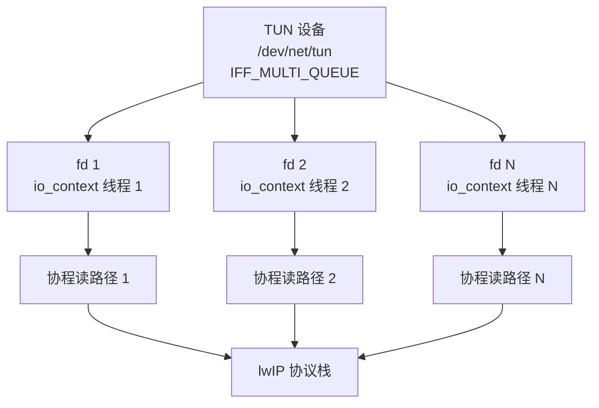
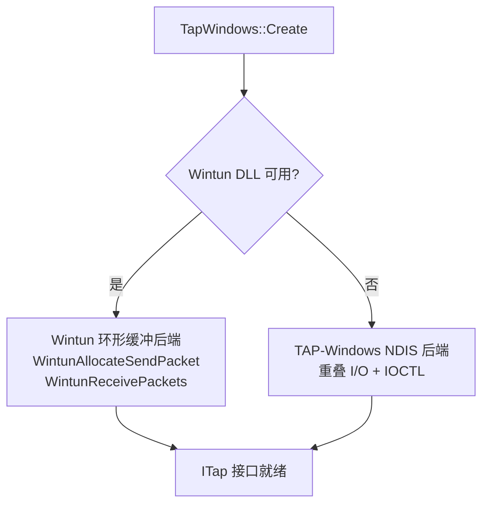
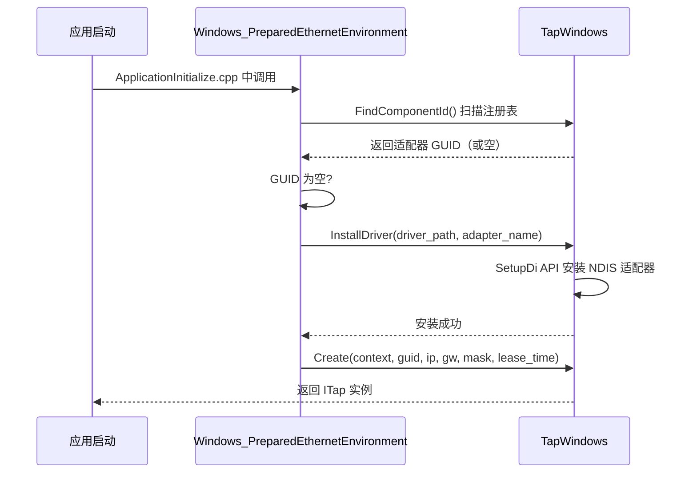
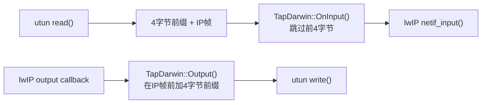
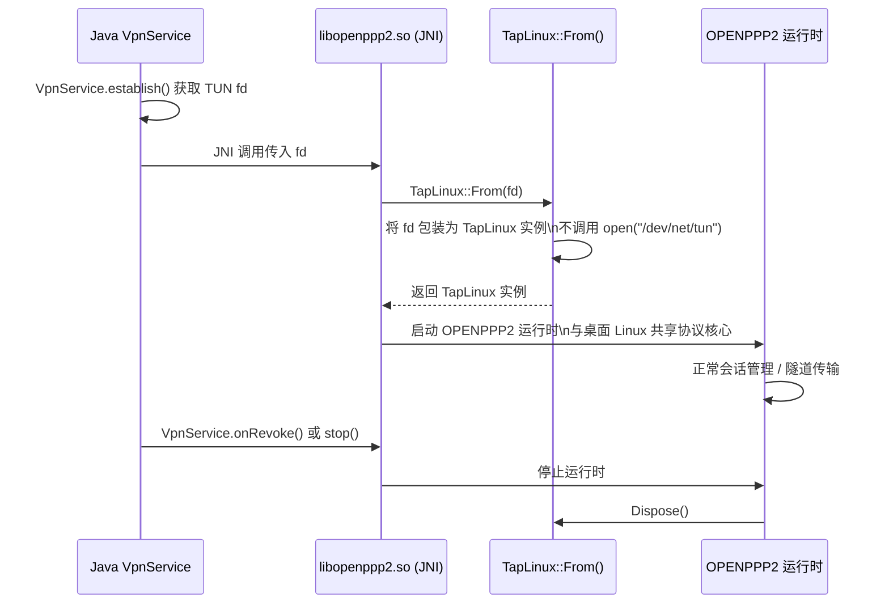
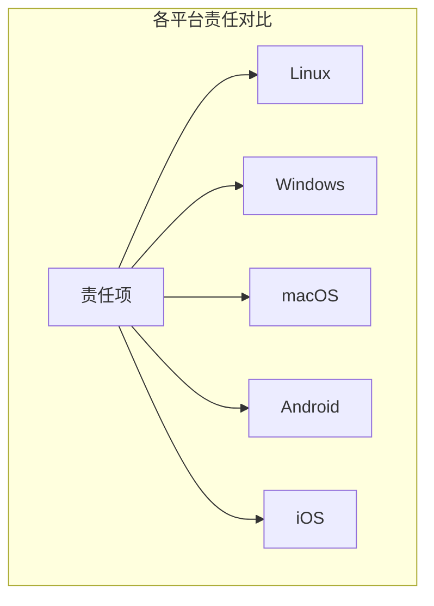
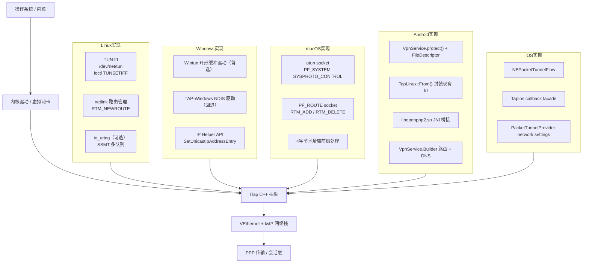

# 平台集成
> Status: Active
> Type: Guide
> Last verified: 63fc030

> **用途：**说明本主题的当前行为、配置或实现边界。
> **适用对象：**OPENPPP2 用户、运维人员与开发者。
> **当前状态：**当前有效。
> **最后核对依据：**当前仓库结构、实现路径与文档链接，2026-07-31。
> **上一层索引：**[返回索引](README_CN.md) · **English：**[Platform Integration](PLATFORMS.md)


[English Version](PLATFORMS.md)

## 1. 范围

本文解释 OPENPPP2 如何把共享运行时核心落到不同宿主网络模型上。目标是准确描述每个平台的集成机制、API 差异和已知限制，而不是笼统地说"支持多平台"。

## 1.1 统一的客户端分流入口

当 `client.routing` 存在且为对象时，它是客户端 IP/DNS policy 的权威入口。canonical 对象只包含 `ip.bypass`、`ip.routes`、`ip.peer-routes` 和 `dns.rules`。顶层 `--mode=client`/`--mode=proxy` 与独立的 `client.proxy-only` 标志决定运行行为；无论是否存在 canonical 对象，都会读取 `client.proxy-only`。旧的 `client.routes` 和 `client.peer-routes` 仅在 canonical 对象缺失时作为兼容输入。旧 routing 对象中的 mode 字段会被忽略且不会序列化。

策略分为 native 层和宿主接入层。两种模式都会把 canonical bypass、普通路由、peer 前缀路由和 DNS 规则加载到 native route/RIB/FIB 与 DNS policy/rule table。桌面 bootstrap 在启用时也会运行 `GeoRuleGenerator`，并在两种模式加载 canonical sources。TUN 宿主接入层可以进一步把 native 状态投影为系统路由或宿主 DNS；纯代理不会丢弃这些状态，只是不执行这些宿主变更：

| 平台 | `tun` | `proxy-only` |
|------|------|--------------|
| Linux / Windows / macOS | 先构建 native policy；支持的 TUN 宿主接入层可把 bypass、普通路由、peer 前缀路由和 DNS 设置投影到宿主机。 | 仍构建并由本地代理使用 native policy；桌面使用 `TapStub`，不安装宿主路由平台或系统 DNS 变更。 |
| Android | 先构建 native policy，同时由 `VpnService.Builder` 添加配置路由、用 `::/0` 捕获 IPv6，并添加隧道 DNS。 | 仍构建 native policy；`VpnService.Builder` 只安装 VPN 接口子网路由，不捕获 IPv6，也不添加隧道 DNS。 |
| iOS | 先构建 native policy，同时 `PacketTunnelProvider` 设置 included route、把 bypass 转为 excluded routes，并通过 `NEDNSSettings` 设置隧道 DNS。 | 仍构建 native policy；provider 只设置隧道子网 included route，不设置 bypass 排除路由或隧道 DNS，但仍保留控制/遥测主机例外路由。 |

`routing.ip.routes` 是普通路由来源层，在两种模式下都会进入 native RIB/FIB。`routing.ip.peer-routes` 是独立的 peer 前缀网关层；桌面 TUN 还可以安装宿主机路由，而纯代理和 Android/iOS 会把它保留在 native 转发状态中，不自动生成任意前缀的系统路由。

---

## 2. 核心思想

共享核心（`ppp/` 目录）负责：配置、传输、握手、链路动作、路由策略和会话管理。

平台层（`linux/`、`windows/`、`darwin/`、`android/`、`ios/`）负责：虚拟接口创建、系统路由变更、DNS 配置、socket protect 和宿主 IPv6 行为。Android 通过 JNI 接收 `VpnService` 已授权的 TUN fd；iOS 通过 Packet Tunnel / Network Extension bridge 接入共享核心。



---

## 3. 构建阶段拆分

根 `CMakeLists.txt` 按当前目标平台选择源文件集：

| 平台 | 源文件目录 | 构建方式 |
|------|-----------|----------|
| Windows | `windows/` | `build_windows.bat` + CMake + Ninja + vcpkg |
| Linux | `linux/` | CMake + Make / Ninja，三方库在 `/root/dev` |
| macOS | `darwin/` | CMake + Make（需 `-DCMAKE_POLICY_VERSION_MINIMUM=3.5`） |
| Android | `android/` + `linux/` | NDK CMake，独立 `CMakeLists.txt` |
| iOS | `ios/` + 共享 `ppp/` | `ios/build-xcframework.sh` + Xcode Packet Tunnel target |



**平台宏规则**（来自 `ppp/stdafx.h`）：

- `_WIN32` 对应 `WIN32`
- `_LINUX` 对应 `LINUX`
- `_MACOS` 对应 `MACOS`
- `_ANDROID` 对应 `ANDROID`
- `_IPHONE` 对应 `IPHONE`
- `_HARMONYOS` 对应 `HARMONYOS`

**严禁**在 `ppp/` 共享代码中使用 `#ifdef __linux__` 或 `#ifdef _MSC_VER`。平台特定代码必须放在对应平台目录下，或使用上述宏守护。

---

## 4. 平台抽象层：ITap

### 4.1 设计概述

`ITap`（`ppp/tap/ITap.h`）是平台无关的虚拟网卡核心抽象。所有平台后端均继承自该接口。



### 4.2 工厂方法签名差异

`ITap::Create()` 在各平台的签名不同：

**Windows**（`windows/ppp/tap/TapWindows.h`）：
```cpp
/**
 * @brief 创建 Windows TAP/Wintun 虚拟网卡实例。
 * @param context              Boost.Asio io_context。
 * @param dev                  适配器名或 GUID。
 * @param ip                   虚拟接口 IP 地址（大端序）。
 * @param gw                   网关地址。
 * @param mask                 子网掩码。
 * @param lease_time_in_seconds DHCP 租约时间（Wintun 模式无效，TAP-Windows 使用）。
 * @return                     成功返回 TapWindows 实例；失败返回 NULLPTR。
 */
static std::shared_ptr<ITap> Create(
    const std::shared_ptr<boost::asio::io_context>& context,
    const ppp::string&                              dev,
    uint32_t                                        ip,
    uint32_t                                        gw,
    uint32_t                                        mask,
    int                                             lease_time_in_seconds) noexcept;
```

**Linux / macOS / Android**（`linux/ppp/tap/TapLinux.h`）：
```cpp
/**
 * @brief 创建 Linux TUN 虚拟网卡实例。
 * @param context  Boost.Asio io_context。
 * @param dev      TUN 接口名（如 "tun0"；空字符串由内核自动分配）。
 * @param ip       虚拟接口 IP 地址（大端序）。
 * @param gw       网关地址。
 * @param mask     子网掩码。
 * @param promisc  是否开启混杂模式（捕获所有帧）。
 * @return         成功返回 TapLinux 实例；失败返回 NULLPTR。
 */
static std::shared_ptr<ITap> Create(
    const std::shared_ptr<boost::asio::io_context>& context,
    const ppp::string&                              dev,
    uint32_t                                        ip,
    uint32_t                                        gw,
    uint32_t                                        mask,
    bool                                            promisc) noexcept;
```

---

## 5. Linux 平台：TapLinux

### 5.1 实现步骤

`TapLinux`（`linux/ppp/tap/TapLinux.h`）是 `final` 类，实现步骤如下：

1. **打开 TUN 设备**：`OpenDriver()` 调用 `open("/dev/net/tun", ...)` 并执行 `ioctl(TUNSETIFF)`，携带 `IFF_TUN | IFF_NO_PI` 标志。接口名来自 `dev` 参数或由内核自动分配。
2. **配置接口**：`SetIPAddress()` 使用 `SIOCSIFADDR`/`SIOCSIFNETMASK`；`SetMtu()` 使用 `SIOCSIFMTU`；`SetNetifUp()` 使用 `SIOCSIFFLAGS`。
3. **路由管理**：通过 `netlink(7)` 的 `RTM_NEWROUTE`/`RTM_DELROUTE` 消息完成，封装为 `AddRoute()`/`DeleteRoute()` 及批量变体。
4. **IPv6 支持**：`SetIPv6Address()`、`AddRoute6()`、`DeleteRoute6()`、`EnableIPv6NeighborProxy()`、`AddIPv6NeighborProxy()` 共同实现服务端 IPv6 透传所需的邻居发现代理管理。
5. **多队列 SSMT**：`Ssmt(context)` 通过 `TUNSETIFF` + `IFF_MULTI_QUEUE` 在同一 TUN 设备上打开额外文件描述符，注册为独立 `stream_descriptor`，实现每 IO 线程独立读路径。
6. **混杂模式**：`promisc_` 为 `true` 时，将接口置于 `IFF_PROMISC` 模式，捕获所有帧。

### 5.2 SSMT 多队列模型



SSMT 通过 `IFF_MULTI_QUEUE` 为每个 io_context 线程提供独立的文件描述符，避免多线程竞争同一 fd 的读操作。这在多核服务器上显著提升了 TAP I/O 吞吐量。

### 5.3 IPv6 邻居发现代理

服务端 IPv6 transit 功能依赖 Linux 内核的 NDP proxy：

```bash
# 内核参数（TapLinux 自动配置，无需手动执行）
sysctl -w net.ipv6.conf.tun0.proxy_ndp=1
ip -6 neigh add proxy fdff::2 dev eth0
```

`TapLinux::EnableIPv6NeighborProxy()` 和 `AddIPv6NeighborProxy()` 封装了这些操作，通过 `netlink` 发送 `RTM_NEWNEIGH` 消息完成代理条目注册。

### 5.4 关键 API

```cpp
/**
 * @brief 在多队列 TUN 设备上为指定 io_context 打开额外读路径。
 *
 * @param context  目标 io_context（应为线程专属）。
 * @return         成功返回 true；SSMT 不可用或 fd 打开失败返回 false。
 * @note           仅在 Linux 内核 ≥ 3.8（支持 IFF_MULTI_QUEUE）时有效。
 */
bool Ssmt(const std::shared_ptr<boost::asio::io_context>& context) noexcept;

/**
 * @brief 添加 IPv4 路由条目。
 *
 * @param address  目标网络地址（大端序）。
 * @param prefix   前缀长度（CIDR）。
 * @param gateway  下一跳网关地址（大端序）。
 * @return         成功返回 true；netlink 操作失败返回 false。
 */
bool AddRoute(uint32_t address, int prefix, uint32_t gateway) noexcept;

/**
 * @brief 包装现有 TUN fd（Android 专用）。
 *
 * 接收 VpnService 提供的 fd，不调用 open("/dev/net/tun")，
 * 直接将其包装为 TapLinux 实例。
 *
 * @param fd       VpnService.establish() 返回的文件描述符。
 * @return         成功返回 TapLinux 实例；无效 fd 返回 NULLPTR。
 */
static std::shared_ptr<TapLinux> From(int fd) noexcept;
```

---

## 6. Windows 平台：TapWindows

### 6.1 两种内核驱动后端

`TapWindows`（`windows/ppp/tap/TapWindows.h`）支持两种内核驱动后端：

| 后端 | 检测方式 | 优先级 | 优点 | 缺点 |
|------|---------|--------|------|------|
| **Wintun** | `IsWintun()` 返回 `true` | 首选 | 环形缓冲，吞吐最高，无 NDIS 开销 | 需要 Wintun DLL，需要管理员权限 |
| **TAP-Windows** | NDIS 中间驱动 | 回退 | 兼容性好，支持 DHCP MASQ | 性能低于 Wintun，需要驱动签名 |



### 6.2 关键操作

**驱动安装**（`TapWindows::InstallDriver()`）：

```
复制 tap.inf / tap.sys → 目标目录
SetupDiCreateDeviceInfo → 创建 NDIS 适配器设备节点
SetupDiCallClassInstaller(DIF_INSTALLDEVICE) → 安装驱动
读取 InstanceId 注册表键 → 获取 GUID
```

**接口配置**（`TapWindows::SetAddresses()`）：

使用 IP Helper API（`SetUnicastIpAddressEntry`、`CreateIpForwardEntry2`）设置虚拟接口的 IP/掩码/网关，而不是传统的 `ioctl`。

**DNS 配置**（`TapWindows::SetDnsAddresses()`）：

通过 `SetInterfaceDnsSettings` 或注册表写入虚拟接口的 DNS 服务器地址，然后调用 `DnsFlushResolverCache()` 刷新系统 DNS 缓存。

**Wintun 环形缓冲**：

```cpp
// 接收数据包
WINTUN_PACKET* packet = WintunReceivePacket(session_, &packet_size);
if (NULLPTR != packet) {
    // 处理 packet->Buffer[0..packet_size-1]
    WintunReleaseReceivePacket(session_, packet);
}

// 发送数据包
WINTUN_PACKET* send_packet = WintunAllocateSendPacket(session_, data_size);
if (NULLPTR != send_packet) {
    memcpy(send_packet->Buffer, data, data_size);
    WintunSendPacket(session_, send_packet);
}
```

### 6.3 初始化流程



### 6.4 Paper Airplane TCP 加速

Windows 平台上，`paper_airplane.tcp = true` 启用 TCP 加速路径。这通过 Windows 内核的 TCP 优化 API 降低 TCP 握手延迟，对某些高延迟链路有明显效果。配置在 `AppConfiguration.Loaded()` 中仅在 `_WIN32` 宏下保留。

---

## 7. macOS 平台：TapDarwin

### 7.1 实现机制

`TapDarwin`（`darwin/ppp/tap/TapDarwin.h`）是 `final` 类，基于 macOS `utun` 虚拟接口：

- **设备创建**：通过 `PF_SYSTEM` socket 连接 `com.apple.net.utun_control` 内核控制，自动获得 `utunN` 接口。无需 `open("/dev/net/tun")`。
- **路由管理**：`AddAllRoutes()`/`DeleteAllRoutes()` 通过 `PF_ROUTE` 原始 socket 发送 `RTM_ADD`/`RTM_DELETE` 消息，遵循 macOS 路由语义（与 Linux netlink 差异显著）。
- **接口枚举**：`GetAllNetworkInterfaces()` 遍历 `getifaddrs()` 结果，`GetPreferredNetworkInterface()` 按 metric 选择最优接口。
- **包帧处理**：`OnInput()` 覆盖基类，剥除 macOS utun 读出时额外的 4 字节地址族前缀，再将裸 IP 帧送入 lwIP 栈。
- **IPv6**：使用 BSD 风格 `SIOCDIFADDR_IN6`/`SIOCAIFADDR_IN6` ioctl 赋址，与 Linux netlink 路径完全不同。

### 7.2 macOS utun 帧格式差异

macOS utun 在读出的数据包前会附加 4 字节地址族前缀：

```
字节 0-3: 地址族（大端序，如 AF_INET = 0x00000002, AF_INET6 = 0x0000001E）
字节 4+: 裸 IP 帧（IPv4 或 IPv6）
```

`TapDarwin::OnInput()` 必须跳过前 4 字节才能得到正确的 IP 帧。同样，发送时也需要在 IP 帧前加上 4 字节前缀。这是与 Linux TUN 的主要帧格式差异。



---

## 8. Android 平台：JNI 桥接

Android 对普通 App 不暴露原始 TUN 设备，集成流程如下：

1. Java 层调用 `VpnService.establish()` 获取系统已经授权的 `ParcelFileDescriptor`；
2. 通过 JNI 把 fd 传给 `libopenppp2.so`；
3. `TapLinux::From()` 包装现有 fd，不重新打开 `/dev/net/tun`；
4. C++ 运行时复用 Linux 的收发和协议核心，但系统路由、DNS 与 fd 生命周期仍由 Java `VpnService` 管理。



### 8.1 Android 分流模式

`PppVpnService.kt` 通过 `VpnService.Builder` 执行顶层 `--mode`/`client.proxy-only` 的运行选择，但这里只负责宿主侧投影。native client 在两种模式都使用同一组 canonical IP/DNS sources：

- **两种模式**：把 `routing.ip.bypass` 和普通 `routing.ip.routes` 加载到 native RIB/FIB，把 `routing.ip.peer-routes` 保留在 native peer RIB/FIB，并把 `routing.dns.rules` 加载到 native DNS policy/rule table；
- **`tun`**：添加配置的 route（通常为 `0.0.0.0/0`），添加 `::/0` 防止 IPv6 泄漏，并添加隧道 DNS；
- **`proxy-only`**：只添加 VPN 接口子网路由，不捕获 `::/0`，也不添加隧道 DNS；
- 启用 geo-rules 时，`android/libopenppp2.cpp` 在两种模式都会运行 `GeoRuleGenerator`，并把生成的及 canonical sources 送入 native client；纯代理不会跳过这条 policy 加载路径。

`routing.ip.peer-routes` 不会被展开成任意 `Builder.addRoute()` 调用。移动端 native 路由协调器会把 peer 前缀保留在内部 RIB/FIB；如果 Android 宿主需要额外的每前缀系统路由，必须由宿主接入层显式提供。

### 8.2 JNI 导出宏约定

`android/libopenppp2.cpp` 中定义的宏：

```cpp
/// @brief 标记 JNI 导出函数为 extern "C" JNIEXPORT
#define __LIBOPENPPP2__(JNIType)  \
    extern "C" JNIEXPORT __unused JNIType JNICALL

/// @brief 获取单例应用上下文
#define __LIBOPENPPP2_MAIN__      \
    libopenppp2_application::GetDefault()
```

### 8.3 Android 特有约束

| 约束 | 说明 |
|------|------|
| 最低 API 级别 | API 23（Android 6.0），不使用高于 API 23 且无运行时回退的特性 |
| 内存分配 | Android 系统默认使用 jemalloc，**应用层不再套一层 jemalloc** |
| socket protect | 必须通过 `VpnService.protect(socket_fd)` 保护 OPENPPP2 自身的控制 socket，防止隧道流量死循环 |
| TUN 设备 | 不直接打开 `/dev/net/tun`，必须使用 `TapLinux::From(fd)` 包装 VpnService 提供的 fd |
| 路由和 DNS 所有权 | 由 Java 层 `VpnService.Builder.addRoute()` / `addDnsServer()` 配置，C++ 层不直接调用 netlink |
| NDK 版本 | 编译检测使用 NDK R20B（`D:\android\sdk\ndk\20.1.5948944`） |

---

## 9. iOS 平台：Packet Tunnel / Network Extension

iOS 在本仓库中没有桌面式的 PF_ROUTE 路由变更路径，应用层与 Packet Tunnel 扩展分工如下：

1. `ProfileStore.swift` 保存 profile 并构造包含 canonical `client.routing` 的有效 JSON，通过 App Group 状态交给隧道扩展；
2. `PacketTunnelProvider.swift` 读取配置并创建 `NEPacketTunnelNetworkSettings`：
   - `tun` 使用配置的 included route，将 `routing.ip.bypass` 转为 IPv4 excluded routes，并在启用隧道 DNS 时设置 `NEDNSSettings`；
   - `proxy-only` 只设置隧道子网 included route，不设置宿主 bypass 排除路由或隧道 DNS，同时保留控制/遥测主机例外，避免 provider 自环；
3. `OpenPPP2PacketTunnelAdapter.swift` 把 `NEPacketTunnelFlow` 的读写连接到 native callback bridge；
4. `OpenPPP2PacketTunnelBridge.cpp` 创建 `TapIos`、启动共享 C++ client runtime，在两种模式加载 canonical native 路由和 DNS policy，并通过 Swift callback 转发数据包。iOS bridge 不调用 `GeoRuleGenerator`。

`routing.ip.peer-routes` 当前在两种模式都进入移动端 native RIB/FIB；Packet Tunnel provider 不会把每一项自动转换成任意 `NEIPv4Route`。如需每前缀系统路由，必须由宿主接入层显式实现。

### 9.1 iOS 集成边界

| 层 | 当前职责 |
|----|----------|
| App `ProfileStore.swift` | 保存 profile，并把有效配置/启动选项写入共享 tunnel state |
| `PacketTunnelProvider.swift` | 设置 included/excluded IPv4 routes、隧道 DNS，并启动/停止扩展 |
| `OpenPPP2PacketTunnelAdapter.swift` | 桥接 `NEPacketTunnelFlow` 数据包和 provider-owned P2P transport |
| `OpenPPP2PacketTunnelBridge.cpp` | 创建 `TapIos`、运行 C++ client，并暴露 C callback |

---

## 10. 平台责任对比



| 责任 | Linux | Windows | macOS | Android | iOS |
|------|-------|---------|-------|---------|-----|
| 虚拟接口创建 | `ioctl(TUNSETIFF)` on `/dev/net/tun` | Wintun API / TAP-Windows SetupDi | `PF_SYSTEM` socket `utun_control` | `TapLinux::From(fd)`（无需自创建） | `NEPacketTunnelFlow` callback + `TapIos` |
| IP 地址配置 | `SIOCSIFADDR` ioctl | IP Helper `SetUnicastIpAddressEntry` | `SIOCAIFADDR` BSD ioctl | Java `VpnService.Builder.addAddress()` | `NEIPv4Settings` |
| 路由添加/删除 | `netlink RTM_NEWROUTE` / `RTM_DELROUTE` | IP Helper `CreateIpForwardEntry2` | `PF_ROUTE RTM_ADD` / `RTM_DELETE` | Java `VpnService.Builder.addRoute()` | `NEIPv4Settings.includedRoutes/excludedRoutes` |
| DNS 配置 | `/etc/resolv.conf` 或 `systemd-resolved` | `SetInterfaceDnsSettings` + `DnsFlushResolverCache` | `scutil --dns` / `/etc/resolv.conf` | Java `VpnService.Builder.addDnsServer()` | `NEDNSSettings`（proxy-only 不设置） |
| Socket protect | `SO_BINDTODEVICE` | `protect_system` WFP 过滤 | `SO_BINDTODEVICE` | `VpnService.protect(fd)` | Packet Tunnel 宿主 transport |
| IPv6 邻居代理 | `netlink RTM_NEWNEIGH` (NDP proxy) | 不支持（server IPv6 仅 Linux） | BSD `SIOCAIFADDR_IN6` | 不由 App VPN route setup 使用 | 不由 Packet Tunnel setup 使用 |
| 多队列 TAP | `IFF_MULTI_QUEUE` SSMT | Wintun 环形缓冲（内置并发） | 不支持（单队列） | 单个 VpnService fd | 单个 `NEPacketTunnelFlow` |

---

## 11. 平台特化实现的层次结构



### 11.1 平台代码位置

| 代码类型 | 位置 |
|----------|------|
| 共享抽象 | `ppp/tap/ITap.h` / `ppp/tap/ITap.cpp` |
| Linux 实现 | `linux/ppp/tap/TapLinux.h` / `.cpp` |
| Windows 实现 | `windows/ppp/tap/TapWindows.h` / `.cpp` |
| macOS 实现 | `darwin/ppp/tap/TapDarwin.h` / `.cpp` |
| Android JNI 桥 | `android/libopenppp2.cpp` |
| iOS TAP 与 bridge | `ios/ppp/tap/TapIos.*` / `ios/OpenPPP2PacketTunnelBridge.cpp` |

### 11.2 编译验证策略

按平台分别验证，避免把宿主平台行为误当作共享核心行为：

1. **Windows**：运行 `build_windows.bat Release x64`。
2. **Linux**：在 Linux 构建目录执行 CMake + Make/Ninja。
3. **Android**：使用 Android Studio 构建，覆盖 NDK R20B / API 23。
4. **macOS**：在 macOS 上构建并检查 `PF_ROUTE`、utun 与 DNS 行为。
5. **iOS**：在 macOS 上运行 `ios/build-xcframework.sh`，再构建 Xcode App / Packet Tunnel target。

---

## 12. 平台错误码参考

以下错误码是 `ppp::diagnostics::ErrorCode` 中与平台集成相关的近似映射，用于排查启动失败问题：

| 症状 | 对应错误码（近似） |
|------|-------------------|
| TAP/TUN 设备无法打开 | `TunnelOpenFailed`、`NetworkInterfaceOpenFailed` |
| 虚拟接口 IP/掩码配置失败 | `NetworkInterfaceConfigureFailed`、`TunnelDeviceConfigureFailed` |
| Windows Wintun DLL 加载失败 | `WindowsWintunCreateFailed` |
| Windows TAP 驱动安装失败 | `TapWindowsInstallDriverInvalidArguments` |
| macOS utun 设备创建失败 | `DarwinUtunOpenInvalidUnitNumber` |
| Android VpnService.protect() 失败 | `ProtectorNetworkProtectInvalidSocket` |
| 系统路由添加/删除失败 | `RouteAddFailed`、`RouteDeleteFailed` |

---

## 13. 运行时效果

宿主层效果只来自 TUN/宿主接入，而不是因为 native 路由策略不存在：

- TUN 模式创建虚拟网卡后，宿主系统路由表可以发生变化，使选定流量进入隧道；
- 启用宿主 DNS 接入时，修改宿主 DNS 设置可以让应用层域名解析走隧道 DNS；
- 纯代理模式下，桌面启动不安装宿主路由平台或系统 DNS 变更；Android 和 iOS builder/provider 只安装最小接口或 tunnel 子网路由，也不安装隧道 DNS；
- 在平台需要时，Socket protect 使 OPENPPP2 自身的控制连接不进入隧道。

两种模式仍然使用 native RIB/FIB、peer 前缀状态、DNS policy/rule table 和本地 HTTP/SOCKS 代理路径。只有 TUN 接入实际安装的宿主变更需要回滚；`ITap::Dispose()` 也会清理 native 路由和 policy 状态，并对已安装的宿主变更触发：

1. 路由条目删除（`DeleteRoute()` / `DeleteRoute6()`）
2. DNS 配置恢复（`SetDnsAddresses()` 写入原始 DNS）
3. DNS 缓存刷新（Windows：`DnsFlushResolverCache()`）
4. 接口 down（`SIOCSIFFLAGS` 清除 `IFF_UP`）
5. 文件描述符关闭（关联的 `stream_descriptor` 销毁）

---

## 相关文档

- [`ARCHITECTURE_CN.md`](../architecture/ARCHITECTURE_CN.md) — 系统架构总览
- [`DEPLOYMENT_CN.md`](../operations/DEPLOYMENT_CN.md) — 各平台部署指南
- [`OPERATIONS_CN.md`](../operations/OPERATIONS_CN.md) — 运维操作指南
- [`STARTUP_AND_LIFECYCLE_CN.md`](../architecture/STARTUP_AND_LIFECYCLE_CN.md) — 启动与生命周期管理
- [`IPV6_TRANSIT_PLANE_CN.md`](IPV6_TRANSIT_PLANE_CN.md) — Linux IPv6 数据面详解
