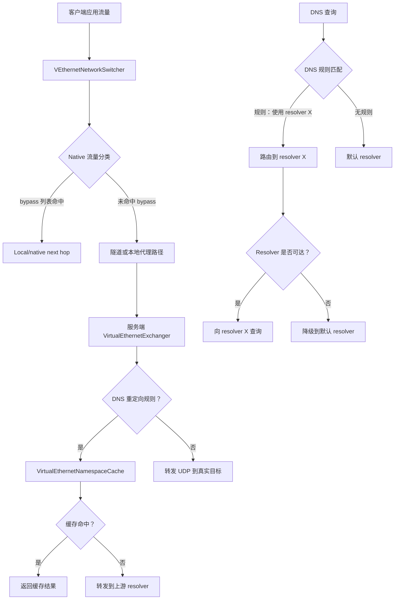
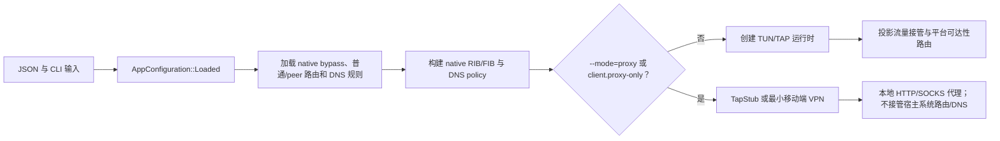
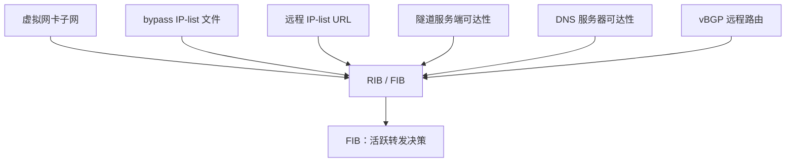
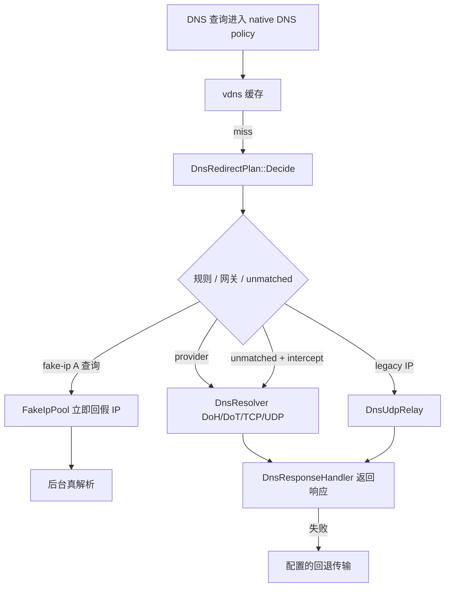
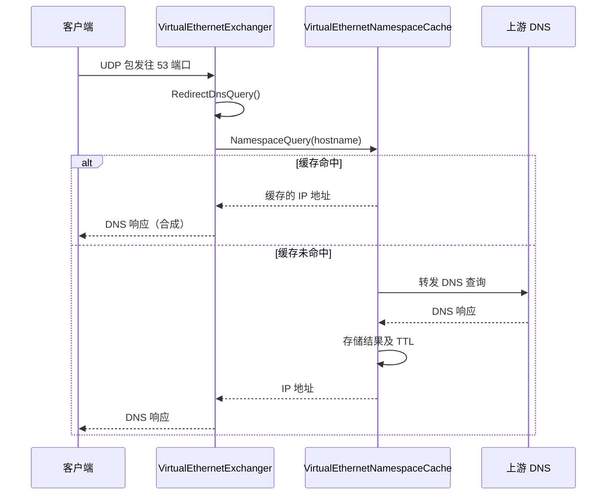
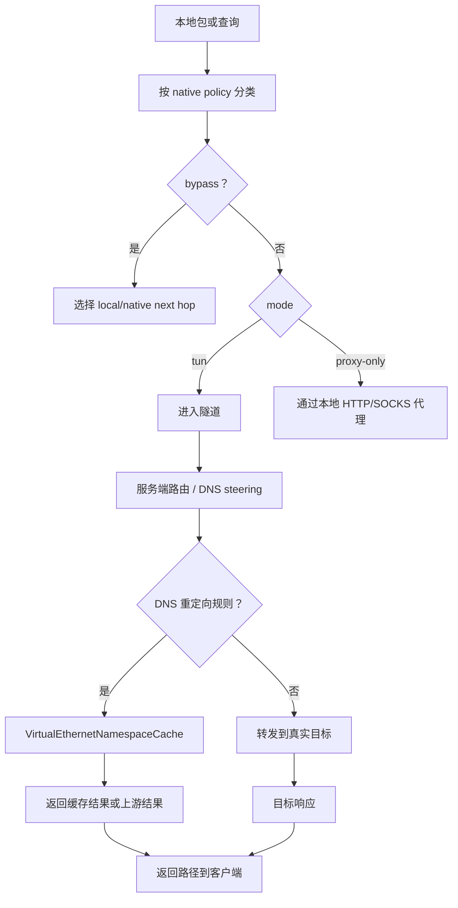
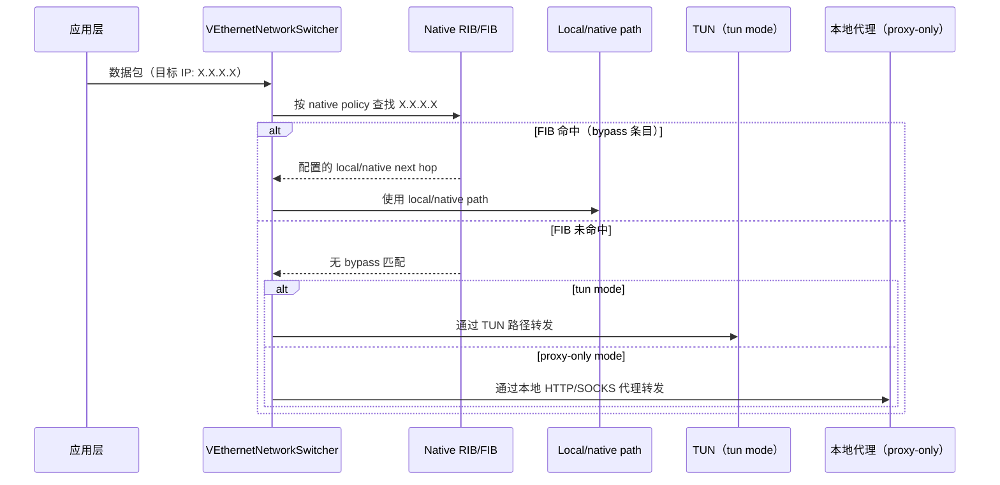
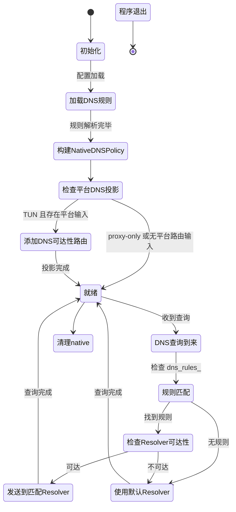

# 路由与 DNS

> **用途：**说明本主题的当前行为、配置或实现边界。
> **适用对象：**OPENPPP2 用户、运维人员与开发者。
> **当前状态：**当前有效。
> **最后核对依据：**当前仓库结构、实现路径与 main 验证记录，2026-07-18。
> **上一层索引：**[返回索引](README_CN.md) · **English：**[Routing And DNS](ROUTING_AND_DNS.md)

> Status: Active
> Type: Reference
> Last verified: c993753

[English Version](ROUTING_AND_DNS.md)

## 范围

本文解释 OPENPPP2 真实的路由与 DNS 整形模型。在代码里，这两者不是分开的两个功能，而是客户端上的统一流量分类系统，以及服务端继续延伸的 DNS 处理路径。

主要锚点：

- `ppp/app/client/VEthernetNetworkSwitcher.*`
- `ppp/app/client/route/RouteState.*`
- `ppp/app/client/route/RouteCoordinator.*`
- `ppp/app/client/route/RoutePlanInput.h`
- `ppp/app/client/dns/DnsController.*`
- `ppp/app/client/dns/Rule.*`
- `ppp/app/server/VirtualEthernetExchanger.*`
- `ppp/app/server/VirtualEthernetDatagramPort.*`
- `ppp/app/server/VirtualEthernetNamespaceCache.*`

---

## 架构总览



---

## 核心思想

客户端决定哪些流量使用 local/native path、哪些流量进入隧道或本地代理，以及哪些 DNS 服务器本身必须保持可达。
服务端则继续 DNS 路径，可能从缓存回答、转发到指定 resolver，或者正常转发。

### 归一化的客户端分流策略

统一的配置入口是 `client.routing`：

```json
{
  "client": {
    "proxy-only": false,
    "routing": {
      "ip": {
        "bypass": [
          "10.0.0.0/8",
          "file://./rules/custom-bypass.txt"
        ],
        "routes": [],
        "peer-routes": []
      },
      "dns": {
        "rules": [
          "example.com /cloudflare/tun",
          "file://./rules/custom-dns.txt"
        ]
      }
    }
  }
}
```

`AppConfiguration::Loaded()` 按以下优先级处理：

1. `client.routing` 是 JSON 对象时，其中的 IP/DNS policy source 为权威来源。
2. `routing.ip.*` 与 `routing.dns.rules` 嵌套字段优先于同级短别名 `routing.bypass`、`routing.routes`、`routing.peer-routes` 和 `routing.dns-rules`。
3. 独立顶层 `client.proxy-only` 无论是否存在 canonical 对象都会读取；`client.routes`、`client.peer-routes` 以及旧 DNS/CLI 来源仅在没有 canonical 对象时作为兼容输入。
4. canonical 的普通路由和 peer 前缀路由会镜像回旧字段，供旧平台消费者迁移期间继续使用。旧 routing 对象中的 mode 字段会被忽略且不会由序列化输出。

`client.proxy-only` 与顶层 `--mode=client`/`--mode=proxy` 决定运行模式。`client.routing` 只承载四类 native IP/DNS 输入；路由 source 字符串会 trim 并移除空项；`file://` scheme 不区分大小写；已存在的路径按文件读取，无法解析的 source 保留为 inline 文本。旧的嵌套 mode 值不会选择或覆盖运行模式。

canonical 客户端策略分为 IP 和 DNS 两层：

- `routing.ip.bypass` 提供应留在物理路径上、或使用已配置 local/native next hop 的目标前缀。
- `routing.ip.routes` 提供由 native route loading 消费的普通路由文件/vBGP 来源。
- `routing.ip.peer-routes` 提供用于 peer 前缀网关转发的 `network/prefix/via` 路由，不是另一份 bypass 列表。
- `routing.dns.rules` 提供域名到 resolver 的规则；`tun` 与 `proxy-only` 两种模式都会将其加载到 native DNS policy，纯代理模式不会向宿主系统投影 DNS 接管或 DNS 可达性路由。

### 运行时决策顺序



两种模式都会加载并使用 native bypass、普通路由、peer 前缀路由和 DNS 规则。这些输入进入 native 路由查找和 DNS policy；本地代理路径也使用同一套分类。TUN 模式还会把这套策略投影到宿主路由和 DNS 处理：IP 分类决定路径，路由条目保证隧道、服务端和 resolver 可达，DNS 规则决定 resolver 语义。纯代理模式则明确不接管系统路由或系统 DNS：桌面使用 `TapStub`，Android 只保留 VPN 接口子网路由，iOS 只保留 tunnel 子网路由。缺少这些平台级路由或 DNS 设置，并不表示已加载的 native policy 失效。平台边界见[平台集成](PLATFORMS_CN.md)。

---

## 客户端所有权

`VEthernetNetworkSwitcher` 只负责组合 Route / DNS 服务，不再拥有其领域状态。`route::RouteState` 持有路由数据，`dns::DnsController` 持有查询与 session 生命周期。

每次操作前，Switcher 会把 TAP 事实、网卡快照、配置标志、bypass 条目、DNS 可达性和 fake-IP 路由
复制到 `RoutePlanInput`。Route manager 与平台 adapter 只接收 `const` 值输入，不再保存 Switcher 指针。
默认路由保护线程只捕获 plan 与独立拥有的取消状态。

### 路由信息表

| 字段 | 说明 |
|------|------|
| `RouteState::rib` | 路由信息表——所有已知路由 |
| `RouteState::fib` | 转发信息表——活跃查找表 |
| `ribs_` | 已加载的 IP-list 来源（文件、URL） |
| `vbgp_` | 远程路由来源（vBGP） |

### DNS 状态

| 字段 / 对象 | 说明 |
|-------------|------|
| `DnsController` | 查询上下文、session generation 与关闭顺序 |
| `DnsInterceptor` | 由 Controller 独占的 DNS 策略、resolver、规则表和 fake-ip 池 |
| `RouteState::dns_servers` | DNS 可达性的 native 快照；宿主/隧道路由投影取决于 mode 与平台 |

Packet dispatch 使用不可变 session 快照调用 `DnsController::HandleQuery()`；Controller 再委托 `DnsInterceptor` 执行策略，隧道回退仅依赖 `IDnsTunnelTransport`，不依赖具体 Exchanger。详见 [DNS_MODULE_DESIGN.md](../architecture/DNS_MODULE_DESIGN.md)。

规则加载、协商 session 信息、fake-IP rewrite、fake-IP 路由投影和 resolver 可达性在生产代码中都只经
`DnsController` 进入；Switcher 不再额外保存 interceptor。

### 路由事务与拆除顺序

`RouteCoordinator` 先捕获平台默认路由，再移除冲突项并应用 `RouteSpec`。部分失败时按逆序删除已应用路由并恢复平台私有快照；`Stop()` 幂等。

拆除顺序固定为：关闭 `DnsController`、释放 Exchanger、最后回滚 Route。这样异步 DNS 回调不会访问失效传输，同时 DNS 路由快照会保留到删除完成。

---

## 路由构造

客户端的路由来源：



### 关键方法

```cpp
/**
 * @brief 从所有已配置来源添加路由。
 * @param y  异步 IP-list 加载的 yield 上下文。
 * @return   所有路由成功应用时返回 true。
 */
bool AddAllRoute(YieldContext& y) noexcept;

/**
 * @brief 从 IP-list 来源加载并添加路由。
 * @param path_or_url  IP-list 文件路径或 HTTP/HTTPS URL。
 * @return             已添加的路由数量。
 */
int AddLoadIPList(const ppp::string& path_or_url) noexcept;

/**
 * @brief 从多个文件路径加载 IP-list。
 * @param paths  文件路径列表。
 * @return       总共加载的路由数量。
 */
int LoadAllIPListWithFilePaths(const ppp::vector<ppp::string>& paths) noexcept;

/**
 * @brief 为远程端点添加可达性路由。
 * @param endpoint  远程端点（服务端或 DNS 服务器）。
 * @return          路由添加成功时返回 true。
 */
bool AddRemoteEndPointToIPList(const IPEndPoint& endpoint) noexcept;

/**
 * @brief 向 OS 路由表添加一条路由。
 * @param network    网络地址。
 * @param mask       子网掩码。
 * @param gateway    网关地址。
 * @return           成功时返回 true。
 */
bool AddRoute(UInt32 network, UInt32 mask, UInt32 gateway) noexcept;

/**
 * @brief 保护默认路由不被隧道覆写。
 * @return 默认路由保护成功时返回 true。
 */
bool ProtectDefaultRoute() noexcept;
```

源文件：`ppp/app/client/VEthernetNetworkSwitcher.h`

---

## DNS 规则

客户端 DNS 规则决定某个域名或域名模式应该使用哪个 resolver。拦截后的完整流水线见 [DNS_MODULE_DESIGN.md](../architecture/DNS_MODULE_DESIGN.md)。

### 规则匹配流程



### DNS 规则配置格式

```json
"dns-rules": [
  "rules://path/to/dns-rules.txt"
]
```

规则文件使用域名后缀 / 通配符条目，每条映射到一个 resolver 地址。

源文件：`ppp/app/client/dns/Rule.h`

---

## DNS 服务器路由分配

DNS 服务器是 native DNS policy 中对可达性敏感的端点。两种模式都会进行 resolver 选择；宿主平台的可达性是另一层投影。

TUN 模式下，平台路由协调可以为配置的 DNS 服务器经物理 NIC（而非隧道）添加直连路由，使默认路由被重定向时该 resolver 仍然可达。纯代理模式下，DNS 规则仍参与 native 处理，但运行时不会安装宿主系统 DNS 接管，也不会安装宿主/隧道 DNS 可达性路由。移动端系统 builder 可能保留最小的接口/tunnel 子网路由，只有存在相应输入时才添加 DNS 例外路由。

```cpp
/**
 * @brief 添加路由以使 DNS 服务器直连可达。
 * @return 所有 DNS 服务器路由添加成功时返回 true。
 */
bool AddRouteWithDnsServers() noexcept;

/**
 * @brief 删除 DNS 服务器可达性路由。
 * @return 路由删除成功时返回 true。
 */
bool DeleteRouteWithDnsServers() noexcept;
```

这些方法描述的是平台可达性投影；不能理解为纯代理模式一定会修改宿主 OS 路由。

---

## 服务端 DNS 路径

服务端侧 DNS 处理：



### 服务端 DNS API

```cpp
/**
 * @brief 通过 namespace cache 重定向 DNS 查询。
 * @param y          Yield 上下文。
 * @param src        源端点（客户端）。
 * @param dns_data   原始 DNS 查询包。
 * @param length     DNS 包长度。
 * @return           查询已处理时返回 true。
 */
bool RedirectDnsQuery(YieldContext& y,
                      const IPEndPoint& src,
                      const Byte* dns_data,
                      int length) noexcept;
```

源文件：`ppp/app/server/VirtualEthernetExchanger.h`

### Namespace Cache

`VirtualEthernetNamespaceCache` 维护基于 TTL 的 DNS 缓存：

```cpp
/**
 * @brief 在 namespace cache 中查询主机名。
 * @param y         Yield 上下文。
 * @param hostname  要解析的主机名。
 * @return          解析得到的 IP 地址，失败时返回 IPEndPoint::None。
 */
IPEndPoint Query(YieldContext& y, const ppp::string& hostname) noexcept;

/**
 * @brief 向缓存插入一个已解析的条目。
 * @param hostname  已解析的主机名。
 * @param address   IP 地址结果。
 * @param ttl       生存时间（秒）。
 */
void Insert(const ppp::string& hostname, const IPEndPoint& address, int ttl) noexcept;
```

源文件：`ppp/app/server/VirtualEthernetNamespaceCache.h`

---

## 路径模型



local/native 分支是策略选择，不代表一定安装宿主 NIC 路由。TUN 模式下，平台投影可以让它经物理 NIC 发送；纯代理模式下，native 查找和本地代理路径使用同一套分类，但不接管宿主系统路由或 DNS。未命中 bypass 的流量只在 TUN 模式进入隧道，在纯代理模式进入本地代理。

---

## IP-list 来源

OPENPPP2 支持从多种来源加载 IP bypass 列表：

| 来源类型 | 示例 | 说明 |
|---------|------|------|
| 本地文件 | `/etc/openppp2/bypass.txt` | 纯文本文件，每行一条 CIDR |
| HTTP URL | `http://example.com/bypass.txt` | 启动时获取 |
| HTTPS URL | `https://cdn.example.com/bypass.txt` | 启动时 TLS 获取 |
| VIRR 刷新 | 配置 `virr.update-interval` | 周期性自动刷新 |

### VIRR 配置示例

```json
"virr": {
    "update-interval": 86400,
    "url": "https://example.com/bypass-list.txt"
}
```

bypass 列表刷新时，native RIB/FIB 随之更新；宿主平台路由是否投影取决于 mode，纯代理模式不因此修改宿主系统路由。

---

## vBGP 远程路由

vBGP 子系统允许从远程 BGP 风格来源加载路由信息：

```json
"vbgp": {
    "update-interval": 3600,
    "url": "https://example.com/bgp-routes.txt"
}
```

vBGP 路由会合并到客户端 RIB 中。

---

## 路由与 DNS 的协调关系

路由和 DNS 不是两个独立的旋钮，而是统一的流量分类策略：

| 关注点 | 关联方式 |
|--------|---------|
| bypass 列表 | 为目标选择 local/native path，而不是隧道或代理路径 |
| DNS 规则 | 在两种模式的 native policy 中决定每个域名使用哪个 resolver |
| Resolver 可达性 | native 可达性状态支持 resolver 选择；TUN 可投影直连路由，纯代理模式不因此安装宿主路由 |
| 服务端 DNS 缓存 | 减少重复的上游 DNS 查询 |
| IPv6 transit | 可能改变 IPv6 目标的"可达"含义 |
| Static echo | 可以提供绕过 DNS 决策的独立路径 |

---

## 配置参考

| 配置键 | 默认值 | 说明 |
|--------|--------|------|
| `--mode=client` / `--mode=proxy` | `client` | 顶层运行模式；`--mode=proxy` 选择纯代理宿主集成 |
| `client.proxy-only` | `false` | 独立顶层运行标志；抑制宿主路由/DNS 接管但不关闭 native policy |
| `client.routing.ip.bypass` | `[]` | native bypass policy 的内联 IP 前缀或 `file://` source；TUN 可将其投影到物理路径，纯代理模式保留 native 决策 |
| `client.routing.ip.routes` | `[]` | 加载到 native route policy 的普通路由文件或 vBGP 来源；平台投影取决于运行模式 |
| `client.routing.ip.peer-routes` | `[]` | 包含 `network`、`prefix`、`via` 的 native peer 前缀网关路由 |
| `client.routing.dns.rules` | `[]` | 加载到两种模式 native DNS policy 的内联规则或 `file://` source；TUN 可投影 resolver 可达性，纯代理模式不接管宿主 DNS |
| `client.routes`、`client.peer-routes` | — | 兼容旧路由字段；仅在没有 `client.routing` 时使用；`--bypass`、`--dns-rules` 仍是启动时来源。旧嵌套 mode 字段会被忽略且不序列化 |
| `geo-rules.enabled` | `false` | 从本地文本 GeoIP/GeoSite 输入生成额外的 bypass 和 DNS-rule 文件 |
| `geo-rules.geoip-dat` | `GeoIP.dat` | GeoIP dat 本地缓存路径；会下载并按配置国家解析 |
| `geo-rules.geosite-dat` | `GeoSite.dat` | GeoSite dat 本地缓存路径；会下载并按配置国家解析 |
| `geo-rules.geoip-download-url` | `""` | 可选 HTTP/HTTPS URL，用于下载/更新 `geoip-dat` |
| `geo-rules.geosite-download-url` | `""` | 可选 HTTP/HTTPS URL，用于下载/更新 `geosite-dat` |
| `geo-rules.geoip` | `[]` | 本地文本 CIDR 来源文件路径或路径数组 |
| `geo-rules.geosite` | `[]` | 本地文本域名来源文件路径或路径数组 |
| `geo-rules.append-bypass` | `[]` | 在 GeoIP CIDR 后追加的内联 CIDR 或本地 CIDR 文件 |
| `geo-rules.append-dns-rules` | `[]` | 在 GeoSite 规则后追加的内联 DNS 规则/域名或 `rules://` 本地文件 |
| `virr.update-interval` | `86400` | bypass 列表刷新间隔（秒） |
| `virr.url` | `""` | 周期性刷新的 bypass 列表 URL |
| `vbgp.update-interval` | `3600` | vBGP 路由刷新间隔（秒） |
| `vbgp.url` | `""` | vBGP 路由来源 URL |
| `udp.dns.cache` | `true` | 开启 DNS 缓存写入；`false` 或 `udp.dns.ttl=0` 会禁止写入并不创建服务端 namespace cache |
| `udp.dns.ttl` | `60` | DNS 缓存最大 TTL（秒）；实际缓存 TTL 取 DNS 响应 TTL 与该值的较小者 |
| `dns.servers.domestic` | `doh.pub` | 默认国内 provider 或结构化 DNS server 配置 |
| `dns.servers.foreign` | `cloudflare` | 默认海外 provider 或结构化 DNS server 配置 |
| `dns.intercept-unmatched` | `true` | 拦截未命中规则的 DNS 查询，并按 `foreign -> domestic -> cloudflare` 解析 |
| `dns.fake-ip.enabled` | `false` | 开启 Clash 风格 fake-ip（立即回假 A 记录，后台解析真 IP） |
| `dns.fake-ip.range` | `198.18.0.1/16` | fake-ip 地址池 CIDR |

---

## 错误码参考

路由和 DNS 相关的 `ppp::diagnostics::ErrorCode` 值（来自 `ppp/diagnostics/ErrorCodes.def`）：

| ErrorCode | 说明 |
|-----------|------|
| `RouteAddFailed` | 向 OS 路由表添加路由失败 |
| `RouteDeleteFailed` | 删除路由失败 |
| `RouteReplaceFailed` | 替换现有路由失败 |
| `ConfigDnsRuleLoadFailed` | 从已配置来源加载 DNS 规则失败 |
| `ConfigRouteLoadFailed` | 从已配置来源加载路由列表失败 |
| `DnsResolveFailed` | DNS 解析失败 |
| `DnsAddressInvalid` | DNS 地址无效 |

---

## 使用示例

### 配置归一化的分流策略

```json
{
  "client": {
    "routing": {
      "ip": {
        "bypass": [
          "file:///etc/openppp2/china-cidr.txt",
          "10.0.0.0/8"
        ],
        "routes": [],
        "peer-routes": []
      },
      "dns": {
        "rules": [
          "file:///etc/openppp2/dns-rules.txt"
        ]
      }
    }
  }
}
```

`routing.ip.bypass` 用于选择 local/native path 的前缀，`routing.ip.routes` 用于普通路由来源，`routing.ip.peer-routes` 用于 peer 前缀网关路由。这些 native 输入由 TUN 与纯代理模式共享，区别只在宿主平台投影。没有 `client.routing` 时，旧 client 字段和 CLI 来源仍作为兼容输入。

DNS 规则文件格式示例：

```
# Provider 规则（推荐）
example.cn /doh.pub/nic
google.com /cloudflare/tun

# 旧 IP 规则仍然支持
legacy-cn.example /1.2.4.8/nic
legacy-foreign.example /1.1.1.1/tun
```

Provider 规则中，第三段选择 resolver 语义：`/nic` 表示国内并允许 ECS，`/tun`、`/vpn`、`/cf`、`/c` 表示海外且不注入 ECS。旧 IP 规则中，第三段仍是 native path 提示：`/nic` 选择 local/native handling，`/tun` 在存在 TUN 路径时选择隧道处理。纯代理模式仍会将规则加载到 native policy，但不会安装宿主系统隧道路由。

### 生成 GeoIP / GeoSite 分流规则

`geo-rules` 是可选配置，默认关闭。开启后，OPENPPP2 会按配置下载/解析 GeoIP/GeoSite dat，读取本地文本输入，写出生成的 bypass 和 DNS-rule 文件，然后接入现有路由/DNS 加载路径。生成结果先于显式的 canonical `client.routing.ip.bypass` 与 `client.routing.dns.rules` 来源加载；`--bypass` 和 `--dns-rules` 仍作为启动时兼容来源支持。生成器会在桌面启动流程和 Android native 启动流程的 `tun` 与 `proxy-only` 两种 mode 下运行；iOS bridge 当前不会调用 `GeoRuleGenerator`，但仍加载 canonical bypass 和 DNS policy。纯代理模式不跳过桌面/Android 生成器或 native policy 加载，只跳过宿主系统路由/DNS 投影。

```json
{
  "geo-rules": {
    "enabled": true,
    "country": "cn",
    "geoip-dat": "/var/lib/openppp2/GeoIP.dat",
    "geosite-dat": "/var/lib/openppp2/GeoSite.dat",
    "geoip-download-url": "https://testingcf.jsdelivr.net/gh/MetaCubeX/meta-rules-dat@release/geoip.dat",
    "geosite-download-url": "https://testingcf.jsdelivr.net/gh/MetaCubeX/meta-rules-dat@release/geosite.dat",
    "geoip": [
      "/etc/openppp2/geoip-cn.txt"
    ],
    "geosite": [
      "/etc/openppp2/geosite-cn.txt"
    ],
    "dns-provider-domestic": "doh.pub",
    "dns-provider-foreign": "cloudflare",
    "output-bypass": "/var/lib/openppp2/generated/bypass-cn.txt",
    "output-dns-rules": "/var/lib/openppp2/generated/dns-rules-cn.txt",
    "append-bypass": [
      "10.0.0.0/8",
      "/etc/openppp2/custom-bypass.txt"
    ],
    "append-dns-rules": [
      "example.cn /doh.pub/nic",
      "internal.example.cn",
      "rules:///etc/openppp2/custom-dns-rules.txt"
    ]
  },
  "dns": {
    "servers": {
      "domestic": "doh.pub",
      "foreign": "cloudflare"
    }
  }
}
```

当前支持的输入格式刻意保持简单：

```text
# geoip-cn.txt：每行一个 CIDR
1.0.1.0/24
1.0.2.0/23
2408:8000::/20
```

```text
# geosite-cn.txt：每行一个域名或匹配表达式
baidu.com
.qq.com
domain:taobao.com
suffix:jd.com
full:example.cn
regexp:^.*\.example\.cn$
```

注意事项：

- `geoip-download-url` 和 `geosite-download-url` 会在启动时把 dat 文件下载到 `geoip-dat` 和 `geosite-dat`。
- 下载后的二进制 `geoip.dat` / `geosite.dat` 会按 `geo-rules.country` 自动解析生成规则；本地文本 `geoip` / `geosite` 输入和 append 列表会继续合并。
- 当 `geo-rules.enabled=true` 时，平台传给生成器的旧 `--bypass` 来源会并入生成结果；canonical `client.routing.ip.bypass` 来源在生成后显式应用。当 `geo-rules.enabled=false` 时，canonical bypass 仍按直接注册路径处理。
- 解析器也兼容 snake_case 写法（`geoip_dat`、`geosite_dat`、`geoip_download_url`、`geosite_download_url`），但文档推荐 kebab-case。
- `geoip` 和 `geosite` 当前仅支持本地文本文件；这些字段暂不支持 URL 来源。
- 生成的 DNS 规则使用 `/<dns-provider-domestic>/nic`；未配置时依次 fallback 到 `dns.servers.domestic` 和 `doh.pub`。
- `dns-provider-foreign` 已解析并预留给未来非 CN 或 `geolocation-!cn` 生成，但当前生成器不消费它。
- `append-bypass` 在 GeoIP CIDR 后合并，可包含内联 CIDR 或本地 CIDR 文件。
- `append-dns-rules` 在 GeoSite 规则后合并，可包含完整规则、用国内 provider 归一化的普通域名，或 `rules://` 本地文件。
- 客户端 `vdns` 和服务端 namespace cache 只缓存正向的 A/AAAA/CNAME 链响应，且 TTL 必须大于 0；实际缓存 TTL 为 `min(响应 TTL, udp.dns.ttl)`，`udp.dns.cache=false` 或 `udp.dns.ttl=0` 禁止写入。
- 桌面端和 Android native 客户端在 `tun` 与 `proxy-only` 两种 mode 下运行生成器；iOS bridge 当前不会调用生成器，但仍加载 canonical bypass 和 DNS policy。移动端系统路由/DNS builder 仍与桌面路由加载器分开，只投影平台级状态。

### VIRR 定期刷新 bypass 列表示例

```json
{
  "virr": {
    "update-interval": 3600,
    "url": "https://cdn.example.com/bypass-latest.txt"
  }
}
```

### vBGP 远程路由示例

```json
{
  "vbgp": {
    "update-interval": 7200,
    "url": "https://cdn.example.com/bgp-routes.txt"
  }
}
```

---

## 路由决策流程



---

## DNS 路由分配状态机



---

## 读源码时要看什么

- 路由项不是静态表，它来自宿主、隧道和 bypass 的组合输入
- DNS 服务器被当成可达性敏感端点——它们有自己专属的路由条目
- 服务端 DNS 行为取决于 namespace cache 和 datagram port 状态
- IPv6 transit 和 static echo 会改变"可达"的含义
- bypass 列表和 DNS 规则是独立刷新的，两者应该保持一致

---

## 相关文档

- [`CONFIGURATION_CN.md`](../reference/CONFIGURATION_CN.md)
- [`CLIENT_ARCHITECTURE_CN.md`](../architecture/CLIENT_ARCHITECTURE_CN.md)
- [`SERVER_ARCHITECTURE_CN.md`](../architecture/SERVER_ARCHITECTURE_CN.md)
- [`LINKLAYER_PROTOCOL_CN.md`](../reference/LINKLAYER_PROTOCOL_CN.md)
- [`DEPLOYMENT_CN.md`](../operations/DEPLOYMENT_CN.md)
